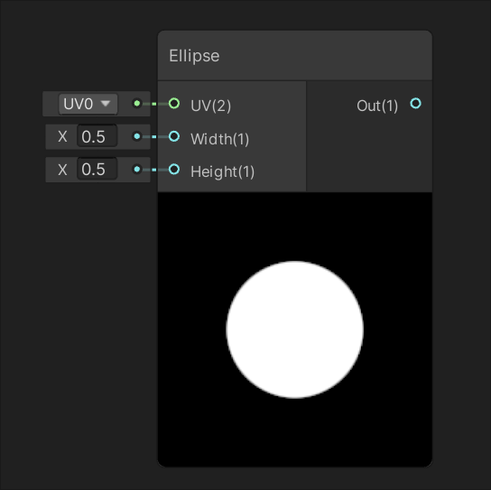

# Procedural Nodes

| [Checkerboard](Checkerboard-Node.md) |
| :-----------|
|  |
| Generates a checkerboard of alternating colors between inputs Color A and Color B based on input UV. |

## Noise

| [Gradient Noise](Gradient-Noise-Node.md) | [Simple Noise](Simple-Noise-Node.md) |
| :------------------------ | :---------------------------- |
|  |  |
| Generates a gradient, or Perlin, noise based on input UV. | Generates a simple, or Value, noise based on input UV. |
| [**Voronoi**](Voronoi-Node.md) |           |
|  ||
|Generates a Voronoi, or Worley, noise based on input UV.  ||

## Shape

| [Ellipse](Ellipse-Node.md) | [Polygon](Polygon-Node.md) |
| :----------------------------------------------------------- | :----------------------------------------------------------- |
|                         |                         |
| Generates an ellipse shape based on input UV at the size specified by inputs Width and Height. | Generates a regular polygon shape based on input UV at  the size specified by inputs Width and Height. The polygon's amount of  sides is determined by input Sides. |
| [**Rectangle**](Rectangle-Node.md) | [**Rounded Rectangle**](Rounded-Rectangle-Node.md) |
|                       |                |
| Generates a rectangle shape based on input UV at the size specified by inputs Width and Height. | Generates a rounded rectangle shape based on input UV at the size specified by inputs Width and Height. The input Radius defines the radius of each corner. |
|  ||
| ||
| Generates a rounded polygon shape based on input UV at the size specified by inputs Width and Height. The input Sides specifies the number of sides, and the input Roundness defines the roundness of each corner. ||
