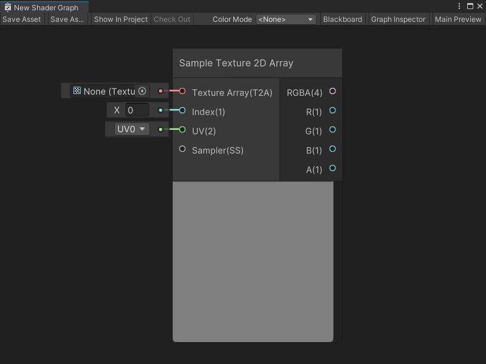

# Sample Texture 2D Array node

The Sample Texture 2D Array node samples a **Texture 2D Array** asset and returns a **Vector 4** color value. You can specify the **UV** coordinates for a texture sample and use a [Sampler State node](Sampler-State-Node.md) to define a specific Sampler State. The node's **Index** input port specifies which index of a Texture 2D Array to sample.

For more information about Texture 2D Arrays, see [Texture Arrays](https://docs.unity3d.com/Manual/class-Texture2DArray.html) in the Unity User manual.

[!include[nodes-sample-errors](./snippets/sample-nodes/nodes-sample-errors.md)]



## Create Node menu category

The Sample Texture 2D Array node is under the **Input** &gt; **Texture** category in the Create Node menu.

## Compatibility

The Sample Texture 3D [!include[nodes-compatibility-all](./snippets/nodes-compatibility-all.md)]

[!include[nodes-sample-fragment-lod](./snippets/sample-nodes/nodes-sample-fragment-lod.md)]

## Inputs

The Sample Texture 3D [!include[nodes-inputs](./snippets/nodes-inputs.md)]

| **Name** | **Type**  | **Binding** | **Description** |
|--|--|--|--|
| **Texture Array** | Texture 2D Array | None | The Texture 2D Array asset to sample. |
| **Index** | Float | None | The index of the specific Texture in the Texture array to sample. The index value is the Texture's location in the Texture array. The index values in an array always start at 0. An array with four textures would have locations 0, 1, 2, and 3. |
| **UV** | Vector 2 | None | UV coordinates to use to sample the Texture. |
| **Sampler** | Sampler State | Default Sampler State | The Sampler State and settings to use to sample the texture. |
| **LOD** | Float | LOD | **NOTE**: The **LOD** Input port only displays if **Mip Sampling Mode** is **LOD**. For more information, refer to [Additional node settings](#additional-node-settings). The specific mip to use when sampling the Texture. |
| **UV** | Vector 2 | UV | The UV coordinates to use to sample the texture. |
| **Sampler** | Sampler State | Default Sampler State | The Sampler State and settings to use to sample the texture.|
| **LOD** | Float | LOD | The specific mip to use when sampling the Texture. **NOTE** The **LOD** Input port only displays if **Mip Sampling Mode** is **LOD**. For more information, refer to [Additional node settings](#additional-node-settings). |
| **Bias** | Float | Bias | **NOTE**: The **Bias** Input port only displays if **Mip Sampling Mode** is **Bias**. For more information, refer to [Additional node settings](#additional-node-settings). If **Use Global Mip Bias** is enabled, Unity adds this Bias amount to the Global Mip Bias for a texture's mip calculation. If **Global Mip Bias** is disabled, Unity uses this Bias amount instead of the Global Mip Bias. |
| **DDX** | Float | DDY | **NOTE**: The **DDX** Input port only displays if **Mip Sampling Mode** is **Gradient**. For more information, refer to [Additional node settings](#additional-node-settings). The specific DDX value to use to calculate the texture's mip when sampling. For more information on DDX values for mipmaps, refer to [Mipmaps introduction](https://docs.unity3d.com/Documentation/Manual/texture-mipmaps-introduction.html) in the Unity User Manual. |
| **DDY** | Float | DDY | **NOTE** The **DDY** Input port only displays if **Mip Sampling Mode** is **Gradient**. For more information, refer to [Additional node settings](#additional-node-settings). The specific DDY value to use to calculate the texture's mip when sampling. For more information on DDY values for mipmaps, refer to [Mipmaps introduction](https://docs.unity3d.com/Documentation/Manual/texture-mipmaps-introduction.html)> in the Unity User Manual. |


## Additional node settings

The Sample Texture 3D [!include[nodes-additional-settings](./snippets/nodes-additional-settings.md)]

[!include[nodes-sample-mip-bias-sample-mode-table](./snippets/sample-nodes/nodes-sample-mip-bias-sample-mode-table.md)]

## Outputs

The Sample Texture 3D [!include[nodes-outputs](./snippets/nodes-outputs.md)]

[!include[nodes-sample-rgba-output-table](./snippets/sample-nodes/nodes-sample-rgba-output-table.md)]

## Example graph usage

In the following example, the Sample Texture 2D Array node samples a Texture array that has 4 different cloth normal maps. Change the number given to the **Index** port as an input, and the Sample Texture 2D Array node can sample a specific normal map from the array. The **Index** value changes the output the node sends to the Normal Unpack node, and the Normal (Tangent Space) Block node in the Master Stack.


## Generated code example

[!include[nodes-generated-code](./snippets/nodes-generated-code.md)]:

```
float4 _SampleTexture2DArray_RGBA = SAMPLE_TEXTURE2D_ARRAY(Texture, Sampler, UV, Index);
float _SampleTexture2DArray_R = _SampleTexture2DArray_RGBA.r;
float _SampleTexture2DArray_G = _SampleTexture2DArray_RGBA.g;
float _SampleTexture2DArray_B = _SampleTexture2DArray_RGBA.b;
float _SampleTexture2DArray_A = _SampleTexture2DArray_RGBA.a;
```

## Related nodes

[!include[nodes-related](./snippets/nodes-related.md)] Sample Texture 3D node:

- [Sample Texture 2D node](Sample-Texture-2D-Node.md)
- [Sample Texture 3D node](Sample-Texture-3D-Node.md)
- [Sampler State node](Sampler-State-Node.md)
