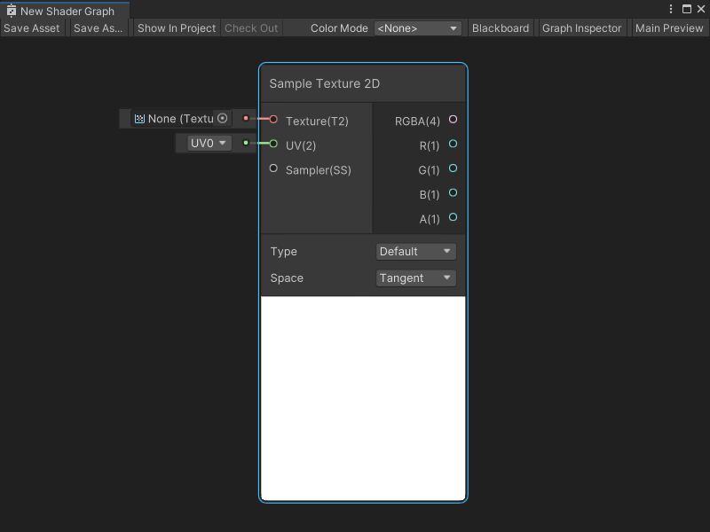

# Sample Texture 2D node

The Sample Texture 2D node samples a **Texture 2D** asset and returns a **Vector 4** color value. You can specify the **UV** coordinates for a texture sample and use a [Sampler State node](Sampler-State-Node.md) to define a specific Sampler State.

A Sample Texture 2D node can also sample a normal map. For more information, see the [Controls](#controls) section, or [Normal map (Bump mapping)](https://docs.unity3d.com/Manual/StandardShaderMaterialParameterNormalMap.html) in the Unity User manual.

[!include[nodes-sample-errors](./snippets/sample-nodes/nodes-sample-errors.md)]



## Create Node menu category

The Sample Texture 2D node is under the **Input** &gt; **Texture** category in the Create Node menu.

## Compatibility

The Sample Texture 2D [!include[nodes-compatibility-all](./snippets/nodes-compatibility-all.md)]

[!include[nodes-sample-fragment-lod](./snippets/sample-nodes/nodes-sample-fragment-lod.md)]

## Inputs

The Sample Texture 2D [!include[nodes-inputs](./snippets/nodes-inputs.md)]

| **Name** | **Type**  | **Binding** | **Description** |
|--|--|--|--|
| **Texture** | Texture 2D | None | The Texture 2D asset to sample.| 
| **UV** | Vector 2 | UV | The UV coordinates to use to sample the texture. |
| **Sampler** | Sampler State | Default Sampler State | The Sampler State and settings to use to sample the texture.|
| **LOD** | Float | LOD | The specific mip to use when sampling the Texture. **NOTE** The **LOD** Input port only displays if **Mip Sampling Mode** is **LOD**. For more information, refer to [Additional node settings](#additional-node-settings). |
| **Bias** | Float | Bias | **NOTE**: The **Bias** Input port only displays if **Mip Sampling Mode** is **Bias**. For more information, refer to [Additional node settings](#additional-node-settings). If **Use Global Mip Bias** is enabled, Unity adds this Bias amount to the Global Mip Bias for a texture's mip calculation. If **Global Mip Bias** is disabled, Unity uses this Bias amount instead of the Global Mip Bias. |
| **DDX** | Float | DDY | **NOTE**: The DDX Input port only displays if **Mip Sampling Mode** is **Gradient**. For more information, refer to [Additional node settings](#additional-node-settings). The specific DDX value to use to calculate the texture's mip when sampling. For more information on DDX values for mipmaps, refer to [Mipmaps introduction](https://docs.unity3d.com/Documentation/Manual/texture-mipmaps-introduction.html) in the Unity User Manual. |
| **DDY** | Float | DDY | **NOTE** The **DDY** Input port only displays if **Mip Sampling Mode** is **Gradient**. For more information, refer to [Additional node settings](#additional-node-settings). The specific DDY value to use to calculate the texture's mip when sampling. For more information on DDY values for mipmaps, refer to [Mipmaps introduction](https://docs.unity3d.com/Documentation/Manual/texture-mipmaps-introduction.html)> in the Unity User Manual. |

## Controls

The Sample Texture 2D [!include[nodes-controls](./snippets/nodes-controls.md)]

<table>
<thead>
<tr>
<th><strong>Name</strong></th>
<th><strong>Type</strong></th>
<th colspan="2"><strong>Description</strong></th>
</tr>
</thead>
<tbody>
<tr>
<td rowspan="3"><strong>Type</strong></td>
<td rowspan="3">Dropdown</td>
<td colspan="2">Select whether the texture is a Texture asset or a normal map.</td>
</tr>
<tr>
<td><strong>Default</strong></td>
<td>The texture is a Texture asset.</td>
</tr>
<tr>
<td><strong>Normal</strong></td>
<td>The texture is a normal map.</td>
</tr>
<tr>
<td rowspan="3"><strong>Space</strong></td>
<td rowspan="3">Dropdown</td>
<td colspan="2">When the node's <strong>Type</strong> is <strong>Normal</strong> to use a texture as a normal map, choose the Space for the normal map.</td>
</tr>
<tr>
<td><strong>Tangent</strong></td>
<td>Use a Tangent normal map whenever the mesh for a geometry needs to deform or change, such as when animating a character. With <strong>Tangent</strong> Space, the normal map's normals are relative to the existing vertex normals of any geometry rendered with your Shader Graph. Your Shader Graph only adjusts the vertex normals and not override them.</td>
</tr>
<tr>
<td><strong>Object</strong></td>
<td>Use an Object normal map whenever the mesh for a geometry is static and doesn't deform. With <strong>Object</strong> Space, the normal map's normals are explicit and override the normals of any geometry rendered with your Shader Graph. Because a static mesh's normals never change, an <strong>Object</strong> normal map also maintains consistent lighting across different levels of detail (LODs). <br/> For more information about normal maps, see <a href="https://docs.unity3d.com/Manual/StandardShaderMaterialParameterNormalMap.html">Normal map (Bump mapping)</a> in the User manual.</td>
</tr>
</tbody>
</table>

## Additional node settings

The Sample Texture 2D [!include[nodes-additional-settings](./snippets/nodes-additional-settings.md)]

[!include[nodes-sample-mip-bias-sample-mode-table](./snippets/sample-nodes/nodes-sample-mip-bias-sample-mode-table.md)]

## Outputs

The Sample Texture 2D [!include[nodes-outputs](./snippets/nodes-outputs.md)]

[!include[nodes-sample-rgba-output-table](./snippets/sample-nodes/nodes-sample-rgba-output-table.md)]

## Example graph usage

In the following example, the Sample Texture 2D node uses a [Subgraph node](Sub-graph-Node.md) that generates UV coordinates in latitude and longitude format. These latitude and longitude UV coordinates help render the **latlong_test** 2D Texture asset, which was created and formatted with a latitude and longitude projection. The generated latitude and longitude UVs accurately map the 2D Texture asset onto a spherical geometry.

If the Sample Texture 2D node uses the **Standard** Mip Sampling Mode, the Texture displays with a seam along the side of the sphere where the left and right sides of the texture meet. The latitude and longitude UV coordinates for sampling the texture jump from `0` to `1` at the seam on the model, which causes a problem with the mip level calculation in the sample. The error in the mip level calculation causes the seam. The texture requires a different mip sampling mode to remove the seam.


When the Mip Sampling Mode is set to **Gradient**, the Sample Texture 2D node can use the standard set of UVs for the model in the mip level calculation, instead of the latitude and longitude UVs needed for sampling the texture. The new UV coordinates passed into the **DDX** and **DDY** input ports result in a continuous mip level, and remove the seam.


## Generated code example

[!include[nodes-generated-code](./snippets/nodes-generated-code.md)], based on the selected [**Type**](#controls) on the Sample Texture 2D node:

### Default

```
float4 _SampleTexture2D_RGBA = SAMPLE_TEXTURE2D(Texture, Sampler, UV);
float _SampleTexture2D_R = _SampleTexture2D_RGBA.r;
float _SampleTexture2D_G = _SampleTexture2D_RGBA.g;
float _SampleTexture2D_B = _SampleTexture2D_RGBA.b;
float _SampleTexture2D_A = _SampleTexture2D_RGBA.a;
```

### Normal

```
float4 _SampleTexture2D_RGBA = SAMPLE_TEXTURE2D(Texture, Sampler, UV);
_SampleTexture2D_RGBA.rgb = UnpackNormalmapRGorAG(_SampleTexture2D_RGBA);
float _SampleTexture2D_R = _SampleTexture2D_RGBA.r;
float _SampleTexture2D_G = _SampleTexture2D_RGBA.g;
float _SampleTexture2D_B = _SampleTexture2D_RGBA.b;
float _SampleTexture2D_A = _SampleTexture2D_RGBA.a;
```

## Related nodes

[!include[nodes-related](./snippets/nodes-related.md)] Sample Texture 2D node:


- [Sample Texture 2D Array node](Sample-Texture-2D-Array-Node.md)
- [Sample Texture 3D node](Sample-Texture-3D-Node.md)
- [Sampler State node](Sampler-State-Node.md)
