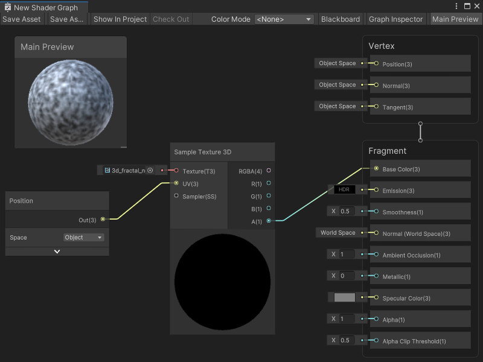

# Sample Texture 3D node

The Sample Texture 3D node samples a **Texture 3D** asset and returns a **Vector 4** color value. You can specify the **UV** coordinates for a texture sample and use a [Sampler State node](Sampler-State-Node.md) to define a specific Sampler State.

For more information about Texture 3D assets, see [3D textures](https://docs.unity3d.com/Manual/class-Texture3D.html) in the Unity User manual.

[!include[nodes-sample-errors](./snippets/sample-nodes/nodes-sample-errors.md)]


## Create Node menu category

The Sample Texture 2D node is under the **Input** &gt; **Texture** category in the Create Node menu.

## Compatibility

The Sample Texture 3D [!include[nodes-compatibility-all](./snippets/nodes-compatibility-all.md)]

[!include[nodes-sample-fragment-lod](./snippets/sample-nodes/nodes-sample-fragment-lod.md)]

## Inputs

The Sample Texture 3D [!include[nodes-inputs](./snippets/nodes-inputs.md)]

<table>
<thead>
<tr>
<th><strong>Name</strong></th>
<th><strong>Type</strong></th>
<th><strong>Binding</strong></th>
<th><strong>Description</strong></th>
</tr>
</thead>
<tbody>
<tr>
<td><strong>Texture</strong></td>
<td>Texture 3D</td>
<td>None</td>
<td>The 3D Texture asset to sample.</td>
</tr>
<tr>
<td><strong>UV</strong></td>
<td>Vector 3</td>
<td>None</td>
<td>The 3D UV coordinates to use to sample the Texture.</td>
</tr>
[!include[nodes-sample-ss-table](./snippets/sample-nodes/nodes-sample-ss-table.md)]
[!include[nodes-sample-lod-table](./snippets/sample-nodes/nodes-sample-lod-table.md)]
</tbody>
</table>


## Additional node settings

The Sample Texture 3D [!include[nodes-additional-settings](./snippets/nodes-additional-settings.md)]

<table>
<thead>
<tr>
<th><strong>Name</strong></th>
<th><strong>Type</strong></th>
<th colspan="2"><strong>Description</strong></th>
</tr>
</thead>
<tbody>
<tr>
<td rowspan="3"><strong>Mip Sampling Mode</strong></td>
<td rowspan="3">Dropdown</td>
<td colspan="2">Choose the sampling mode that the Sample Texture 3D node uses to calculate the mip level of the texture. </td>
</tr>
<tr>
<td><strong>Standard</strong></td>
<td>The mip is calculated and selected automatically for the texture.</td>
</tr>
<tr>
<td><strong>LOD</strong></td>
<td>Set an explicit mip for the texture. The texture will always use this mip, regardless of the DDX or DDY calculations between pixels. If the <strong>Mip Sampling Mode</strong> is set to <strong>LOD</strong>, you can connect the node to a Block node in the <strong>Vertex</strong> Context. For more information on Block nodes and Contexts, see <a href="Master-Stack.md">Master Stack</a>.</td>
</tr>
</tbody>
</table>

## Outputs

The Sample Texture 3D [!include[nodes-outputs](./snippets/nodes-outputs.md)]

[!include[nodes-sample-rgba-output-table](./snippets/sample-nodes/nodes-sample-rgba-output-table.md)]

## Example graph usage

In the following example, the Sample Texture 3D node samples a 3D fractal noise Texture asset. It takes its input UV coordinates from a Position node, set to **Object** Space.

The Sample Texture 3D node needs a Vector 3 for its UV coordinate input, rather than a Vector 2, because the Texture asset exists as a volume in imaginary 3D space. The node uses the default Sampler State because there is no Sampler State node connected.

This specific Texture 3D asset stores its Texture data in the Alpha channel, so the Sample Texture 3D node uses its **A** output port as an input for the Base Color Block node in the **Fragment** Context of the Master Stack:



## Generated code example

[!include[nodes-generated-code](./snippets/nodes-generated-code.md)]:

```
float4 _SampleTexture3D_Out = SAMPLE_TEXTURE3D(Texture, Sampler, UV);
```

## Related nodes

[!include[nodes-related](./snippets/nodes-related.md)] Sample Texture 3D node:

- [Sample Texture 2D Array node](Sample-Texture-2D-Array-Node.md)
- [Sample Texture 2D node](Sample-Texture-2D-Node.md)
- [Sampler State node](Sampler-State-Node.md)
