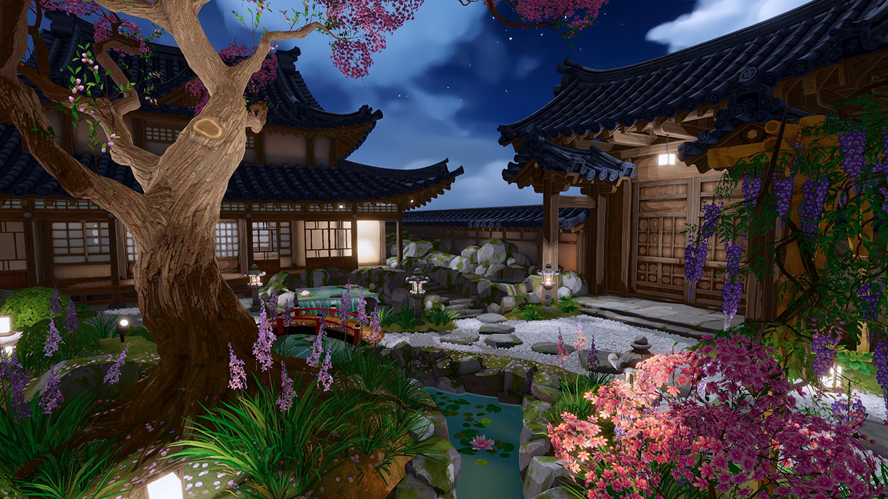

# Custom Lighting
 

The Shader Graph Custom Lighting sample shows how you can create your own custom lighting in Shader Graph and provides dozens of example templates, shaders, and subgraphs to help you get started with your own custom lighting.

 Documentation for this set of samples is broken into two pages:

* [Lighting Models](Shader-Graph-Sample-Custom-Lighting-Lighting-Models.md)
* [Components](Shader-Graph-Sample-Custom-Lighting-Components.md)

## Limitations
Before making your own custom lighting model in Shader Graph, be aware of the following limitations:

* Customizable lighting is only intended to be used when the render type is set to Forward or Forward+ in the Render Asset.
  
  When the render type is set to Deferred or Deferred+, it's not possible to control the lighting directly in an object’s shader, because the lighting occurs in a pass that is not directly connected to the object's shader.
  
  If you need to customize lighting in deferred rendering context, you have to write code instead of using Shader Graph.

* To support multiple light sources, you have to write a small amount of code.
  
  For the main directional light, you can create custom lighting 100% in Shader Graph. However, the part of the graph that does multiple light calculations requires the use of a Custom Function node, because Shader Graph doesn’t support `For` loops.
  
  The sample includes multiple examples of Additional Lights nodes, but if you want to create your own, you need to know a little bit of HLSL coding.

## Motivations
There are two main reasons you might want to customize the lighting model in Shader Graph:

* Improve rendering performance by leaving out one or more types of lighting calculations, sacrificing visual quality for rendering speed.

* Make your lighting look different from the lighting that Unity already provides. For example, you might want your project to look like a watercolor painting, like it’s drawn with pen and ink, etc.

## Examples
The sample includes the following subgraph examples in the Shader Graph node library:

* Lighting / Light Models / Lit Basic
* Lighting / Light Models / Lit Colorize
* Lighting / Light Models / Lit Simple
* Lighting / Light Models / Lit Toon
* Lighting / Light Models / Lit URP

To get customized lighting with any of these subgraphs: 
1. Add the subgraph to an empty Shader Graph.
1. Connect the Lit output port to the Base Color input port on the Unlit Master Stack.
1. To allow the Unlit target to correctly support custom lighting models, make sure to set the Graph inspector as follows:
   * Enable *Keep Lighting Variants*.
   * Disable *Default Decal Blending* and *Default SSAO*.

Notice that each of the above subgraphs use the following:
* The ApplyDecals subgraph to blend decal data with the original material properties.
* The Debug Lighting and Debug Materials subgraph nodes to support the debug rendering modes (available in the Rendering Debugger window).
* A subgraph from the Core Lighting Models category to define the behavior of the lighting itself.

While the ApplyDecals, DebugLighting, and DebugMaterials subgraph nodes aren’t strictly required, they are included in the lighting model subgraphs to enable these core engine features: decals and debug rendering modes. When these features are not in use, the ApplyDecals, DebugLighting, and DebugMaterials subgraph nodes don't add any performance cost to the shader overall. You can use them without worrying that you’re slowing down your project.

You can create any type of lighting that you want, but the above subgraphs show you a recommended pattern to illustrate how Unity expects custom lighting models to be defined.
