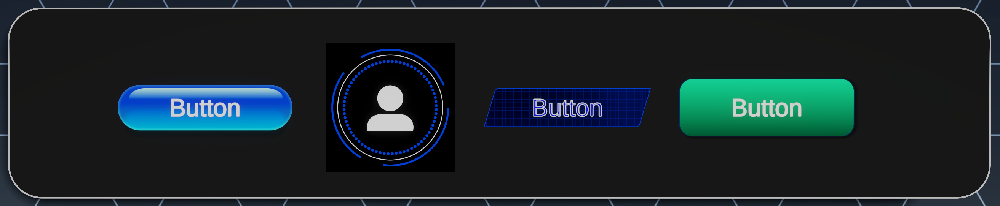

# Examples
These example shaders are built using the subgraph nodes. They show how the subgraph nodes work and how you can  combine them to create backgrounds, buttons, and meters.

## Backgrounds
The background examples are shaders that you can assign to Canvas Image objects that serve as backgrounds for other UI elements.

### 80sSunset
This example combines the LinearTime, Perspective, Move, SquareTiles, Bars, and AntiAliasing nodes to generate a perspective grid that scrolls into the distance.

Library Subgraph Nodes used in this example:
- Perspective
- LinearTime
- Move
- SquareTiles
- LinearGradient
- Bars
- AntiAliasing
- Gradients

### Animated Clouds
This example combines animated procedural noise to create interesting dynamic patterns.

### Blurred Hexagon
This example uses the SceneColorBlurred node to create a blurred version of the scene behind the user interface. It also uses the HexagonTiles node to generate a hexagon grid pattern. You can use the HexagonDisolve parameter to shrink and grow the size of the hexagons, which makes the pattern appear to dissolve.

Library Subgraph Nodes used in this example:
- SceneColorBlurred
- HexagonTiles

### Halftone
This example uses the Halftone node to convert the rendered scene behind the UI elements into a halftone pattern. It converts each of the three channels (red, green, and blue) into a halftone dot pattern, then recombines them to create the final image.

Library Subgraph Nodes used in this example:
- Halftone

### LavaLamp
This is an illustration of how distorted circle shapes can be animated to move around in random directions, and how signed distance field shapes can be blended together using the Smooth output of the SDFUnite node to merge the shapes.

Library Subgraph Nodes used in this example:
- SineTime
- Move
- Circle
- SDFUnite

### Pixelation
This example shows how to use the PosterizeUV node to quantize the UV coordinates used to sample the scene.  The result is a version of the scene that appears to be made of larger pixels.

Library Subgraph Nodes used in this sample:
- PosterizeUV

### RoundedRectangleBubble
This example shows how to create a rounded frame as a background, including an outline and a drop shadow, for other UI elements. To maintain the correct aspect ratio of the rounded corners in this shader, connect the exposed WidthHeight parameter of this shader to the UI Image element’s Width and Height parameters.  You can do this with the ImageSize script. Refer to [How to make shapes that adapt to the aspect ratio of the UI element](Shader-Graph-Sample-UGUI-Shaders-How-tos-aspect-ratio.md) for details on how to accomplish this.

Library Subgraph Nodes used in this sample:
- Scale
- LinearGradient
- Move
- Rectangle

### TechGrid
This example uses the SquareTiles node to generate a grid pattern and the AnimatedClouds node to create a smooth noise. These effects together create a nice tech grid for a background.

Library Subgraph Nodes used in this sample:
- AnimatedClouds
- SquareTiles

### WarpedGradient
This example shows how to warp UV coordinates with procedural noise and then use those warped coordinates to generate a deformed and blurry circle. It also darkens the corners of the screen using the Vignette node.

Library Subgraph Nodes used in this sample:
- Move
- Circle
- Vignette

## Buttons
 
These examples show how to create buttons of various visual styles. Each button has exposed parameters that control the button’s visual states - selected, pressed, and active. In the example scene, you can take a look at how these material parameters are connected to the button’s state events to drive the appearance of the button.

Many shape elements of the buttons use the AntiAliasing node which converts SDFs and gradients to perfectly anti-aliased shapes, regardless of scale or camera position. For more details on how to accomplish this, refer to [How to create a resolution-independent shape](Shader-Graph-Sample-UGUI-Shaders-How-tos-Res-indepenent.md).

### AquaButton
This example shows how to create an aqua-style button and includes a specular highlight, gradient shading, a fresnel outline, and a colored drop shadow. It adjusts to the aspect ratio of the button object it’s assigned to using the WidthHeight parameter. In the sample scene, notice that this material parameter is connected to the UI object’s width and height values using the ImageSize script.

Library Subgraph Nodes used in this sample:
- Move
- AspectRatio
- AnimatedSheen
- Pill

### SciFiButton
This example uses multiple circular elements and illustrates how multiple elements can be combined with subtract, maximum, lerp, and multiply.

Library Subgraph Nodes used in this sample:
- Circle
- CircleSegments
- AntiAliasing
- Scale
- PlayerIcon

### SciFiButton2
This button example is similar to the Tech Grid background.  It uses the SquareTiles node to create a grid and the AnimatedClouds node to create a smooth noise background. It also illustrates the use of the Tilt node to turn the rectangle shape into a parallelogram.

Library Subgraph Nodes used in this sample:
- AspectRatio
- LinearTime
- CircleSegments
- Rectangle
- AntiAliasing
- AnimatedSheen
- SquareTiles

### SimpleButton
This is an example of how you can create a simple button with a smooth gradient color, a drop shadow, and Selected, Pressed, and Active states.

Library Subgraph Nodes used in this sample:
- Move
- Scale
- LinearGradient
- Rectangle
- AntiAliasing

## Indicators

These UI elements indicate things to the player visually such as health level, ammo count, shield power, etc. All of them have an exposed material parameter called “Health” that drives the level of the meter. Using a script, you can connect this parameter to any value in your project to indicate its level to the player.

### AquaMeter
The style of this meter matches the AquaButton example - but instead of exposing button states, it has a controllable fill meter.

Library Subgraph Nodes used in this sample:
- AspectRatio
- Pill
- AntiAliasing
- HistogramScan

### DialMeter
This example uses polar coordinates to create a circular-shaped meter. It also uses drop-shadows on both the inner circle and the outer shape. The player icon at the center could be replaced with a texture sample or another SDF shape.

Library Subgraph Nodes used in this sample:
- AspectRatio
- Pill
- AntiAliasing
- HistogramScan

### FantasyMeter
This example could be used as a health or mana indicator for a fantasy game. It uses the SphereGradient node to generate fake lighting and reflections based on a procedurally-generated sphere shape. The sphere defaults to being filled with red liquid, but you can easily change the color to anything you like by using the exposed Color parameter.

Library Subgraph Nodes used in this sample:
- LinearGradient
- PosterizeGradient
- Hash11
- LinearTime
- GridTiles
- Move
- Circle
- HistogramScan
- Waves
- AntiAliasing
- Gradients
- SphereGradient

### SciFiMeter
This meter could be used to indicate ammo or shield level in a sci-fi-themed game. The cool thing about this one is that it starts to shake when the indicator gets low - to emphasize the urgency of low ammo or shields.

Library Subgraph Nodes used in this sample:
- Shake
- AspectRatio
- Tilt
- Rectangle
- AntiAliasing
- WindowBlinds
- PosterizeGradient
- HistogramScan

## Progress Bars
 

### FancyLoading
This is a circle that’s made of circles. Each circle starts large and then gets smaller over time and the effect is offset so it happens in a wave pattern. The larger circle pattern also appears to move and change perspective over time as if it were tilting around in a 3D space. These effects are all achieved by chaining together various nodes from the Subgraph Library.

Library Subgraph Nodes used in this sample:
- SineTime
- Perspective
- Scale
- Move
- LinearTime
- GridTiles
- Circle
- AntiAliasing

### GradientBar
This is a pill-shaped bar that fills up as the progress parameter increases from zero to one. The aspect ratio adapts if it’s correctly connected to the width and height parameters of the Canvas Image element it’s assigned to.

Library Subgraph Nodes used in this sample:
- Move
- Pill
- AntiAliasing
- Invert
- LinearGradient
- Scale
- Gradients

### ProgressCircle
This is a round dial that fills up in a circle shape as the progress parameter increases from zero to one. The start color and end color are exposed as parameters and can be adjusted to create different looks.

Library Subgraph Nodes used in this sample:
- Invert
- PosterizeGradient
- HistogramScan
- Circle
- AntiAliasing
- CircleSegments

### SimpleLoading
This is a circle made of pill-shaped elements that fade from white to black over time. Each element fades in a wave-like pattern that appears to go around the circle.  This type of animation is very commonly used as a loading indicator.

Library Subgraph Nodes used in this sample:
- Tilt
- Scale
- LinearTime
- GridTiles
- Pill
- AntiAliasing
