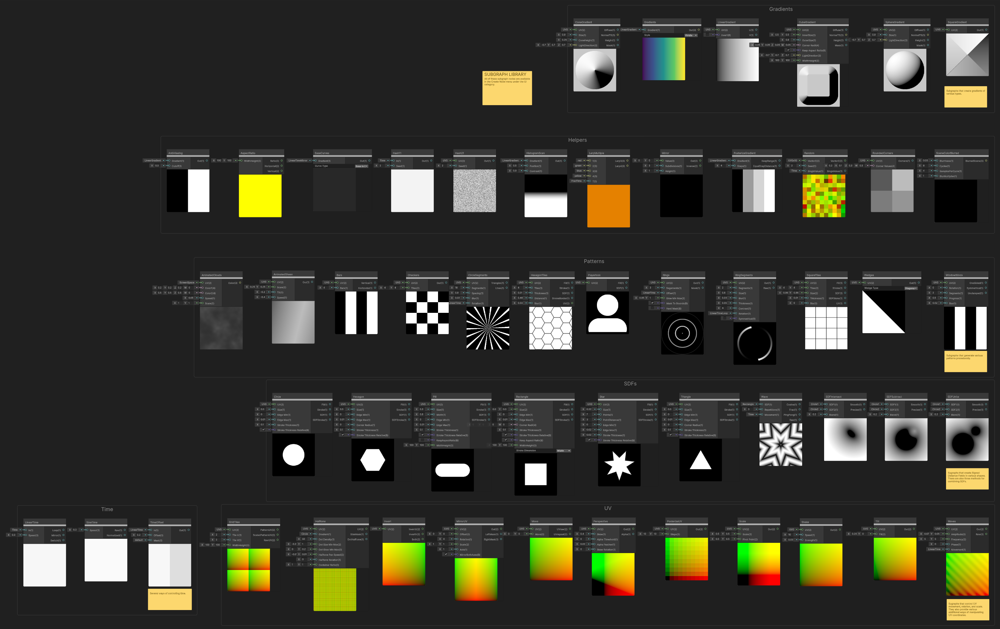

# Subgraph Nodes

The subgraphs have been created to help speed up the process of creating user interface elements. They’re building blocks that can be strung together quickly to achieve various appearances and functionalities. You can see all of the subgraph nodes in the collection by opening this shader file:
Assets/Samples/Shader Graph/<your version>/UGUI Shaders/Subgraphs/SubgraphLibrary

The subgraphs are broken into the following categories:
 - **Inputs** - These subgraphs provide input data.
 - **Utilities** - These subgraphs feature simple utilities to help with input data.
 - **Gradients** - These nodes generate gradients in various shapes including linear, spherical, square, and custom.
 - **Helpers** - these subgraphs provide commonly-used operations for building UI elements
 - **Patterns** - These nodes generate procedural patterns that can be used as backgrounds or masks.  The patterns include clouds, bars, checkers, circle segments, hexagon tiles, player icon, rings, ring segments, square tiles, wedges, and window blinds.
 - **SDFs** - Signed Distance Field shapes are the basis for UI elements. The value of each pixel in an SDF represents the distance to the edge of the shape. You can use the SDF data to create resolution-independent shapes that are either sharp or blurry. Shapes in the set include circle, hexagon, pill, rectangle, star, and triangle. This collection also contains operators for combining SDF shapes.
 - **Time** - These nodes output time in various forms - looping, mirroredm, sine wave, etc.
 - **UV** - These nodes manipulate UV coordinates including move, scale, tilt, mirror, invert, and more. Shapes and elements can be transformed by adjusting their UV coordinates with these nodes.
 

## Inputs

### Canvas Color
This subgraph outputs the UI element color in linear space, performing color space conversion on vertex color if the Canvas is set to store vertex colors in gamma space.
Make sure to check "Disable Color Tint" in the Graph Settings when using the Canvas Color node, to not tint the final output.

## Utilities

### SelectableStateCompare
This subgraph takes a Selectable State as a float and outputs Boolean values to inform on the states.

### SelectableStatePreview
This subgraph takes a Selectable State as a float input and features a dropdown to override its value withing Shader Graph only. This allows previewing what things look like when in a given state.
This has no effect on the final shader that will always use the provided input.

### SliderDirectionCompare
This subgraph takes a Direction as a Vector2 and outputs Boolean values to inform on cardinals.

### SliderDirectionPreview
This subgraph takes a Direction as a Vector2 input and features a dropdown to override its value withing Shader Graph only. This allows previewing what things look like with a different direction is used.
This has no effect on the final shader that will always use the provided input.

### Gradients
This node is a collection of commonly used gradients. You can select the gradient you want to use from the Style dropdown. By default, a horizontal LinearGradient is used as the input, but you can pass in any input gradient you want.

#### Cone Gradient
Creates a Gradient, Normals, Height, and a Mask for a procedurally-generated cone. This allows you to create 3d effects in a 2d environment. The Size input port controls the size of the generated cone relative to the UV space. ConeHeight input controls the height above the base of the cone’s center point.  The LightDirection input port is a vector that determines the direction the light is coming from for the Diffuse gradient output. The Diffuse output uses the cone’s normals and the incoming LightDirection to calculate diffuse lighting. Areas of the Diffuse gradient facing away from the LightDirection will have negative values, so you may need to use a Saturate node to limit the range of the output to zero to one. The NormalTS output is a normalized vector that indicates the direction each pixel on the cone’s surface is facing. The Height output is a heightmap for the cone. The Mask output is white inside the cone and black outside.

Usage Examples: 
- Examples/Backgrounds/80sSunset
- Examples/Indicators/FantasyMeter

#### Linear Gradient
This node uses UV coordinates to create a vertical or horizontal gradient from black to white. By default, the node uses the UV coordinates from the UI element, but you can also pass in your own coordinates to the UV input port. The U output port creates a horizontal gradient and the V output port creates a vertical gradient.

Usage Examples: 
- Examples/Backgrounds/80sSunset
- Examples/ProgressBars/GradientBar

#### Cube Gradient
Creates a gradient, normals, height, and a mask for a procedurally-generated cube. This allows you to create 3d effects in a 2d environment. The InnerSize and OuterSize input ports control the size of the generated cube relative to the UV space. The LightDirection input port is a vector that determines the direction the light is coming from for the Diffuse gradient output. The Diffuse output uses the cube’s normals and the incoming LightDirection to calculate diffuse lighting. Areas of the Diffuse gradient facing away from the LightDirection will have negative values, so you may need to use a Saturate node to limit the range of the output to zero to one. The NormalTS output is a normalized vector that indicates the direction each pixel on the sphere’s surface is facing. The Mask output is white inside the sphere and black outside.

#### Sphere Gradient
Creates a gradient, normals, height, and a mask for a procedurally-generated sphere. This allows you to create 3d effects in a 2d environment. The Size input port controls the size of the generated sphere relative to the UV space. The LightDirection input port is a vector that determines the direction the light is coming from for the Diffuse gradient output. The Diffuse output uses the sphere’s normals and the incoming LightDirection to calculate diffuse lighting. Areas of the Diffuse gradient facing away from the LightDirection will have negative values, so you may need to use a Saturate node to limit the range of the output to zero to one. The NormalTS output is a normalized vector that indicates the direction each pixel on the sphere’s surface is facing. The Mask output is white inside the sphere and black outside.

Usage Examples: 
- Examples/Indicators/FantasyMeter

### Helpers

#### Anti Aliasing
You can use this node to create a perfectly anti-aliased edge from any SDF shape or gradient regardless of the size of the shape or the camera’s distance from the UI element. You can use it to create resolution-independent UI elements. The Cutoff input controls the point along the input gradient where the hard edge should be. See the documentation section entitled “How to create a resolution-independent shape” for instructions on using this node.

Usage Examples: 
- Examples/Indicators/FantasyMeter
- Examples/Backgrounds/LavaLamp

#### Aspect Ratio
Given the Width and Height of the UI element, this node calculates the aspect ratio of the UI element. It can be used to create buttons and widgets that correctly adapt to changes in the width or height of the assigned UI element. It works best when the WidthHeight input port is connected to the Width and Height parameters of the assigned UI element. See the documentation section entitled “How to make shapes that adapt to the aspect ratio of the UI element” for more information.

Usage Examples: 
- Examples/Indicators/AquaMeter
- Subgraphs/SDFs/Pill

#### Ease Curves
This node adjusts the falloff curve of the input gradient. There are 9 available falloff curves.  More information on the falloff curves can be found here: https://easings.net/  By default, the input Gradient is LinearTimeMirror, but you can use any type of gradient you want.

#### Hash11
Given an input value In and a Seed, this node generates a deterministic random value in the 0 to 1 range as output. Time is used as the default input, but you can use any input value you want.

Usage Examples:
- Examples/Indicators/FantasyMeter

#### Hash21
Given a vector2 value UV (such as UV coordinates) and a Seed, this node generates a deterministic random value as output. UV0 is the default UV input, but you can use any vector 2 value you want.

#### Histogram Scan
This node allows you to convert a gradient or SDF into a solid shape. You can control the Position along the gradient where the solid edge forms as well as the hardness of the edge using Contrast input. The lower the Contrast value, the softer the edge.

Usage Examples:
- Examples/ProgressBars/ProgressCircle
- Examples/Indicators/DialMeter

#### Lerp Multiple
This node works in a similar way as the Lerp node, but allows you to blend between 3 or 4 values instead of just 2. FracTime is used as the default for the T value but you can use any value you want.

#### Mirror
This node flips the input value back and forth. The number of times to repeat the back and forth pattern is determined by the Subdivisions input.

Usage Examples:
- Subgraphs/SDFs/Wave

#### PosterizeGradient
This node quantizes gradients into discrete steps. The number of steps is controlled by the Steps input. The step divisions can be divided to preserve the overall range or to preserve the step distance.

Usage Examples:
- Examples/ProgressBars/ProgressCircle
- Examples/Indicators/SciFiMeter

#### Random
Given UV coordinates and a Seed, this node generates random values - either Vector 2 or Float. Because the method used to generate the values uses a sine function, it is non-deterministic, may vary on various hardware platforms (depending on the hardware implementation of sine), and may exhibit repetitive patterns when given large input values. If you are seeing these issues, use the Hash11 or Hash21 nodes instead.

Usage Examples:
- Subgraphs/UV/Shake.shadersubgraph

#### RoundedCorners
This is a helper node used by the SDF Rectangle node.  It helps to generate the rounded corners of the rectangle.

Usage Examples:
- Subgraphs/SDFs/Rectangle

#### Scene Color Blurred
This node samples the Scene Color node in a spiral pattern and averages the result to create the appearance of blurring the scene background behind the UI element. Cycles is the number of turns of the spiral. Use Samples Per Cycle to control the number of samples in each cycle. The total number of samples is Cycles times Samples Per Cycle.  Higher numbers of samples result in smoother blur appearance but higher cost. Lower sample numbers give better performance but grainier results. See the Sticky Notes inside the subgraph for more information.

Usage Examples:
- Examples/Backgrounds/BlurredHexagon

### Patterns

#### Animated Clouds
Generates an animated cloud pattern. By default, the clouds are generated in screen space, but you can also pass in your own UV coordinates. You can control the color of the clouds with the Color1 and Color2 inputs.  The speed of cloud movement is controlled with the Speed input. And the size of the clouds can be controlled with the Scale input.

Usage Examples:
- Examples/Backgrounds/TechGrid
- Examples/Buttons/SciFiButton2

#### Animated Sheen
This node creates a scrolling highlight gradient. It’s intended to create the animated sheen on buttons - especially when the button is selected or the user’s mouse is hovering over the button. You can control the size of the effect with the Scale input. The angle of tilt can be adjusted with the Tilt input value. And you can control the Speed that the effect scrolls with the Speed input.

Usage Examples:
- Examples/Buttons/AquaButton
- Examples/Buttons/SciFiButton2

#### Bars
This node generates vertical or horizontal bars (an alternating black and white pattern) depending on the output port you use. You can control the number of bars using the Bars input.

#### Checkers
This node generates a simple checkerboard pattern. You can control the scale of the pattern using the Tiles input.

#### Circle Segments
This node divides a circle into the given number of segments and alternates them between black and white.  The width and blur of the segments can be controlled with the Spacing and Blur inputs. The segments can be output as triangles or lines. You can also rotate the pattern using the Rotation input.

Usage Example:
- Examples/Buttons/SciFiButton

#### Hexagon Tiles
This node creates a hexagon grid. The Tiles input controls the scale of the hexagon tiles. The Thickness input controls the width of the Stroke outlines. The Distance input controls the size of the white parts of the tiles relative to the black lines. The Blur input controls the blurriness of the tile outlines.  An interesting and useful inverse SDF effect can be achieved by setting the Distance input to 0 and the Blur input to 0.5.

Usage Examples:
- Examples/Backgrounds/BlurredHexagon

#### Player Icon
This node creates an avatar icon. It combines the Circle and Pill SDF nodes. It’s a good example of how SDFs can be combined to create other shapes.

Usage Examples:
- Examples/Buttons/SciFiButton
- Examples/Indicators/DialMeter

#### Rings
This subgraph generates a series of concentric rings. You can select the number of rings with the Segments input. You can control how sharp or blurry the rings are with the Glow Min Max input. You can crop the rings at the edges with the Mask To Bounds input. The Offset input moves the rings toward or away from the center. By default it’s set to LinearTime but you can use any input value.

#### Ring Segments
This node generates a set of rotating ring segments. You can control the number of segments with the Segments input. The Size input controls how far the segments are from the center. The Blur input controls how sharp or blurry the edges of the segments are. The Thickness input controls the width of the segments. The Contrast input controls the falloff of the segment’s tail. The Rotation input controls the movement or position around the circle of the segments.

#### Square Tiles
This node generates a grid pattern of square tiles. The Tiles input controls the number of tiles in each dimension. Size controls the size of the white squares vs black lines in both dimensions. The lower these values are, the thicker the black outlines will be. Blur controls the sharpness/blurriness of the white squares. You’ll most likely need to turn the Size value down in order to make room for blurry edges.

Usage Examples:
- Examples/Backgrounds/TechGrid
- Examples/Buttons/SciFiButton2

#### Wedges
This node generates wedge patterns of various types. The type can be selected with the dropdown box.

Usage Examples:
- Subgraphs/Gradients/SquareGradient

#### Window Blinds
This node generates a bar pattern that can expand or contract to give the appearance of opening and closing window blinds. The Rotation input controls the orientation of the blinds in degrees. The Segments input controls the number of blinds. The Progress input controls the balance between black and white. Higher values make the white bars larger and lower values make the black bars larger. Blur controls the sharpness/blurriness of the bard edges.

Usage Example:
- Examples/Indicators/SciFiMeter

### SDFs
SDFs or Signed Distance Fields are a very useful way of representing procedurally-generated shapes. The value of each pixel in the SDF represents the distance to the nearest shape edges. Pixels inside the shape have negative values - also indicating the distance to the nearest edge.

SDFs can be used to create a final shape using the Fill output of the SDF node, using the Histogram Scan node, or the AntiAliasing node.  The AntiAliasing node specifically will create shapes that are perfectly anti-aliased regardless of scale, camera distance, or resolution.

Each of the SDF shape nodes outputs the shape from the Fill output.  The Stroke port outputs an outline of the shape. The Stroke Thickness input parameter controls the width of the Stroke outline. The nodes also output the SDF itself as well as the Stroke SDF.

You can control the sharpness or blurriness of the Fill shape by using the Edge Min and Edge Max controls. The closer together the values are, the sharper the edge of the shape will be. The farther apart the values are, the softer/blurrier the edges will be. A blurry SDF shape makes a great drop shadow.

#### Circle
Creates a circle shape.

- Usage Examples:
- Examples/Buttons/SciFiButton
- Examples/Indicators/FantasyMeter
- Examples/Indicators/DialMeter

#### Hexagon
Creates a hexagon shape. It’s possible to round the corners of the hexagon using the Corner Radius input parameter.

#### Pill
Generates a pill shape. You can control the height of the pill with the Size parameter. You can control the width of the pill with the Width parameter. To control the aspect ratio of the pill, use the WidthHeight parameter to enter the dimensions of the UI element.

Usage Examples:
- Examples/Buttons/AquaButton
- Examples/ProgressBars/GradientBar

#### Rectangle
Creates a rectangle shape. You can round the corners of the rectangle using the four Corner Radii input values. To control the aspect ratio of the rectangle, use the WidthHeight parameter to enter the dimensions of the UI element.

Usage Examples:
- Examples/Buttons/SimpleButton
- Examples/Backgrounds/RoundedRectangleBubble

#### Star
Creates a star shape. You can control the number of points and the point distance. 

#### Triangle
Creates a triangle shape. It’s possible to round the corners of the triangle using the Corner Radius input parameter.

#### Waves
Generates an animated wave pattern from any SDF. You can control the number of waves and the movement of the waves using the Repetitions and Movement parameters.

Usage Example:
- Examples/Indicators/FantasyMeter

#### SDF Intersect
This is a basic boolean intersection operation between two SDFs. The result is the intersection where the two shapes overlap.  Using the Smooth output allows the result to have a soft blend instead of the hard edge.

#### SDF Subtract
This is a basic boolean intersection operation between two SDFs. The result is the second SDF subtracted from the first.  Using the Smooth output allows the result to have a soft blend instead of the hard edge.

#### SDF Unite
This is a basic boolean intersection operation between two SDFs. The result is the two SDF shapes combined together.  Using the Smooth output allows the result to have a soft blend instead of the hard edge.

Usage Example:
- Examples/Backgrounds/LavaLamp

### Time

#### LinearTime
Outputs time values that increase linearly. The Loop output increases linearly from 0 to 1 and then jumps back to zero.  The Mirror output increases linearly from 0 to 1 and then decreases linearly back to 0 and repeats this back and forth cycle. The Switch output jumps from 0 directly to 1 and then back to 0 again.

Usage Examples:
- Examples/Backgrounds/80sSunset
- Examples/Buttons/SciFiButton2
- Examples/Indicators/FantasyMeter

#### SineTime
The Raw output flows in a smooth curve from -1 to 1 and back. The Normalized output flows in a smooth curve between 0 and 1.

Usage Examples:
- Examples/ProgressBars/FancyLoading
- Examples/Backgrounds/LavaLamp

#### TimeOffset
Allows you to use a mask to determine areas where time is offset. The maximum offset value is defined by the Offset input. Areas where the Mask is 1 are time offset by the maximum amount. Areas where the Mask is 0 are not time offset.

### UV
#### GridTiles
Divides the UV space into the number of tiles defined by Tile U and Tile V. Aspect ratio can be maintained by inputting correct values into WidthHeight

Usage Examples:
- Examples/Indicators/FantasyMeter
- Examples/ProgressBars/FancyLoading

#### Halftone
Divides the UV space into halftone space or outputs a halftone pattern based on the input gradient where the size of the dots are determined by the shades in the input gradient. Areas where the input gradient is white have the largest halftone dots.

Usage Example:
- Examples/Backgrounds/Halftone

#### Invert
Flips the U coordinate, the V coordinate, or both.

Usage Example:
- Examples/Indicators/DialMeter
- Examples/ProgressBars/GradientBar
- Examples/ProgressBars/ProgressCircle

#### MirrorUV
Takes UV coordinates in the 0 to 1 range and converts them to go from 0 to 1 to 0 again. You can control the offset, rotation, scale, and axis to mirror.

#### Move
Moves UV coordinates the amount specified by the Move input.

Usage Examples:
- Examples/Backgrounds/80sSunset
- Examples/Backgrounds/LavaLamp
- Examples/Backgrounds/WarpedGradient
- Examples/Buttons/SimpleButton

#### Perspective
Distorts UV coordinates to make it look like perspective is applied as if the object were rotated away from the camera. Because of the perspective warping, some empty space is created around the edges. This empty space is black in the Alpha output. The Alpha Threshold and Alpha Feather inputs control the edges of the empty space.

Usage Examples:
- Examples/ProgressBars/FancyLoading
- Examples/Backgrounds/80sSunset

#### PosterizeUV
Divides smooth UV coordinates into discrete, quantized units. The number of units can be specified with the Steps input. This node works well to convert a high resolution image into a low resolution one.

Usage Example:
- Examples/Backgrounds/Pixelation

#### Scale
Scales texture coordinates by the amount specified in Scale around the point specified by Pivot Point.

Usage Examples:
- Examples/Backgrounds/RoundedRectangleBubble
- Examples/Buttons/SciFiButton
- Examples/Indicators/DialMeter

#### Shake
Oscillates UV coordinates back and forth quickly by a random amount and using the Speed and Strength inputs.

Usage Example:
- Examples/Indicators/SciFiMeter

#### Tilt
Tilts the UV coordinates so that the resulting object slants to the left or right.

Usage Examples:
- Examples/Indicators/SciFiMeter
- Examples/ProgressBars/SimpleLoading

#### Waves
Distorts the UV coordinates in a wave pattern. The strength and size of the waves can be controlled with the Amplitude and Frequency inputs.

Usage Example:
- Examples/Indicators/FantasyMeter