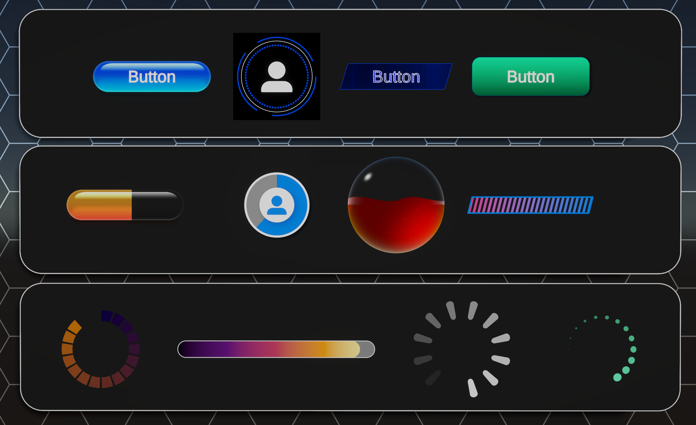

# UGUI Shaders
 

The Shader Graph UGUI Shaders sample is a collection of Shader Graph subgraphs that serve as building blocks for building user interface elements. They speed up the process of building widgets, buttons, and backgrounds for the user interface of your project.  Using these tools, you can build dynamic, procedural UI elements that don’t require any texture memory and scale correctly for any resolution screen.

In addition to the subgraphs, the sample also includes example buttons, indicators, and backgrounds built using the subgraphs.  The examples show how the subgraphs function in context and help you learn how to use them.

We have two main objectives with this sample set:

 - Demonstrate Shader Graph’s ability to create dynamic, resolution-independent user interface elements in a wide variety of shapes and styles.
 - Make it easier and faster to create UI elements by providing a large set of UI-specific subgraph nodes that can be used as building blocks to speed up the creation process.

 Using Shader Graph and UGUI, you can create user interface elements that are resolution independent, require zero texture memory, can be authored and edited directly in Shader Graph inside of Unity, automatically adapt to aspect ratio, and contain all visual states and behaviors.  That’s a lot, so let’s unpack it!

 - **Resolution Independent** - These UI elements are procedurally-generated, so they look perfectly crisp whether displayed on a small smartphone screen or a 100 inch 8k TV. You can zoom in on them as close as you want and they’ll always be tack sharp.
 - **Zero Texture Memory** - The visuals for these UI elements are created using math, so they don’t rely on textures at all. That means they require zero texture memory.
 - **Authored In Shader Graph** - If you’re frustrated by the back and forth workflow of editing your UI images outside of Unity, chopping them up into textures, importing them, and then going back to make adjustments, you’ll be glad to hear that these UI elements are created entirely in Shader Graph, so there’s no export/import loop. Adjustments require simply changing shader parameters or re-wiring a few nodes.
 - **Automatically Adapt To Aspect Ratio** - By passing the width and height values of the assigned UI element into the shader, the shader can automatically adapt the visuals to fit that ratio. No more making different button shapes to fit different size buttons or fiddling with 9 slicing.
 - **Contain all visual states and behaviors** - One shader can contain all the information needed for a hover state, and active/inactive state, a pressed down state, etc, so you don’t need to manage multiple image assets for each button or widget.

 This set of samples demonstrates how to use all of these advanced techniques for generating UI, and provides tools to make the process easier.

 Documentation for this set of samples is broken into the following pages:

* [Getting started](Shader-Graph-Sample-UGUI-Shaders-Getting-Started.md)
* [Custom UI componenents](Shader-Graph-Sample-UGUI-Shaders-Custom-UI-components.md)
* [Custom nodes](Shader-Graph-Sample-UGUI-Shaders-Custom-nodes.md)
* [Subgraph nodes](Shader-Graph-Sample-UGUI-Shaders-Subgraph-nodes.md)
* [Examples](Shader-Graph-Sample-UGUI-Shaders-Examples.md)
* [How tos](Shader-Graph-Sample-UGUI-Shaders-How-tos.md)
    * [How to create a resolution-independent shape](Shader-Graph-Sample-UGUI-Shaders-How-tos-Res-indepenent.md)
    * [How to create a functioning button](Shader-Graph-Sample-UGUI-Shaders-How-tos-Button.md)
    * [How to make shapes that adapt to the aspect ratio of the UI element](Shader-Graph-Sample-UGUI-Shaders-How-tos-aspect-ratio.md)
* [Notes on performance](Shader-Graph-Sample-UGUI-Shaders-Notes-on-performance.md)
