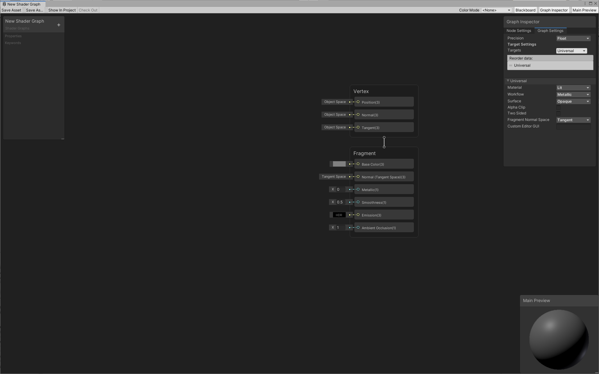

# Shader Graph Window

The **Shader Graph Window** contains the workspace to edit your shader graphs.

To access the **Shader Graph Window**, you must first create a [Shader Graph Asset](index.md). If the Shader Graph window doesn't open automatically after you [create a new shader graph asset](create-shader-graph.md), you have to double-click on the created asset.

## Shader Graph window layout

| Label | Name | Description |
| :--- | :--- | :--- |
| **A** | [Toolbar](#toolbar) | A set of tools to manage the shader graph asset, display elements in the window, and more. |
| **B** | [Workspace](#workspace) | The area where you create your graph. |
| **C** | [Master Stack](Master-Stack.md) | The final connection that determines your shader output. It consists of two separate contexts: **Vertex** and **Fragment**. |
| **D** | [Main Preview](Main-Preview.md) | Previews the current shader output. Use this to rotate the object, and zoom in and out. You can also change the basic mesh on which the shader is previewed. |
| **E** | [Blackboard](Blackboard.md) | Contains all of the shader's properties and keywords in a single, collected view. Use the Blackboard to add, remove, rename, and reorder properties and keywords. |
| **F** | [Graph Inspector](Internal-Inspector.md) |  Displays the properties of the currently selected component. Use this to modify properties, node options, and the graph settings. This window is hidden by default and only appears when something is selected that can be edited by the user. |

## Toolbar

Use the **Shader Graph Window** toolbar to manage the shader graph asset, display elements in the window, and more.

| Icon                | Item                | Description |
|:--------------------|:--------------------|:------------|
|  | **Save Asset**      | Save the graph to update the [Shader Graph Asset](index.md). |
|  | **Save As**         | Save the [Shader Graph Asset](index.md) under a new name. |
| | **Show In Project** | Highlight the [Shader Graph Asset](index.md) in the [Project Window](https://docs.unity3d.com/Manual/ProjectView.html). |
| | **Check Out**       | If version control is enabled, check out the [Shader Graph Asset](index.md) from the source control provider. |
|  | **Color Mode Selector**      | Select a [Color Mode](Color-Modes.md) for the graph. |
|  | **Blackboard**      | Toggle the visibility of the [Blackboard](Blackboard.md). |
|  | **Graph Inspector** | Toggle the visibility of the [Graph Inspector](Internal-Inspector.md). |
|  | **Main Preview**    | Toggle the visibility of the [Main Preview](Main-Preview.md). |
|  | **Help**     | Open the Shader Graph documentation in the browser. |
|  | **Resources** | Contains links to Shader Graph resources (like samples and User forums). |

## Workspace

Use the **Shader Graph Window** workspace to create [Node](Node.md) networks and connect them to the **Master Stack**.

To navigate the workspace, do the following: 
- Press and hold the Alt key and drag with the left mouse button to pan. 
- Use the mouse scroll wheel to zoom in and out.

You can hold the left mouse button and drag to select multiple [Nodes](Node.md) with a marquee. There are also various [shortcut keys](Keyboard-shortcuts.md) you can use for better workflow.

### Context Menu

Right-click in the workspace area, on a node, or on a selection of nodes to open a context menu.

| Item                         | Description |
|:-----------------------------|:------------|
| **Create Node**              | Opens the [Create Node Menu](Create-Node-Menu.md). |
| **Create Sticky Note**       | Creates a new [Sticky Note](Sticky-Notes.md) on the Graph. |
| **Collapse All Previews**    | Collapses previews on all nodes. |
| **Cut**                      | Removes the selected nodes from the graph and places them in the clipboard. |
| **Copy**                     | Copies the selected nodes to the clipboard. |
| **Paste**                    | Pastes the nodes from the clipboard. |
| **Delete**                   | Deletes the selected nodes. |
| **Duplicate**                | Duplicates the selected nodes. |
| **Select** > **Unused Nodes**    | Selects all nodes on the graph that are not contributing to the final shader output from the [Master Stack](Master-Stack.md). |
| **View** > **Collapse Ports**    | Collapses unused ports on all selected nodes. |
| **View** > **Expand Ports**      | Expands unused ports on all selected nodes. |
| **View** > **Collapse Previews** | Collapses previews on all selected nodes. |
| **View** > **Expand Previews**   | Expands previews on all selected nodes. |
| **Precision** > **Inherit**      | Sets the precision of all selected nodes to Inherit. |
| **Precision** > **Float**        | Sets the precision of all selected nodes to Float. |
| **Precision** > **Half**         | Sets the precision of all selected nodes to Half. |

## Additional resources

* [Color Modes](Color-Modes.md)
* [Create Node Menu](Create-Node-Menu.md)
* [Keyboard shortcuts](Keyboard-shortcuts.md)
* [Master Stack](Master-Stack.md) 
* [Nodes](Node.md)
* [Sticky Notes](Sticky-Notes.md)
