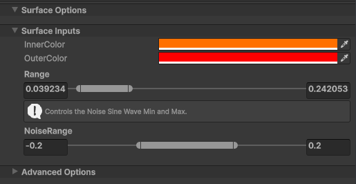

# Shader Graph samples

## Description

The Shader Graph package offers sample Assets, which you can download through **Package Manager**. When you import these samples, Unity places the files in your Project's Asset folder. The files contain examples that demonstrate how to use Shader Graph features.

## Add samples

To add samples to your project:

1. In the main menu, go to **Window** > **Package Management** > **Package Manager**.

1. Select **Shader Graph** from the list of packages.

1. In the **Samples** section, select **Import** next to a sample.

1. Open the sample assets from the `Assets/Samples/Shader Graph/<your version>/` folder.

## Available samples

The following samples are currently available for Shader Graph.

| Procedural Patterns |
|:--------------------|
| |
| This collection of Assets showcases various procedural techniques possible with Shader Graph. Use them directly in your Project, or edit them to create other procedural patterns. The patterns in this collection are: Bacteria, Brick, Dots, Grid, Herringbone, Hex Lattice, Houndstooth, Smooth Wave, Spiral, Stripes, Truchet, Whirl, Zig Zag. |

| Node Reference |
|:--------------------|
| |
| This set of Shader Graph assets provides reference material for the nodes available in the Shader Graph node library. Each graph contains a description for a specific node, examples of how it can be used, and useful tips. Some example assets also show a break-down of the math that the node is doing. You can use these samples along with the documentation to learn more about the behavior of individual nodes. |

| [Feature Examples](Shader-Graph-Sample-Feature-Examples.md) |
|:--------------------|
| |
| This is a collection of over 30 Shader Graph files.  Each file demonstrates a specific shader technique such as angle blending, triplanar projection, parallax mapping, and custom lighting. While you won’t use these shaders directly in your project, you can use them to quickly learn and understand the various techniques, and recreate them into your own work. Each file contains notes that describe what the shader is doing, and most of the shaders are set up with the core functionality contained in a subgraph that’s easy to copy and paste directly into your own shader. The sample also has extensive documentation describing each of the samples to help you learn.

| [Production Ready Shaders](Shader-Graph-Sample-Production-Ready.md) |
|:--------------------|
| |
| The Shader Graph Production Ready Shaders sample is a collection of Shader Graph shader assets that are ready to be used out of the box or modified to suit your needs.  You can take them apart and learn from them, or just drop them directly into your project and use them as they are. The sample includes the Shader Graph versions of the HDRP and URP Lit shaders. It also includes a step-by-step tutorial for how to combine several of the shaders to create a forest stream environment.

| [UGUI Shaders](Shader-Graph-Sample-UGUI-Shaders.md) |
|:--------------------|
| |
| The Shader Graph UGUI Shaders sample is a collection of Shader Graph subgraphs that you can use to build user interface elements. They speed up the process of building widgets, buttons, and backgrounds for the user interface of your project.  With these tools, you can build dynamic, procedural UI elements that don’t require any texture memory and scale correctly for any resolution screen. In addition to the subgraphs, the sample also includes example buttons, indicators, and backgrounds built with the subgraphs.  The examples show how the subgraphs function in context and help you learn how to use them.

| Custom Material Property Drawers |
|:--------------------|
| |
| This sample contains an example of a Custom Material Property Drawer that allows using a Min/Max Slider to control a Vector2 x and y values, often used for range remapping. It comes with a documented Shader Graph example. |
