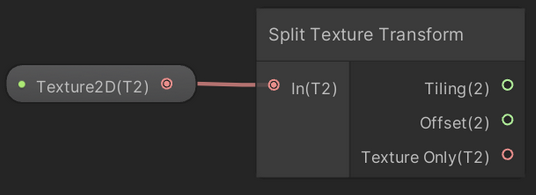

# Split Texture Transform Node

## Description
This node makes it possible to separately output tiling, offset, and texture data for a Texture 2D asset. That enables you to present an asset differently in a specific context—to warp it in a mirror, for example—and put it into the UV without modifying the original asset.

This node outputs the texture with its tiling set to (0,0) and scale set to (1,1). That activates the shader property [NoScaleOffset](https://docs.unity3d.com/Manual/SL-Properties.html), which enables you to modify **Tiling Offset** values via the Material Inspector.

Another term you may hear for tiling in this context is scale. Both terms refer to the size of the texture tiles.

### Ports

| **Name**        | **Direction** | **Type** | **Description** |
|--------------|-----------|-----------|------------------------------------------------------------------------|
| In           | Input     | Texture2D | The Texture 2D Node input.                                              |
| Tiling       | Output    | Vector 2  | Amount of tiling to apply per channel, set via the Material Inspector. |
| Offset       | Output    | Vector 2  | Amount of offset to apply per channel, set via the Material Inspector. |
| Texture Only | Output    | Vector 2  | The input Texture2D, without tiling and offset data. |
