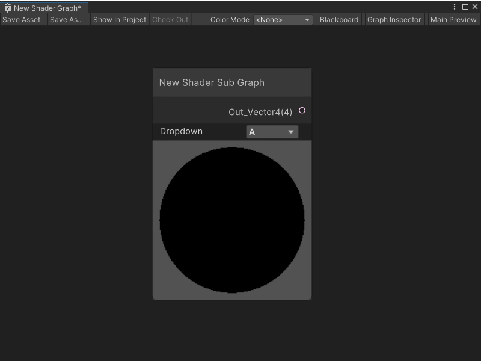
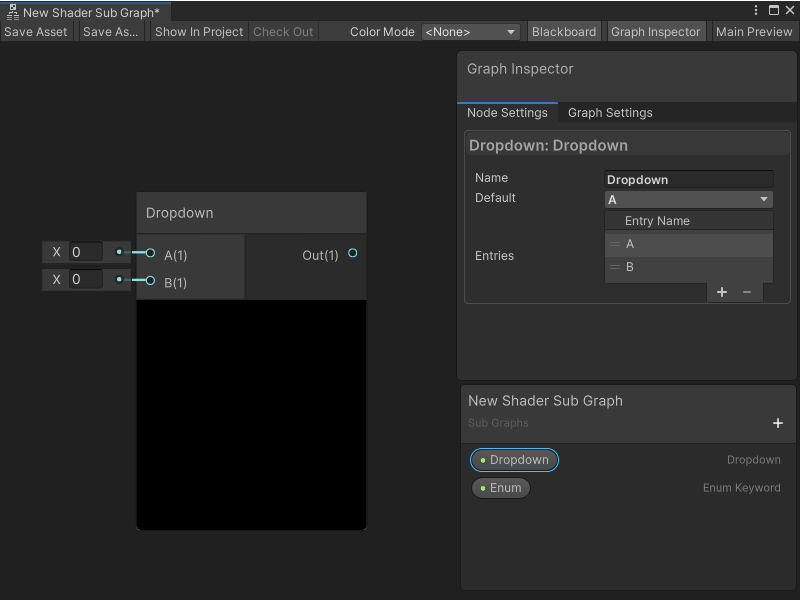

# Subgraph Dropdown node

The Subgraph Dropdown node is a node representation of a Dropdown property. It allows you to create a custom dropdown menu on a Subgraph node in its parent Shader Graph. You can specify the number of options that appear in the dropdown menu, and their names.

After you create a Dropdown property and add a Dropdown node to a Subgraph, the Subgraph node in any parent Shader Graph displays with a dropdown control:

## Create Node menu category

The Subgraph Dropdown node isn't accessible from the Create Node menu.

To add a Subgraph Dropdown node to a Subgraph:

1. In the Shader Graph window, open a Subgraph.

2. In the Blackboard, select **Add** (+) and select **Dropdown**.

3. Enter a name for your new Dropdown property, and press Enter.

4. Select your Dropdown property and drag it onto your graph to create a new Subgraph Dropdown node.

5. Select your new Dropdown node in your graph or the Dropdown property in the Blackboard and open the Graph Inspector.

6. Select the **Node Settings** tab.

7. In the **Entries** table, select **Add to the list** (+) to add a new option to your dropdown. Each Entry adds a corresponding input port to your node.
    To remove an Entry, select its handle in the list and select **Remove selection from the list** (-).

8. (Optional) In the **Default** list, select the default Entry that you want Shader Graph to select on your property.

## Compatibility

The Subgraph Dropdown [!include[nodes-compatibility-all](./snippets/nodes-compatibility-all.md)]    <!-- ALL PIPELINES INCLUDE  -->

## Ports

> [!NOTE]
> The Subgraph Dropdown node's number of input ports and their names directly correspond to the settings you specify in the Graph Inspector's **Node Settings** tab. The node always has one output port.

A Subgraph Dropdown node's input ports always have the **DynamicVector** type. This means that you can make a connection to an input port from any node that outputs a float, Vector 2, Vector 3, Vector 4, or Boolean value. For more information, see [Dynamic Data Types](Data-Types.md#dynamic-data-types).

It has one output port:

| **Name**     | **Type**      | **Description**  |
| :---         | :-----------  |   :----------    |
| Out          | DynamicVector |  The selected option from the dropdown menu on the parent Shader Graph's Subgraph node. This value can also be the specified **Default** for the property in the Graph Inspector's **Node Settings** tab.     |

## Example graph usage

In the following example, a Subgraph Dropdown node changes the UV channel it sends to the Subgraph's Output node. The selection on the Subgraph node in the parent graph changes whether the Subgraph outputs **UV1** or **UV0**. If the Subgraph is used in multiple Shader Graphs, the Subgraph Dropdown node can change the UV channel output without changing the Subgraph:

## Related nodes

<!-- OPTIONAL. Any nodes that may be related to this node in some way that's worth mentioning -->

[!include[nodes-related](./snippets/nodes-related.md)] Subgraph Dropdown node:

- [Subgraph node](Sub-graph-Node.md)
