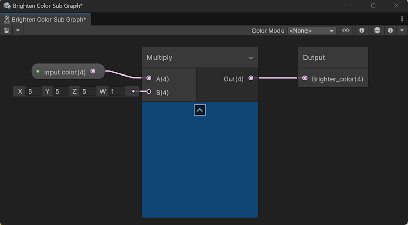
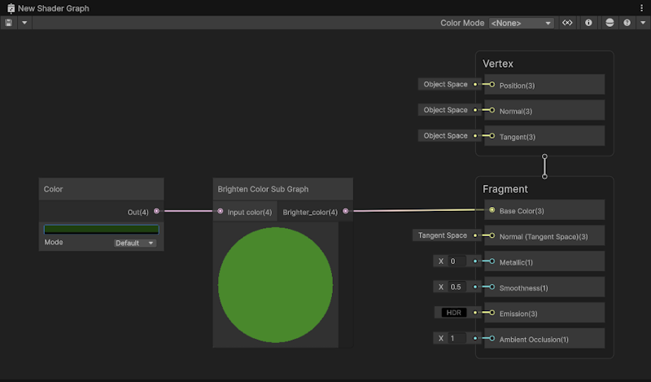

# Introduction to Sub Graphs

A Sub Graph is a type of shader graph that you include in other shader graphs. Use a Sub Graph to perform the same operations multiple times within a single shader graph, or across multiple shader graphs. It's similar to a reusable function in programming. 

Create and edit Sub Graphs in the same way as regular shader graphs. Sub Graphs differ from regular shader graphs in the following ways:

- A Sub Graph is saved in its own asset file.
- A Sub Graph doesn't have a Master Stack. Instead it has an Output Node.
- When you add a Sub Graph to a shader graph, Unity creates a [Sub Graph Node](Sub-graph-Node.md). The inputs are the blackboard properties of the Sub Graph, and the outputs are from the Output node. 
- To change the behavior of a Sub Graph, add a Dropdown node to the Sub Graph. For more information, refer to [Change the behavior of a Sub Graph with a dropdown](Change-Behaviour-Sub-Graph-Dropdown.md).

For more information, refer to [Create a Sub Graph](Create-Sub-Graph.md).

## Examples

The following Sub Graph uses a Multiply node to brighten an input color.

The following shader graph uses the Sub Graph to brighten a custom color.

Refer to the following for other example Sub Graphs:

- [Shader Graph samples](ShaderGraph-Samples.md)
- Built-in nodes that are Sub Graphs, for example the [ThreadMapDetail node](ThreadMapDetail-Node.md) or the [SpeedTree](SpeedTree8-SubGraphAssets.md) nodes.
- The example shader graph on the [Sample Texture 2D node](Sample-Texture-2D-Node.md) page.

## Additional resources

- [Branch On Input Connection node](Branch-On-Input-Connection-Node.md)
- [Custom Function Node](Custom-Function-Node.md)
