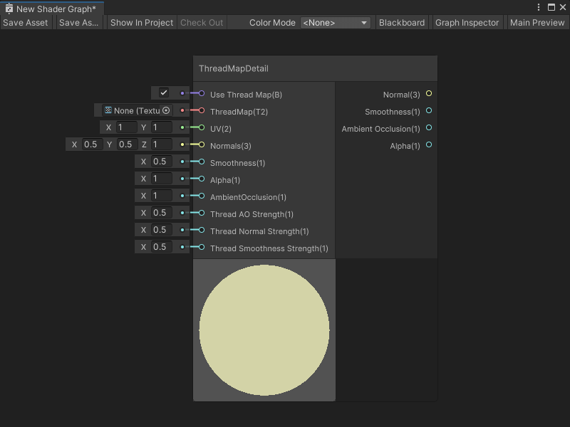

# ThreadMapDetail node

The ThreadMapDetail node adds tileable thread map detail information to a fabric material. The node outputs a thread map that you can apply to a fabric material.

[!include[nodes-subgraph-node](./snippets/nodes-subgraph-node.md)]

A thread map is a Texture with 4 channels. Like a detail map, a thread map contains information about ambient occlusion, the normal x-axis and normal y-axis, and smoothness.

For more information on Detail maps, see [Secondary Maps (Detail Maps) & Detail Mask](https://docs.unity3d.com/Manual/StandardShaderMaterialParameterDetail.html) in the Unity User Manual.

## Create Node menu category

The ThreadMapDetail node is under the **Utility** &gt; **High Definition Render Pipeline** &gt; **Fabric** category in the Create Node menu.

## Compatibility

[!include[nodes-compatibility-hdrp](./snippets/nodes-compatibility-hdrp.md)]

[!include[hdrp-latest-link](./snippets/hdrp-latest-link.md)]

[!include[nodes-all-contexts](./snippets/nodes-all-contexts.md)]

## Inputs

[!include[nodes-inputs](./snippets/nodes-inputs.md)]

| **Name** | **Type** | **Binding** | **Description** |
| :--- | :--- | :--- | :--- |
| **Use Thread Map** | Boolean | None | Use the port's default input to enable or disable the ThreadMapDetail node. You can also connect a node that outputs a Boolean to choose when to enable or disable the thread map. |
| **ThreadMap** | Texture 2D | None | The texture that contains the detailed information of a fabric's thread pattern. The texture should contain 4 channels:<ul><li>R - The ambient occlusion</li><li>G - The normal Y-axis</li><li>B - The smoothness</li><li>A - The normal X-axis |
| **UV** | Vector 2 | UV  | The UV coordinates the ThreadMapDetail node should use to map the ThreadMap texture on the geometry. |
| **Normals** | Vector 3 | None | The base normal map that you want your Shader Graph to apply to the geometry before it applies the thread map. |
| **Smoothness** | Float | None | The base smoothness value that you want your Shader Graph to apply to the geometry before it applies the thread map. |
| **Alpha** | Float | None | The base alpha value that you want your Shader Graph to apply to the geometry before it applies the thread map. |
| **Ambient Occlusion** | Float | None | The base ambient occlusion value that you want your Shader Graph to apply to the geometry before it applies the thread map. |
| **Thread AO Strength** | Float | None | Specify a value of `0` or `1` to determine how the **ThreadMap**'s ambient occlusion should impact the final shader result:<ul><li>If you provide a value of `0`, the **ThreadMap**'s ambient occlusion has no effect on the final output of the shader.</li><li>If you provide a value of `1`, Shader Graph multiplies your base **Ambient Occlusion** value by the ambient occlusion value specified in your **ThreadMap** to determine the final output of the shader.</li></ul> |
| **Thread Normal Strength** | Float | None | Specify a value of `0` or `1` to determine how the **ThreadMap**'s normal should impact the final shader result:<ul><li>If you provide a value of `0`, the **ThreadMap**'s normal has no effect on the final output of the shader.</li><li>If you provide a value of `1`, Shader Graph blends the values from your base **Normals** with the normal specified in your **ThreadMap** to determine the final output of the shader.</li></ul> |
| **Thread Smoothness Strength** | Float | None | Specify a value of `0` or `1` to determine how the **ThreadMap**'s smoothness should impact the final shader result:<ul><li>If you provide a value of `0`, the **ThreadMap**'s smoothness value has no effect on the final output of the shader.</li><li>If you provide a value of `1`, Shader Graph adds the smoothness value specified in your **ThreadMap** to your base **Smoothness** value to determine the final output of the shader. For this calculation, Shader Graph remaps the value of your **ThreadMap**'s smoothness from (0,1) to (-1, 1).</li></ul> |

## Outputs

[!include[nodes-outputs](./snippets/nodes-outputs.md)]

| **Name** | **Type** | **Description** |
| :--- | :--- | :--- |
| **Normal** | Vector 3 | The final normal output of the thread map. |
| **Smoothness** | Float | The final smoothness output of the thread map. |
| **Ambient Occlusion** | Float | The final ambient occlusion output of the thread map. |
| **Alpha** | Float | The final alpha output of the thread map. Shader Graph calculates this alpha value by multiplying the input **Alpha** value by the **Thread AO Strength** value. |

## Example graph usage

For an example use of the ThreadMapDetail node, see either of the HDRP's Fabric shaders.

To view these Shader Graphs:

1. Create a new material and assign it the **HDRP** &gt; **Fabric** &gt; **Silk** or **HDRP** &gt; **Fabric** &gt; **CottonWool** shader, as described in the Unity User Manual section [Creating a material asset, and assigning a shader to it](https://docs.unity3d.com/Documentation/Manual/materials-introduction.html).

2. Next to the **Shader** dropdown, select **Edit**.

Your chosen Fabric's Shader Graph opens. You can view the ThreadMapDetail node, its Subgraph, and the other nodes that create HDRP's Fabric shaders.
