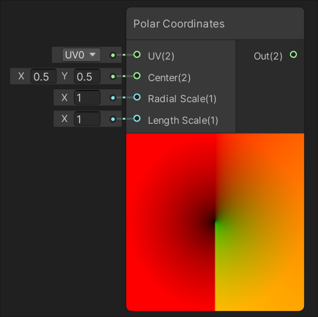

# UV Nodes

| [Flipbook](Flipbook-Node.md) | [Polar Coordinates](Polar-Coordinates-Node.md) |
| :--------------- | :-------- |
|  |  |
| Creates a flipbook, or texture sheet animation, of the UVs supplied to input In. | Converts the value of input UV to polar coordinates. |
| [**Radial Shear**](Radial-Shear-Node.md) | [**Rotate**](Rotate-Node.md) |
|  |  |
| Applies a radial shear warping effect similar to a wave to the value of input UV. | Rotates the value of input UV around a reference point defined by input Center by the amount of input Rotation. |
| [**Spherize**](Spherize-Node.md) | [**Tiling and Offset**](Tiling-And-Offset-Node.md) |
|  |  |
| Applies a spherical warping effect similar to a fisheye camera lens to the value of input UV. | Tiles and offsets the value of input UV by the inputs Tiling and Offset respectively. |
| [**Triplanar**](Triplanar-Node.md) | [**Twirl**](Twirl-Node.md) |
|  |  |
| A method of generating UVs and sampling a texture by projecting in world space. | Applies a twirl warping effect similar to a black hole to the value of input UV. |
| [**Parallax Mapping**](Parallax-Mapping-Node.md) | [**Parallax Occlusion Mapping**](Parallax-Occlusion-Mapping-Node.md) |
|  |  |
| Creates a parallax effect that displaces a material's UVs. | Creates a parallax effect that displaces a material's UVs and depth. |
