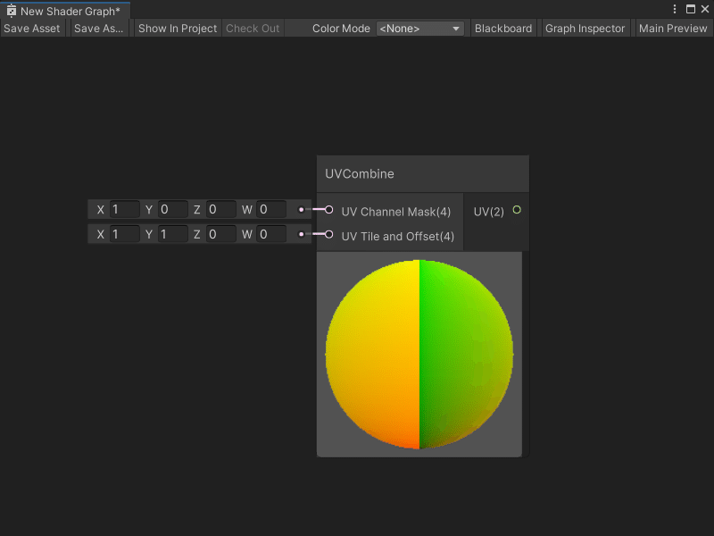

# UVCombine node

The UVCombine node lets you select which UV channel you want to use for mapping your shader to geometry in your application. You can also choose to apply tiling and offset to your UV coordinates.

[!include[nodes-subgraph-node](./snippets/nodes-subgraph-node.md)]

## Create Node menu category

The UVCombine node is under the **Utility** &gt; **High Definition Render Pipeline** category in the Create Node menu.

## Compatibility

[!include[nodes-compatibility-hdrp](./snippets/nodes-compatibility-hdrp.md)]

[!include[hdrp-latest-link](./snippets/hdrp-latest-link.md)]

[!include[nodes-all-contexts](./snippets/nodes-all-contexts.md)]

## Inputs

[!include[nodes-inputs](./snippets/nodes-inputs.md)]

| **Name** | **Type** | **Description** |
| :--- | :--- | :--- |
| **UV Channel Mask** | Vector 4 | Select which UV channel you want to use for your UV coordinates by entering a `1` in the corresponding default input on the port:<ul><li>**X**: UV channel 0</li><li>**Y**: UV channel 1</li><li>**Z**: UV channel 2</li><li>**W**: UV channel 3</li></ul>Set all other default inputs to `0`. You can also connect a node that outputs a Vector 4. |
| **UV Tile and Offset** | Vector 4 | Use the port's default input to specify the amount of offset or tiling that you want to apply to your shader's UV coordinates:<ul><li>Use **X** and **Y** to specify the tiling.</li><li>Use **W** and **Z** to specify the offset.</li></ul>You can also connect a node that outputs a Vector 4. |

## Outputs

[!include[nodes-single-output](./snippets/nodes-single-output.md)] <!-- SINGLE OUTPUT PORT INCLUDE -->

| **Name** | **Type** | **Binding** | **Description** |
| :--- | :--- | :--- | :--- |
| **UV** | Vector 2 | UV  | The final UV output, after selecting a UV channel and, if specified, any tiling or offset. |

## Example graph usage

For an example use of the UVCombine node, see either of the HDRP's Fabric shaders.

To view these Shader Graphs:

1. Create a new material and assign it the **HDRP** &gt; **Fabric** &gt; **Silk** or **HDRP** &gt; **Fabric** &gt; **CottonWool** shader, as described in the Unity User Manual section [Creating a material asset, and assigning a shader to it](https://docs.unity3d.com/Documentation/Manual/materials-introduction.html).

2. Next to the **Shader** dropdown, select **Edit**.

Your chosen Fabric's Shader Graph opens. You can view the UVCombine node, its Subgraph, and the other nodes that create HDRP's Fabric shaders.
