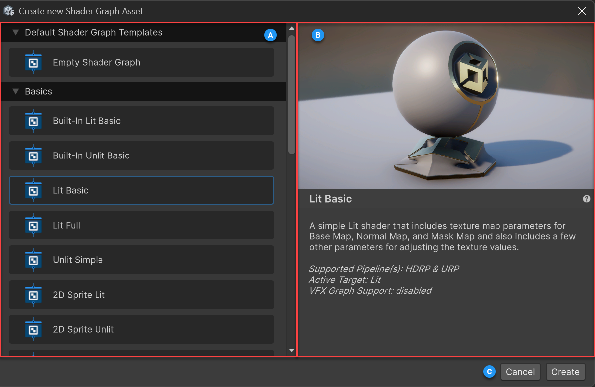

# Shader Graph template browser

The Shader Graph template browser allows you to create a new shader graph from an existing template.

To access the Shader Graph template browser, right-click in your Project window and select **Create** > **Shader Graph** > **From Template**.

| Label | Name | Description |
| :--- | :--- | :--- |
| **A** | Template list | Lists all the available templates you can select and start from to create a new shader graph. |
| **B** | Template details | Displays a picture and description of the selected template. |
| **C** | Action buttons | Finish the asset creation flow. The options are:<ul><li>**Create**: Creates a new shader graph asset based on the selected template.</li><li>**Cancel**: Closes the window and cancels the shader graph asset creation.</li></ul> |

**Note**: The template browser displays only templates that are compatible with the current project.

### Create a custom shader graph template

You can create your own shader graph templates to have them available in the template browser. You can share these templates with your team to maintain consistency across shaders, for example in projects with unique lighting setups or specific shader requirements.

To create a custom shader graph template, follow these steps:

1. In the **Project** window, select the shader graph asset you want to use as a template.

1. In the **Inspector** window, select **Use As Template**.

1. Expand the **Template** section.

1. Optional: Set the metadata that describes the template in the template browser: **Name**, **Category**, **Description**, **Icon**, and **Thumbnail**.

> [!NOTE]
> By default, when you convert an existing shader graph asset into a template, you can no longer assign it to any materials through the [Material Inspector](https://docs.unity3d.com/Manual/class-Material.html). However, it remains active for materials that were already using it. To make the shader graph asset available again for any materials, enable the **Expose As Shader** option in the shader graph asset Inspector.

## Additional resources

* [Create a new shader graph](Create-Shader-Graph.md)
