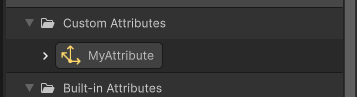

# Attributes

An Attribute is a piece of data attached to elements in a System. For example, the color of a particle, a particle's position, or the amount of particles that a spawn System creates are all Attributes.

Systems can read from, or write to, Attributes in order to perform custom behavior and differentiate between elements.

A System only stores Attributes when it needs them. This means that the System does not store any unnecessary data and thus saves memory.

## Manage Attributes

You can manage Attributes as follows:

- To duplicate a custom attribute, use the shortcut **Ctrl+D** (macOS: **Cmd+D**) or the context menu.

- To select several custom attributes, hold **Shift+Click** or **Ctrl+Click** (macOS: **Cmd+Click**), then drag and drop them into the graph as needed.

- To copy custom attributes and paste them across different VFX Graphs, use **Ctrl+C** and **Ctrl+V**.

- To highlight all nodes using a custom or a built-in attribute, hover over the attribute in the Blackboard panel. Similarly, hover over a node in the graph to highlight its corresponding attribute in the Blackboard panel.

- To identify unused custom attributes, right-click on categories or at the top of the Blackboard panel and select the appropriate option from the context menu. This is useful for cleaning up your VFX Graph.

- To quickly create a custom attribute, duplicate a built-in attribute using **Ctrl+D** (macOS: **Cmd+D**). This creates a new custom attribute with a name like `originalname_1` and the same type.

### Write Attributes

To write to an Attribute, use a [Block](Blocks.md). Blocks are the only graph elements that can write Attributes to the System.

The Visual Effect Graph only stores an Attribute that you write to in simulation data if a later [Context](Contexts.md) reads the Attribute. This means that:

* When you write to an Attribute in Initialize or Update Contexts, the Visual Effect Graph only stores the Attribute in simulation data if a later Update or Output Context reads from the Attribute.
* When you write to an Attribute in Output Contexts, the Visual Effect Graph does not store the Attribute in simulation data and only uses the Attribute for rendering.

### Read Attributes

To read from an Attribute, use an Operator or Block:

* Use a **Get Attribute** Operator.
* Use different composition modes in a **Set Attribute** Block that depends on the previous value of the Attribute.

 **Notes**:

* If you read from an Attribute that the Visual Effect Graph has not stored in the simulation data, the Attribute passes its default, constant value.
* Currently, you can only read from Attributes in Particle and ParticleStrip Systems. To read from Attributes in Spawn Systems, use [Spawner Callbacks](SpawnerCallbacks.md).
* To avoid typos when writing [custom HLSL](CustomHLSL-Common.md) code, drag and drop an attribute directly into the HLSL code editor in Unity.

## Attribute Locations

Every System stores Attributes in its own specific data container. However, you can read an Attribute from the current simulation data pool or from another data pool that the System depends on.

### Current

The current Attribute location refers to the **current** system data container that you read the value from. For example:

* Particle Data from a Particle System.
* ParticleStrip Data from a ParticleStrip System.
* SpawnEvent Data from a Spawn Context or sent through a [SendEvent](https://docs.unity3d.com/Documentation/ScriptReference/VFX.VisualEffect.SendEvent.html) [EventAttribute](https://docs.unity3d.com/Documentation/ScriptReference/VFX.VFXEventAttribute.html) Payload.

### Source

The source Attribute location refers to the **previous** system data container that you read the value from. You can only read from a source Attribute in the first Context of a system, after a system data change. For example, you can only access EventAttributes and GPU EventAttributes in Particle / ParticleStrip System Initialize Contexts.

* In Initialize Particle / Initialize Particle Strips Contexts:
  * From incoming Spawn Contexts.
  * From other Particle Systems, through GPUEvent spawn.

## Variadic Attributes

Some attributes possess **Variadic** properties. These Attributes can be a scalar or a vector of different dimensions depending on the components you require for simulating and/or rendering.

When you read from a variadic Attribute, it reads from all other implicit components using their default values.

For example, you can express the **scale** of a Quad particle as a **Vector2** (as the width, and length of the quad), whereas, to express the **scale** of a Box particle, you can use a **Vector3** (as the width, length, and depth of the cube). When you set variadic attributes, a drop-down of all channel combinations allows you to write only to the necessary channels.

Another example is for the rotation of a sprite around its normal. You only need the **Z** component of the angle Attribute (**angleZ**), so it is unnecessary to store **angleX**, and **angleY**.

