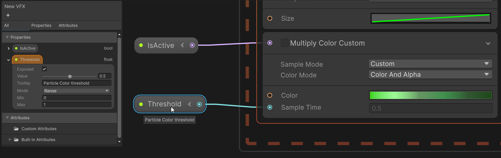
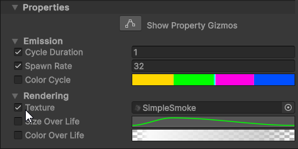
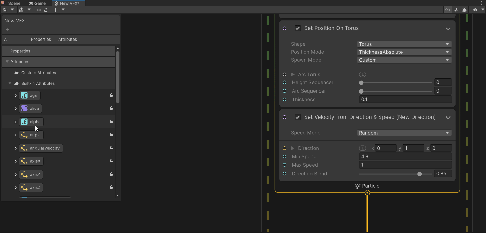
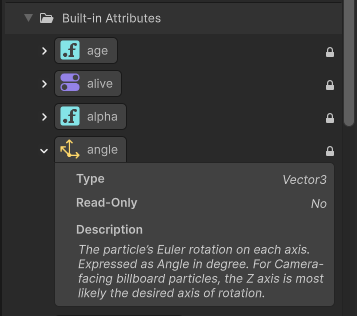
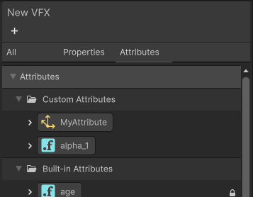
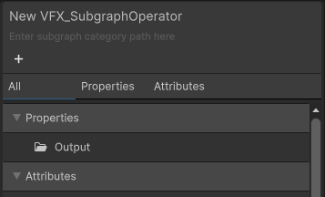

# Blackboard

The Blackboard is a utility panel in the [Visual Effect Graph window](VisualEffectGraphWindow.md) that allows you to manage:
- [Properties](Properties.md)
- [Custom Attributes](#attributes)
- Built-in particle [attributes](Attributes.md)

To toggle the Blackboard visibility, you can either use the `SHIFT + 1` shortcut or click on the **Blackboard** button in the Visual Effect Graph [Toolbar](VisualEffectGraphWindow.md#Toolbar).   
Drag window's edge to resize and drag the window's header to move it.

## Properties
You can create/delete, order and categorize properties.    
For each property the following options are available:

| **Setting** | **Description**                                                                                                                                                                                                                |
|-------------|--------------------------------------------------------------------------------------------------------------------------------------------------------------------------------------------------------------------------------|
| **Exposed** | Specifies whether the property is exposed or not. When enabled, you can see and edit the property on the [Visual Effect Component](VisualEffectComponent.md) as well as via the [C# API](ComponentAPI.md).    When the property is exposed, a green dot is displayed (bright green if the property is used and dimmed out if not used).                  |
| **Value**   | Specifies the default value of the property. The Visual Effect Graph uses this value if you do not expose the property or if you expose the property, but do not override it.                                                  |
| **Tooltip** | Specifies text that appears when you hover the property in the graph or in the Visual Effect component inspector.                                                                                                              |
| **Mode**    | For numerical types you can set a **Range** mode (with minimum and maximum values) which turns the value control into a slider.     And for UInt type you can also choose **Enum** which turns the control into a dropdown |

To use a property in the graph you can either drag and drop it in the graph, or find it by name in the node search.    
You can use the same property as many times as you want in the graph (even in different systems)

### Add a property
To add a property, click the plus `+` button in the top-left corner of the Blackboard.    
A menu will open offering two options: **Property** and [**Attribute**](#attributes). Choose the **Property** option and then select the desired type.

You can also convert an inline [Operator](Operators.md) to a property. To do this, either use the shortcut `SHIFT + X` or right-click on the Node in the graph and select either:
- **Convert to Property** if you want to create a constant.
- **Convert to Exposed Property** if you want to create an exposed property    
Regardless of the option you choose, you can enable or disable the **Exposed** setting later.

### Arranging properties
1. To rename a property you can:
   - Select property and press F2
   - Double-click the property name
   - Right-click the property name and select **Rename** from the context menu.
   - In the inspector change the **Exposed Name** value
2. To reorder a property, drag&drop it somewhere above or below.    
If you drop it over a category or inside a category the property will move to that category
3. To delete a property:
   - Right-click the property then select **Delete** from the context menu.
   - Select the property then press the **Delete** key (for macOS, **Cmd** + **Delete** key).

### Property categories
Categories allow you to sort properties into groups so you can manage them more easily. You can **rename** and **delete** categories in the same way as you can for properties.   
Category creation works the same way as for Properties, just pick the **Category** type at the top of the menu.
You can drag&drop properties from one category to another. If you don't want a property to be part of a category, drop it at the top of the properties.

### Property Nodes
Property Nodes look slightly different to standard [operators](Operators.md). They display the property name and a green dot if the property is exposed.
The value is either the default value set in the blackboard or the overriden value set in the component inspector.

You can expand them to use a sub-member of the property value.

On the left are unexposed properties, on the right exposed properties (notice the green dot)

 

### Exposed Properties in the Inspector
When you enable the **Exposed** setting for a property, the property becomes visible in the **Properties** section of the Inspector for a [Visual Effect](VisualEffectComponent.md) component.    
Properties appear in the same order and categories that you set in the Blackboard.

#### Overriding property values per GameObject

For each VFX component in the scene, you can override any exposed property value.    
When the GameObject holding the Visual Effect is selected in the hierarchy, in the inspector you'll see all exposed properties listed.    
Then if you change a property value, the override checkbox will be checked and the value overriden.
To revert your change, you can simply uncheck the override checkbox, then the default value for that property, set in the blackboard, will be used.

## Attributes
An [attribute](Attributes.md) is a short name for **Particle Attribute** which are independent values carried by each particle.
The blackboard now lets you manage both built-in attributes and custom attributes.

The icon on the left represents the type of the attribute. In the screenshot below, we can see that the attribute is a `Vector3`

To use an attribute in the graph you can drag&drop it in the graph.
* If you drop it in a context, it will create a `Set Attribute` block.    
* If you drop it in the void, it will create a `Get Attribute` operator.    

You can also find the attribute in the node search window.

### Custom Attributes
For each custom attribute you can:
- **Rename**: all usage of the custom attribute will be updated automatically
- **Change type**: all usage of the custom attribute will be updated automatically
- **Add a description**: it will be displayed as a tooltip in the graph

### Built-in Attributes
This section lists all available built-in attributes. The small locker icon on the right indicates that you cannot modify them.    
For each built-in attribute you have the follwing information:
- Name
- Type
- Access (is it read-only or not)
- Description

### Custom HLSL
To avoid typo when writing [custom HLSL](CustomHLSL-Common.md) code, you can drag&drop an attribute inside the HLSL code editor (in Unity).

## Common Features

- **Duplicate**: you can duplicate a property or a custom attribute with the shortcut `Ctrl + D` (macOS: `Cmd + D`) or with the context menu
- **Multi-Selection**: you can multi-select properties or custom attributes with `Shift + Click` or `Ctrl + Click`(macOS: `Cmd + Click`) and then drag&drop in the graph for instance
- **Copy/Paste**: you can copy/paste properties and custom attributes across different VFX Graphs using `Ctrl + C` and `Ctrl + V`
- **Hover Property**: if you hover a property, all corresponding nodes in the graph will get highlighted in orange    
And same if you hover a node in the graph, corresponding property will be highlighted in the blackboard.
- **Hover Attribute**: if you hover an attribute, all nodes using it in the graph will get highlighted in orange    
And same if you hover a node in the graph, corresponding attributes will be highlighted in the blackboard.    
This applies for both custom and built-in attributes.
- **Select unused**: when right clicking on categories (or at the top of the blackboard) a context menu offers options to select unused properties or unused custom attributes.
This can be helpful when you want to cleanup your VFX.

- 

> [!TIP]
> A handy workflow for custom attribute is to duplicate a built-in attribute with `Ctrl + D` (macOS: `Cmd + D`).    
This will create a new custom attribute with a name like `orignalname_1` and with same type.

## Filter
Near the top of the blackboard, there are three tabs which let you filter which kind of elements to display:
- **All**: Properties and Attributes are displayed
- **Properties**: Only properties are displayed
- **Attributes**: Only attributes are displayed

## Subgraph Category
When dealing with a subgraph, the blackboard lets you specify a category that will be used in the node search.
To change the category, double-click the sub-title of the blackboard and enter the desired category name, then validate using the `Return` key

To create multiple category levels, use the `/` character. For example, `MySubgraphs/Math`.

