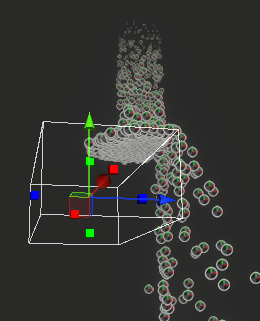
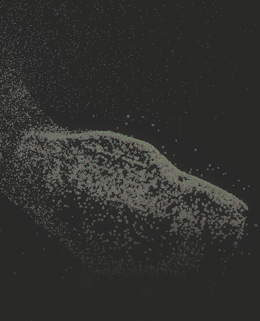

# Collision Shape Block reference

The Collision Shape Block defines a shape that particles collide with.

 
If you change the **Behavior** property of the block, the Block changes to the following:

- A [Kill Shape Block](Block-KillShape.md) if you set **Behavior** to **Kill**.
- A [Trigger Shape Block](Block-TriggerShape.md) if you set **Behavior** to **None**.

## Block compatibility

You can add the Collision Shape Block to the following Contexts:

- [Initialize](Context-Initialize.md)
- [Update](Context-Update.md)

To add a Collision Shape Block to your graph, [open the menu for adding a graph element](VisualEffectGraphWindow.md#adding-graph-elements) then select **Collision** > **Collision Shape**.

## Block settings

| **Property** | **Type** | **Description** |
|-|-|-|
| **Shape** | Enum | Sets the shape for particles to collide with. For more information, refer to the [Shape dropdown](#shape-dropdown) section. |
| **Mode** | Enum | Specifies how particles interact with the collider. The options are:<ul><li><strong>Solid</strong>: Stops particles entering the collider. If you set <strong>Shape</strong> to <strong>Plane</strong>, particles collide with the plane when they travel away from the normal of the plane.</li><li><strong>Inverted</strong>: Stops particles leaving the shape volume. If you set <strong>Shape</strong> to <strong>Plane</strong>, particles collide with the plane when they travel in the same direction as the normal of the plane.</li></ul> |
| **Radius Mode** | Enum | Sets the collision radius of the particles. The options are:<ul><li><strong>None</strong>: Sets the collision radius to zero.</li><li><strong>From Size</strong>: Sets the collision radius for each particle to its individual size.</li><li><strong>Custom</strong>: Sets the collision radius to the value of **Radius** in the [Block properties](#block-properties).</li></ul> |
| **Collision Attributes** | Enum | Specifies whether Unity stores data in the collision attributes of particles. The options are:<ul><li><strong>No Write</strong>: Doesn't write or store collision attributes.</li><li><strong>Write Punctual Contact only</strong>: Updates the collision attribute only when a specific, single-point collision occurs. This prevents Unity updating the collision attributes repeatedly when a particle slides along a collision shape. To increase or decrease how much a particle needs to bounce off a shape to cause a collision response, enable **Override Bounce Threshold** in the Inspector window.</li><li><strong>Write Always</strong>: Updates the collision attribute every time a collision occurs.</li></ul> |
| **Rough Surface** | Boolean | Adds randomness to the direction in which particles bounce back, to simulate collision with a rough surface. To set the roughness of the surface, use the **Roughness** property. |

### Shape dropdown

| **Shape** | **Description** |
|-|-|
| **Sphere**| Sets the collision shape as a spherical volume. |
| **Oriented Box** | Sets the collision shape as a box volume. |
| **Cone**| Sets the collision shape as truncated cone volume.|
| **Plane** | Sets the collision shape as a flat plane with infinite length and width. |
| **Signed Distance Field** | Sets the collision shape as a signed distance field (SDF), so you can create precise complex collision with an existing asset. To generate a signed distance field asset, use the [SDF Bake Tool](sdf-bake-tool.md) or an external digital content creation (DCC) tool. |

## Block properties

| **Input** | **Type** | **Description**|
|-|-|-|
| **Sphere**| [Sphere](Type-Sphere.md) | Sets the sphere that particles collide with. This property is available only if you set **Shape** to **Sphere**. |
| **Box** | [OrientedBox](Type-OrientedBox.md) | Sets the box that particles collide with. This property is available only if you set **Shape** to **Box**. |
| **Cone**| [Cone](Type-Cone.md) | Sets the cone that particles collide with. This property is available only if you set **Shape** to **Cone**. |
| **Plane** | [Plane](Type-Plane.md) | Sets the plane that particles collide with. This property is available only if you set **Shape** to **Plane**. |
| **Distance Field**| Signed distance field | Sets the signed distance field (SDF) that particles collide with. This property is available only if you set **Shape** to **Signed Distance Field**. |
| **Field Transform** | [Transform](Type-Transform.md) | Sets the position, size, and rotation of the **Distance Field**. This property is available only if you set **Shape** to **Signed Distance Field**. |
| **Bounce**| Float | Sets how strongly particles bounce away from a collision. A value of 0 means the particles don't bounce. A value of 1 means particles bounce away at the same speed they collided at. |
| **Friction**| Float | Sets how much speed particles lose during a collision. The minimum value is 0. |
| **Bounce Speed Threshold** | Float | Sets the minimum speed for a bounce that causes Unity to update the collision attribute for a particle, if you set **Collision Attributes** to **Write Punctual Contact Only**. The default value is 1. This property is available only if you enable **Override Bounce Threshold** in the Inspector window. | 
| **Lifetime Loss** | Float | Sets how much life particles lose after a collision. |
| **Radius**| Float | Sets the collision radius of the particles. This property is available only if you set **Radius Mode** to **Custom**. |
| **Roughness** | Float | Sets the roughness of the surface, by adjusting how randomly particles change direction after they collide with the surface. This property is available only if you enable **Rough Surface**. |

## Inspector window properties

| **Property** | **Type** | **Description** |
|-|-|-|
| **Behavior** | Enum | Specifies how particles behave when they collide with the shape. The options are: <ul><li><strong>None</strong>: Changes the Block to a Trigger Shape Block, so particles don't bounce off the shape.</li><li><strong>Collision</strong>: Causes particles to bounce off the shape.  This is the default in a Collision Shape Block.</li><li><strong>Kill</strong>: Changes the Block to a [Kill Shape Block](Block-KillShape.md), so particles are destroyed when they collide with the shape.</li></ul> |
| **Write Rough Normal** | Boolean | When enabled, Unity writes the version of the normal with roughness applied to the Collision Event Normal attribute. |
| **Override Bounce Threshold** | Boolean | Makes the **Bounce Speed Threshold** setting available in the Block properties. |
