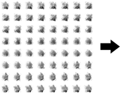

# Flipbook Player

Menu Path : **FlipBook > Flipbook Player**

The **Flipbook Player** Block creates animated particles using flipbook textures. To do this, it increments each particle's **Tex Index** attribute over time. If you want to directly control **Tex Index**, you can use a [Set Attribute From Curve](Block-SetAttributeFromCurve.md) block instead.

Flipbook textures are texture sheets that consist of multiple smaller sub-images. To produce an animation, Unity steps through the sub-images in a particular order.

<video src="Images/Block-FlipbookPlayerExampleRHS.mp4" Title="A translucent cloud gradually forms, swirls gently, and then dissipates into the background." width="320" height="auto" autoplay="true" loop="true" controls></video>

To generate a Flipbook, use external digital content creation tools.

To set an output to use flipbooks, change its **UV Mode** to **Flipbook**. For more information on the different UV Modes, refer to the documentation for the various output Contexts.

There are two different modes to control the playback: **Frame Rate** and **Cycles**. Additionally, in both modes, you can control the **Animation Range**.

### Frame Rate mode

In this mode, you can control directly the frame rate used to play the animation. The number of frames displayed depends on the particle's lifetime.

You can select between different submodes:
- **Constant**: Specify the framerate directly for all particles.
- **Random**: Select the framerate randomly between two values, for each particle.
- **Over Lifetime**: Use a curve to specify the framerate during the particle lifetime.
- **By Speed**: Use a curve to specify the framerate, depending on the speed of the particle. In this mode, you need to provide the min and max speed values.
- **Custom**: Use a curve and provide the sample time manually.

Specifying the **Animation Range** is optional in this mode.

### Cycles mode

In this mode, you specify the number of cycles that the animation must be played. The frame rate depends on the particle lifetime.

You can select between different submodes:
- **Constant**: Specify the number of cycles directly for all particles.
- **Random**: Select the number of cycles randomly between two values, for each particle.
- **Random Full Cycle**: Same as **Random**, but values are rounded to the next integer, to force the animation cycle to end on the last frame of the animation.

To calculate the frame rate, specify the **Animation Range**.

### Animation range

By default, the flipbook plays all frames sequentially, from left to right and top to bottom.

You can select a subset of frames to be played:
- **Entire Flipbook**: Default value, all frames.
- **Flipbook Row**: Only play the frames in the row selected by **Index**.
- **Flipbook Column**: Only play the frames in the column selected by **Index**.
- **Start End Frames**: Specify the start and end frames of the animation, inclusive.

## Block compatibility

This Block is compatible with the following Contexts:

- [Update](Context-Update.md)

## Block settings

| **Setting**          | **Type** | **Description**                                              |
| -------------------- | -------- | ------------------------------------------------------------ |
| **Mode**             | Enum     | Specifies how to determine the frame rate, in frames per second, for the flipbook. The options are: &#8226; **FrameRate**: Controls the frame rate directly, depending on the **Frame Rate Mode**. &#8226; **Cycles**: Controls the number of cycles that the animation will be played, depending on the **Cycles Mode**. Frame rate will be automatically computed to fit. |
| **Frame Rate Mode**  | Enum     | Selects between different modes to control the frame rate when **FrameRate** mode is selected. Refer to [Frame Rate mode](#frame-rate-mode). |
| **Cycles Mode**      | Enum     | Selects between different modes to specify the number of cycles when **Cycles** mode is selected. Refer to [Cycles mode](#cycles-mode). |
| **Animation Range**  | Enum     | Different modes to control which frames are displayed. Refer to [Animation Range](#animation-range). |
| **Use Custom Range** | Boolean  | In **FrameRate** mode, allows to customize the animation range. |
| **Reverse**          | Boolean  | Plays the animation from end to start. |
| **Clamp Blending**   | Boolean  | Only visible if flipbook blending is enabled. Clamps the blending between the last and first frames. |
| **Custom Curve**     | Boolean  | Allows using a curve to control animation speed over one cycle. By default, speed is linear: each frame is displayed for the same amount of time. |

## Block properties

### Frame Rate mode properties

| **Input**       | **Type** | **Description**                                              |
| --------------- | -------- | ------------------------------------------------------------ |
| **Frame Rate**  | Float    | Sets the flipbook rate in image frames per second. This property only appears if you set **Frame Rate Mode** to **Constant**. |
| **Frame Rate**  | Vector2  | Sets the flipbook rate in image frames per second, selected randomly between the minimum and maximum value of the range. This property only appears if you set **Frame Rate Mode** to **Random**. |
| **Seed**        | uint     | Specifies a seed that the Block uses to generate random values. This property only appears if you set **Frame Rate Mode** to **Random**. |
| **Frame Rate**  | Curve    | Sets the flipbook rate, in image frames per second, over the particle's lifetime via a curve. The curve value at time 0 is the frame rate when a particle is born, and the value at time 1 is the frame rate when the particle reaches its lifetime.  This property only appears if you set **Frame Rate Mode** to **Over Lifetime**. |
| **Frame Rate**  | Curve    | Sets the flipbook rate, in image frames per second, depending on the speed of the particle. The curve value at time 0 is the frame rate when the particle's speed is less than or equal to the minimum of the **Speed Range**, and the value at time 1 is the frame rate when the particle's speed is greater than or equal to the maximum of the **Speed Range**. This property only appears if you set **Frame Rate Mode** to **By Speed**. |
| **Speed Range** | Vector2  | Sets the minimum and maximum speed values that control the **Frame Rate** curve. This property only appears if you set **Frame Rate Mode** to **By Speed**. |
| **Frame Rate**  | Curve    | Sets the flipbook rate, in image frames per second, depending on the **Sample Time**. This property only appears if you set **Frame Rate Mode** to **Custom**. |
| **Sample Time** | Float    | Specifies the time used to sample the **Frame Rate** curve. This property only appears if you set **Frame Rate Mode** to **Custom**. |

### Cycles mode properties

| **Input**      | **Type** | **Description**                                              |
| -------------- | -------- | ------------------------------------------------------------ |
| **Cycles**     | Float    | Sets the fixed number of cycles that the animation plays over the particle's lifetime. This property only appears if you set **Cycles Mode** to **Constant**. |
| **Cycles**     | Vector2  | Sets the number of cycles that the animation plays over the particle's lifetime. This number is randomly selected between the minimum and maximum values of the range. If **Cycles Mode** is set to **Random Full Cycle**, the number of cycles to play is an integer. Otherwise, it's a float (and might not end at the last frame of the animation). This property only appears if you set **Cycles Mode** to **Random** or **Random Full Cycle**. |
| **Seed**       | uint     | Specifies a seed that the Block uses to generate random values. This property only appears if you set **Cycles Mode** to **Random** or **Random Full Cycle**. |

### Animation range properties

| **Input**       | **Type** | **Description**                                              |
| --------------- | -------- | ------------------------------------------------------------ |
| **Index**       | uint     | Selects the row or column of the flipbook to be used for the animation. The number of rows and columns is determined by the **Flipbook Size** property in the output context. This property only appears if you set **Animation Range** to **Flipbook Row** or **Flipbook Column**. |
| **Frame Range** | Vector2  | Sets the minimum and maximum frame (both inclusive) to be played in the animation. This property only appears if you set **Animation Range** to **Start End Frames**. |
