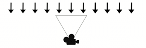
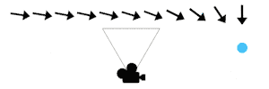

# Orient: Face [Mode]

Menu Path : **Orientation > Orient: Face [Mode]**

The **Orient** Block makes particles orient themselves to face a certain way. It supports a number of different modes:

**Face Camera Plane**

Particles orient to face forward towards the camera plane. This mode works for most use cases, however the facing illusion can break sometimes at the edges of the screen.

**Face Camera Position**

Particles orient to face forward towards the camera position. Similar to the **Face Camera Plane** mode, however, here particles face towards the camera itself, appearing identical even at the edge of the screen.

**Look At Position**

Particles orient to face towards a specified position.

**Look At Line**

Particles orient to face towards the nearest point along the direction of an infinite line.

**Advanced**

Particles orient to a custom particle space defined using two specified axes. The first axis is immutable and the Block uses the second axis to derive the third. It then recalculates the second axis to create an orthogonal particle space.

This is an advanced mode and you can use it to create custom orientation behaviors.

**Fixed Axis**

Particles orient themselves on the specified ‘up’ axis and rotate on it to face the camera. This is useful for effects like grass where the up axis is generally known and particles should rotate on it to face the camera without falling flat if observed from the top.

**Along Velocity**

Particles orient to face forward towards the direction they are moving in based on the **Velocity** attribute. The up axis is set to the velocity, and particles rotate on it to orient themselves to the camera as needed.

## Block compatibility

This Block is compatible with the following Contexts:

- Any output Context

## Block settings

| **Setting** | **Type** | **Description**                                              |
| ----------- | -------- | ------------------------------------------------------------ |
| **Mode**    | Enum     | Specifies the orientation mode of the particle. The options are: &#8226; [Face Camera Plane](#face-camera-plane): Particles orient to face towards the camera plane. &#8226; [Face Camera Position](#face-camera-position): Particles orient to face towards the camera position. &#8226; [Look At Position](#look-at-position): Particles orient to face towards a position that you specify. &#8226; [Look At Line](#look-at-line): Particles orient towards the closest point to them on a line that you specify. &#8226; [Advanced](#advanced): Particles orient to a custom particle space that you define using two axes. &#8226; [Fixed Axis](#fixed-axis): Particles orient themselves on an ‘up’ axis that you specify and rotate on it to face the camera. &#8226; [Along Velocity](#along-velocity): Particles orient to face forward towards the direction they are moving in based on the **Velocity** attribute. |
| **Axes**    | Enum     | The two axes used to orient the particle. For information on how the Block orients the particle, see [Advanced mode](#advanced). The options are: &#8226; **XY**: Uses the **X** and **Y** axes to orient the particle. &#8226; **YZ**: Uses the **Y** and **Z** axes to orient the particle. &#8226; **ZX**: Uses the **Z** and **X** axes to orient the particle. &#8226; **YX**: Uses the **Y** and **X** axes to orient the particle. &#8226; **ZY**: Uses the **Z** and **Y** axes to orient the particle. &#8226; **XZ**: Uses the **X** and **Z** axes to orient the particle.  This setting only appears if you set **Mode** to **Advanced**. |

## Block properties

| **Input**    | **Type**                     | **Description**                                              |
| ------------ | ---------------------------- | ------------------------------------------------------------ |
| **Position** | [Position](Type-Position.md) | The Position the particle faces towards. This property only appears if you set **Mode** to **Look At Position**. |
| **Line**     | [Line](Type-Line.md)         | The Line to use for particle orientation. Particles orient to face towards the nearest point along the direction of this Line. This property only appears if you set **Mode** to **Look At Line** |
| **Axis X**   | [Vector](Type-Vector.md)     | The x-axis of the Advanced orientation. This property only appears if you set **Mode** to **Advanced** and **Axes** uses the **X** axis. |
| **Axis Y**   | [Vector](Type-Vector.md)     | Specifies the y-axis of the Advanced orientation. This property only appears if you set **Mode** to **Advanced** and **Axes** uses the **Y** axis. |
| **Axis Z**   | [Vector](Type-Vector.md)     | Specifies the z-axis of the Advanced orientation. This property only appears if you set **Mode** to **Advanced** and **Axes** uses the **Z** axis. |
| **Up**       | [Vector](Type-Vector.md)     | Specifies the up axis of the particle. The particle orients itself towards the camera by only spinning on the fixed axis you specify here. This property only appears if you set **Mode** to **Fixed Axis**. |
