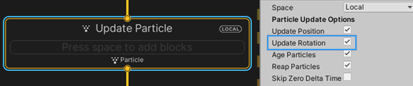

# Integration : Update Rotation

Menu Path : **Implicit > Integration : Update Rotation**

The **Integration : Update Rotation** Block updates particle orientation based on their angular velocity.

**Note:** If the system uses the angular velocity attribute and you enable **Update Rotation** in the Update Context's Inspector, Unity implicitly adds this Block to the Context and hides it. If you add your own **Integration : Update Rotation** Block too, Unity updates rotation twice.



The Block adds the corresponding angular velocity, multiplied by deltaTime, to the current particle angle:

```
angleX += angularVelocityX * deltaTime;
angleY += angularVelocityY * deltaTime;
angleZ += angularVelocityZ * deltaTime;
```

If you disable **Update Rotation** in the Update Context's Inspector, the system does not change the particle orientation based on the particle's angular velocity attribute.

You can also add the **Integration : Update Rotation** Block to the Update Context manually and enable/disable it to specify when the System updates the particle orientation based on its angular velocity.


## Block compatibility

This Block is compatible with the following Contexts:

- [Update](Context-Update.md)
