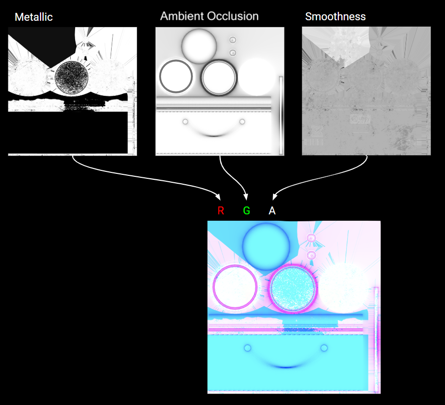

# Output Particle URP Lit Decal

The **Output Particle URP Lit Decal** Context uses a decal to render a particle system. A decal is a box that the Visual Effect Graph projects a texture into. Unity renders that texture on any geometry that intersects the decal along its xy plane. This means decal particles that don’t intersect any geometry are not visible. When a decal is not visible, it still contributes to the resource intensity required to simulate and render the system.

This Context can project its properties onto a surface using a Base Color map (albedo), a Normal Map, a Metallic Map and/or an Occlusion Map.

To use this context, add the [URP Decal Renderer Feature](https://docs.unity3d.com/Packages/com.unity.render-pipelines.universal@latest?subfolder=/manual/renderer-feature-decal.html) to your Renderer. For more information, refer to [How to add a Renderer Feature](https://docs.unity3d.com/Packages/com.unity.render-pipelines.universal@latest?subfolder=/manual/urp-renderer-feature-how-to-add.html). 

Menu Path : **Context > Output Particle URP Lit Decal**

The **Output Particle URP Lit Decal** Context can affect the following properties of the surface it projects onto:

- Base Color
- Metalness
- Ambient Occlusion
- Smoothness
- Normal

The particles project their properties along their positive Z-axis.

Below is a list of settings and properties specific to the Output Particle URP Lit Decal Context. For information about the generic output settings this Context shares with all other Contexts, see [Output Lit Settings and Properties](Context-OutputLitSettings.md).

# Context Settings

| **Input**                  | **Type** | **Description**                                              |
| -------------------------- | -------- | ------------------------------------------------------------ |
| **Normal Opacity Channel** | Enum     | Use this drop-down to select the map that controls the opacity of the normal map : • **Base Color Map Alpha**: Uses the alpha channel of the **Base Map** to control the opacity. • **Metallic Map Blue**: Uses the blue channel of the **Metallic Map** to control opacity. |
| **MAOS Opacity Channel**   | Enum     | Use this drop-down to select the source of the **MAOS Maps **(Metallic, Ambient Occlusion, Smoothness) opacity: • **Base Color Map Alpha**: Uses the alpha channel of the **Base Map** to control the opacity of the MAOS Map. • **Metallic Map Blue**: Uses the blue channel of the **Metallic Map**  to control its opacity. |
| **Affect Base Color**      | Bool     | Enable this checkbox to make this decal use the **Base Color** properties.  When this property is disabled the decal has no effect on the  Base Color.  HDRP still uses the alpha channel of the base color as an opacity for the other properties when this property is enabled or disabled. |
| **Affect MAOS**            | Bool     | Inspector) Make the decal affect the Metallic, Ambient Occlusion and Smoothness surface properties. This property exposes the following properties in the Inspector window: • Use Occlusion Map • Use Metallic Map **Affect MAOS** also exposes the following properties in the output context. In VFX Graph each texture type is stored in a specific color channel:<br • **Metallic**: The red channel of a decal mask texture. • **Ambient Occlusion**: The green channel of a decal mask  texture. • **Smoothness**: The alpha channel of a decal mask  texture.   |
| **Use Occlusion Map** **[URP]** | Bool | (**Inspector**) Indicates whether the output accepts an Occlusion Map to simulate shadowing from ambient lighting. This property only appears when you enable **MAOS Opacity Channel.** |
| **Use Metallic Map** **[URP]** | Bool | (**Inspector**) Indicates whether the output accepts a metallic map to multiply the metallic value with. This property only appears when you enable **MAOS Opacity Channel.** |
| **Decal Layer**            | Enum     | The layer that specifies which Materials Unity projects the decal onto.  Unity displays the decal onto any Mesh Renderers or Terrain that use a matching Decal Layer. |
|**Smoothness Source**|Enum|**(Inspector)** Specifies the smoothness map source. It can be the alpha channel of the Metallic Map or the Base Color Map if they are used in the output. The individual enum options are only available if the respective maps are enabled.|
|**Smoothness**|Float (slider)|The smoothness of the particle. Smoother surfaces bounce light off more uniformly, creating clearer reflections. This property only appears when you enable **Affect MAOS**|
|**Metallic**|Float (slider)|The metallicity of the particle. Metallic surfaces reflect their environment more, making their albedo color less visible. This property only appears if Material Type is set to Standard or Simple Lit and enable **Affect MAOS**.|
|**Occlusion Map** **[URP]**|Texture2D|Controls the occlusion across the surface of the material. For more information about occlusion mapping and its effects, see [Occlusion mapping(https://docs.unity3d.com/Manual/StandardShaderMaterialParameterOcclusionMap.html). This property only appears when you enable **Affect MAOS****.**|

# Context Properties

| **Input**             | **Type** | **Description**                                              |
| --------------------- | -------- | ------------------------------------------------------------ |
| **Fade Factor**       | Float    | Change this value to fade the decal in and out. A value of 0 makes the decal fully transparent, and a value of 1 does not change the overall opacity. |
| **Angle Fade**        | Vector2  | Use the min-max slider to control the fade out range of the decal (in degrees) based on the angle between the Decal backward direction and the vertex normal of the receiving surface. This value is clamped between 0 and 180 degrees. |
| **Normal Alpha**      | Float    | Use the slider to control the blend factor between the normal of the surface and the normal from the Normal map. |
| **Ambient Occlusion** | Float    | Use the slider to scale the Ambient occlusion values contained in the Occlusion Map. |

# Limitations

- This Output does not support Shader Graph.
- For this Context to work, add the[ Decal Renderer Feature](https://docs.unity3d.com/Packages/com.unity.render-pipelines.universal@latest?subfolder=/manual/renderer-feature-decal.html) to your Renderer.
- Each decal renderer technique has its own limitations. For more information, refer to [Decal Renderer Feature](https://docs.unity3d.com/Packages/com.unity.render-pipelines.universal@latest?subfolder=/manual/renderer-feature-decal.html).
