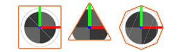

# Output Particle Primitive

Menu Path : **Context > Output Particle [Primitive]**
*(Output Particle (Lit) Quad, Output Particle (Lit) Triangle, Output Particle (Lit) Octagon)*

The Output Particle primitives (quad/triangle/octagon) Context are the most commonly-used output types and are great for a wide range of effects. They come in a regular (unlit) and a [Lit](Context-OutputLitSettings.md) variety (HDRP-only).

This Context supports the following planar primitives:

* **Quad:** A standard rectangular particle, useful in most scenarios.
* **Triangle:** Has only half the geometry compared to quad particles, triangle primitives are useful for fast-moving effects or effects which render many particles.
* **Octagon:** Useful for reducing overdraw at the cost of pushing extra geometry, octagon primitives can be useful to conform closely to the particle texture and avoid rendering unnecessary transparent areas.

Below is a list of settings and properties specific to the Output Particle Primitive Context. For information about the generic output settings this Context shares with all other Contexts, see [Global Output Settings and Properties](Context-OutputSharedSettings.md).

## Context settings

|**Setting**|**Type**|**Description**|
|---|---|---|
|**Primitive Type**|Enum|**(Inspector)** Specifies the primitive this Context uses to render each particle. The options are: &#8226; **Quad**: Renders each particle as a quad. &#8226; **Triangle**: Renders each particle as a triangle. &#8226; **Octagon**: Renders each particle as an octagon.|

## Context properties

|**Input**|**Type**|**Description**|
|---|---|---|
|**Crop Factor**|float|The amount by which to crop the octagonal particle shape. This eliminates transparent pixels which allows for a tighter fit and reduces potential overdraw. This property only appears if you set **Primitive Type** to **Octagon**.|
