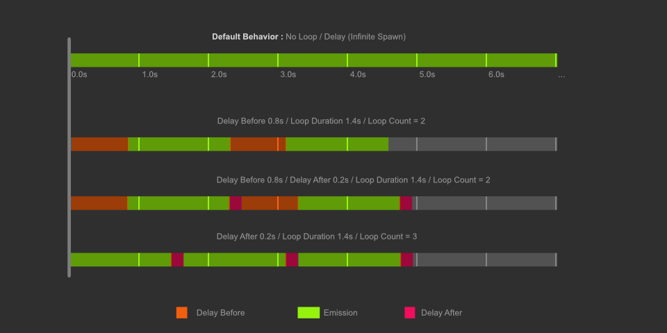

# Spawn

Menu Path : **Context > Spawn**

The Spawn Context controls how many instances the system feeds into an [Initialize](Context-Initialze.md) Context. This Context handles a set of built-in Block to control the spawn rate. You can also implement  [VFXSpawnerCallbacks](https://docs.unity3d.com/ScriptReference/VFX.VFXSpawnerCallbacks.html) to create a custom behavior.

This Context spawns particles within spawn loops. You can specify the number of loops it processes, the duration of each loop, and whether or not to have a delay before or after each loop.

## Context settings

| **Setting**             | **Type** | **Description**                                              |
| ----------------------- | -------- | ------------------------------------------------------------ |
| **Loop Duration**       | Enum     | **(Inspector)** Specifies how long this Context produces particles. The options are: &#8226; **Infinite**: Produces particles continuously. &#8226; **Constant**: Produces particles for a specific duration that you can specify. After this time, if **Delay Mode** is set to **After Loop** or **Before And After Loop**, this Context pauses particle spawning. What it does after this pause depends on the **Loop Count** and **Delay Mode**. &#8226; **Random**: Produces particles for a random duration between a minimum and maximum value. After this time, if **Delay Mode** is set to **After Loop** or **Before And After Loop**, this Context pauses particle spawning. What it does after this pause depends on the **Loop Count** and **Delay Mode**. |
| **Loop Count**          | Enum     | **(Inspector)** Specifies how many times this Context loops for. During each loop, this Context triggers particle spawns. The options are: &#8226; **Infinite**: Loops indefinitely. &#8226; **Constant**: Loops a specific number of times. &#8226; **Random**: Loops a random number of times between a minimum and maximum value. |
| **Delay Mode**          | Enum     | **(Inspector)** Specifies where in the loop this Context processes a delay. The options are: &#8226; **None**: Does not process a delay. &#8226; **Before Loop**: Processes a delay before the spawn loop. &#8226; **After Loop**: Processes a delay after the spawn loop. &#8226; **Before And After Loop**: Processes a delay before and after the spawn loop. |
| **Delay Before Random** | Bool     | **(Inspector)** Toggles whether the delay before the spawn loop is a random value between a minimum and a maximum value or a constant value. This setting is only visible if you set **Delay Mode** to **Before Loop** or **Before And After Loop**. |
| **Delay After Random**  | Bool     | **(Inspector)** Toggles whether the delay after the spawn loop is a random value between a minimum and a maximum value or a constant value. This setting is only visible if you set **Delay Mode** to **After Loop** or **Before And After Loop**. |

## Context properties

| **Setting**       | **Type**      | **Description**                                              |
| ----------------- | ------------- | ------------------------------------------------------------ |
| **Loop Duration** | float/Vector2 | The duration of the spawn loop. This property only appears if you set **Loop Duration** to **Constant** or **Random**. |
| **Loop Count**    | int/Vector2   | Defines how many loops the Context processes before going back to the initial state. This property only appears if you set **Loop Count** to **Constant** or **Random**. |
| **Delay Before**  | float/Vector2 | The duration of the delay before the spawn loop. This property only appears if you enable **Random**. |
| **Delay After**   | float/Vector2 | The duration of the delay after the spawn loop. This property only appears if you enable **Random**. |

## Flow

| **Port**       | **Description**                                              |
| -------------- | ------------------------------------------------------------ |
| **Start**      | Connection from an [Event](Context-Event.md), a [GPU Event](Context-GPUEvent.md), or another Spawn Context. |
| **Stop**       | Connection from an [Event](Context-Event.md), a [GPU Event](Context-GPUEvent.md), or another Spawn Context. |
| **SpawnEvent** | Connection to an [Initialize Context](Context-Initialize.md) or another Spawn Context. |

## Remarks

### System lifecycle

For a visualization of the looping and delay system, see the below illustration.

The lifecycle of the looping phases is split up into [states](https://docs.unity3d.com/ScriptReference/VFX.VFXSpawnerLoopState.html) that the Spawn Context handles internally. The lifecycle is as follows:

| **Step**                     | **State description**                                        |
| ---------------------------- | ------------------------------------------------------------ |
| 1. Initial State             | The initial state of a spawn Context is [VFXSpawnerLoopState.Finished](https://docs.unity3d.com/Documentation/ScriptReference/VFX.VFXSpawnerLoopState.Finished.html). At this stage, the Context is waiting for **Start** flow input to trigger. This occurs when you call [VisualEffect.Play](https://docs.unity3d.com/Documentation/ScriptReference/VFX.VisualEffect.Play.html). |
| 2. OnPlay                    | When the **Start** flow input triggers, if there are [custom spawner callbacks], the Context triggers [VFXSpawnerCallbacks.OnPlay](https://docs.unity3d.com/Documentation/ScriptReference/VFX.VFXSpawnerCallbacks.OnPlay.html). The Spawn Context evaluates the graph to set the [loop count](https://docs.unity3d.com/ScriptReference/VFX.VFXSpawnerState-loopCount.html). It then proceeds to the next step. |
| 3. Reset Delay durations     | The Spawn Context evaluates the graph and initializes: &#8226; The [delayBeforeLoop](https://docs.unity3d.com/ScriptReference/VFX.VFXSpawnerState-delayBeforeLoop.html) time. &#8226; The [loopDuration](https://docs.unity3d.com/ScriptReference/VFX.VFXSpawnerState-loopDuration.html) time. &#8226; The [delayAfterLoop](https://docs.unity3d.com/ScriptReference/VFX.VFXSpawnerState-delayAfterLoop.html) time. It then sets the [totalTime](https://docs.unity3d.com/ScriptReference/VFX.VFXSpawnerState-totalTime.html) to zero and proceeds to the next step. |
| 4. Awaiting before the loop. | The [loopState](https://docs.unity3d.com/Documentation/ScriptReference/VFX.VFXSpawnerState-loopState.html) transitions to [DelayingBeforeLoop](https://docs.unity3d.com/Documentation/ScriptReference/VFX.VFXSpawnerLoopState.DelayingBeforeLoop.html).  During this phase, while [totalTime](https://docs.unity3d.com/ScriptReference/VFX.VFXSpawnerState-totalTime.html) is below [delayBeforeLoop](https://docs.unity3d.com/ScriptReference/VFX.VFXSpawnerState-delayBeforeLoop.html), the Context waits.  When totalTime exceeds delayBeforeLoop, the Context sets totalTime to zero and proceeds to the next step. |
| 5. Looping                   | The [loopState](https://docs.unity3d.com/Documentation/ScriptReference/VFX.VFXSpawnerState-loopState.html) transitions to [Looping](https://docs.unity3d.com/Documentation/ScriptReference/VFX.VFXSpawnerLoopState.Looping.html) and the Context sets [playing](https://docs.unity3d.com/Documentation/ScriptReference/VFX.VFXSpawnerState-playing.html) to true. During this phase, while [totalTime](https://docs.unity3d.com/ScriptReference/VFX.VFXSpawnerState-totalTime.html) is below [loopDuration](https://docs.unity3d.com/ScriptReference/VFX.VFXSpawnerState-loopDuration.html), the Spawn Context evaluates the internal spawn Blocks and spawns particles. When totalTime exceeds loopDuration, the Context sets totalTime to zero and proceeds to the next step. |
| 6. Awaiting after the loop   | The [loopState](https://docs.unity3d.com/Documentation/ScriptReference/VFX.VFXSpawnerState-loopState.html) transitions to [DelayingAfterLoop](https://docs.unity3d.com/Documentation/ScriptReference/VFX.VFXSpawnerLoopState.DelayingAfterLoop.html).  During this phase, while [totalTime](https://docs.unity3d.com/ScriptReference/VFX.VFXSpawnerState-totalTime.html) is below [delayAfterLoop](https://docs.unity3d.com/ScriptReference/VFX.VFXSpawnerState-delayAfterLoop.html), the Context waits.  When totalTime exceeds delayBeforeLoop, the Context sets totalTime to zero and proceeds to the next step. |
| 7. Verify final state.       | Finally, the Context increments the [loopIndex](https://docs.unity3d.com/Documentation/ScriptReference/VFX.VFXSpawnerState-loopIndex.html). If the new loopIndex is less than the [loopCount](https://docs.unity3d.com/ScriptReference/VFX.VFXSpawnerState-loopCount.html), the lifecycle moves back to step **3**. Otherwise, it moves back to the initial step, **1**, and awaits a new **Start** flow input trigger. |

### Linking Spawn Contexts

The standard way to turn a Spawn Context on and off is to use an input event. When there isn’t an input to a Spawn Context's **Start** input flow slot, the Visual Effect Graph implicitly connects the “OnPlay” event. Also, when there isn't an input to a Spawn Context's **Stop** input flow slot, the Visual Effect Graph implicitly connects the “OnStop” event.

Another way to turn a Spawn Context on and off is to link it to another Spawn Context. To do this, link a Spawn Context's, **SpawnEvent** output flow slot to another Spawn Context's **Start** input flow slot. In that case, the event attributes state is automatically transferred from the first Spawn Context to the second. You can then connect to the first Spawn Context's **Start** and **Stop** input flow slots to turn the connected Contexts on and off.
