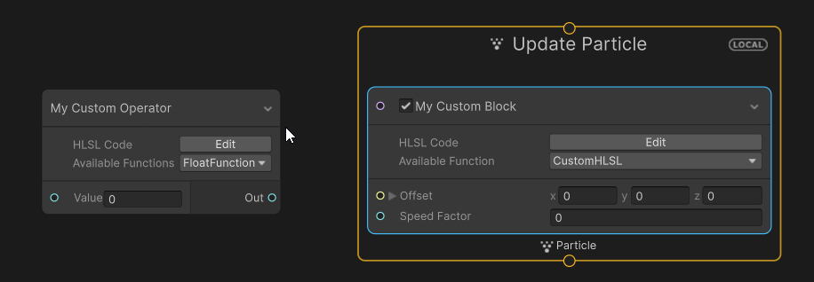
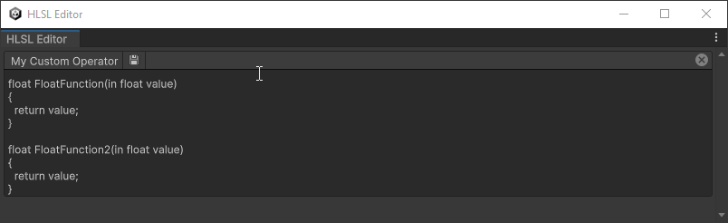

## Custom HLSL Nodes (block and operator)

These Custom HLSL nodes enable you to execute custom HLSL code during particle simulation.
You can use an [operator](Operator-CustomHLSL.md) for horizontal flow or a [block](Block-CustomHLSL.md) for vertical flow (in contexts).    


## Node settings

| **Setting name**       | UI         | Location   | Action                         |
|------------------------|------------|------------|--------------------------------|
| **Name**               | Text field | Inspector  | Choose the name of the block   |
| **HLSL Code**          | Button     | Graph node | Opens a code editor window     |
| **Available Function** | Drop down  | Graph node | Pick which function to execute |


## HLSL Code
The HLSL code can be either **embedded** in the node or an **HLSL file** can be used.
Multiple functions can be contained within the same HLSL source (embedded or file); in such cases, you must select the desired function from a dropdown list within the node.
To ensure validity and correct interpretation by the VFX Graph, adhere to the following conventions.

## Function declaration
To be properly recognized by VFX Graph the function must fulfill the following requirements:
- Return a supported type [Supported types](#Supported-types)
- Each function parameter must be of a [Supported types](#Supported-types)
- If you declare multiple functions, they must have unique names.

## Inline documentation
You can specify a tooltip for each function parameter using the three slash comment notation as shown below:
```csharp
/// <parameter-name>: the tooltip's text
```

These comments must be right above the function declaration.
```csharp
/// a: the tooltip for parameter a
/// b: the tooltip for parameter b
float Distance(in float3 a, in float3 b)
{
  return distance(a, b);
}
```

If you wish to write a helper function that should not appear in the node's selection list, use the special comment above the function declaration:
```csharp
/// Hidden
float SomeFunction(in float a)
{
  ...
}
```
> [!IMPORTANT]
> When implementing helper functions, you must use an HLSL file, not the embedded HLSL code.

## Supported types

### Basic types

| **HLSL Type**         | **Port Type**  | **Description**                                                                  |
|-----------------------|----------------|----------------------------------------------------------------------------------|
| **bool**              | bool           | A scalar value represented as a boolean.                                         |
| **uint**              | uint           | A scalar value represented as an unsigned integer.                               |
| **int**               | int            | A scalar value represented as a integer.                                         |
| **float**             | float          | A scalar value represented as a float.                                           |
| **float2**            | Vector2        | A structure containing two float.                                                |
| **float3**            | Vector3        | A structure containing three float.                                              |
| **float4**            | Vector4        | A structure containing four float.                                               |
| **float4x4**          | Matrix4x4      | A structure representing a matrix.                                               |
| **VFXGradient**       | Gradient       | A structure that describes a gradient that can be sampled.                       |
| **VFXCurve**          | AnimationCurve | A structure that describes a curve that can be sampled.                          |

### Texture types

| **HLSL Type**          | **Port Type**  | **Description**                                                                 |
| ---------------------- | -------------- | --------------------------------------------------------------------------------|
| **VFXSampler2D**       | Texture2D      | A structure containing a sampler state and a two-dimensional texture.           |
| **VFXSampler3D**       | Texture3D      | A structure containing a sampler state and a three-dimensional texture.         |
| **VFXSampler2DArray**  | Texture2DArray | A structure containing a sampler state and an array of two-dimensional textures.|
| **VFXSamplerCube**     | TextureCube    | A structure containing a sampler state and a cube texture.                      |
| **Texture1D**          | Texture2D      | A one-dimensional texture.                                                      |
| **Texture2D**          | Texture2D      | A two-dimensional texture.                                                      |
| **Texture3D**          | Texture3D      | A three-dimensional texture.                                                    |
| **TextureCube**        | Cubemap        | A cube texture.                                                                 |
| **Texture1DArray**     | Texture2DArray | An array of one-dimensional textures.                                           |
| **Texture2DArray**     | Texture2DArray | An array of two-dimensional textures.                                           |
| **TextureCubeArray**   | CubemapArray   | An array of cube textures.                                                      |
| **RWTexture1D**        | Texture2D      | A read-write one-dimensional texture.                                           |
| **RWTexture2D**        | Texture2D      | A read-write two-dimensional texture.                                           |
| **RWTexture3D**        | Texture3D      | A read-write three-dimensional texture.                                         |
| **RWTextureCube**      | Cubemap        | A read-write cube texture.                                                      |
| **RWTexture1DArray**   | Texture2DArray | A read-write array of one-dimensional textures.                                 |
| **RWTexture2DArray**   | Texture2DArray | A read-write array of two-dimensional textures.                                 |
| **RWTextureCubeArray** | CubemapArray   | A read-write array of cube textures.                                            |

### Buffers

| **HLSL Type**               | **Port Type**  | **Description**                                                                 |
| --------------------------- | -------------- | --------------------------------------------------------------------------------|
| **StructuredBuffer**        | GraphicsBuffer | A read-only buffer for storing an array of structures or basic HLSL data types. |
| **ByteAddressBuffer**       | GraphicsBuffer | A read-only raw buffer.                                                         |
| **Buffer**                  | GraphicsBuffer | A read-only raw buffer for basic HLSL types.                                    |
| **AppendStructuredBuffer**  | GraphicsBuffer | A read-only buffer where you can append new entries.                            |
| **ConsumeStructuredBuffer** | GraphicsBuffer | A read-only buffer where you can remove entries.                                |
| **RWBuffer**                | GraphicsBuffer | A read-write raw buffer for basic HLSL types.                                   |
| **RWStructuredBuffer**      | GraphicsBuffer | A read-write buffer for storing an array of structures or basic HLSL data types.|
| **RWByteAddressBuffer**     | GraphicsBuffer | A read-write raw buffer.                                                        |

## Sampling

### Textures
The CustomHLSL functions are exclusively used within a Compute or Vertex Shader context. This means that derivative functions, such as `ddx` and `ddy`, are unavailable. Consequently, when sampling a texture, you must explicitly specify the mipmap level.

The simplest way to sample a texture is to use the VFX Graph structure called VFXSampler2D (or VFXSampler3D), which is defined as follows:
```csharp
struct VFXSampler2D
{
    Texture2D t;
    SamplerState s;
};
```
VFX Graph provides the function: `float4 SampleTexture(VFXSampler2D texure, float2 coordinates, float level)`.    

```csharp
float4 CustomSampleTexture(VFXSampler2D inputTexture, float2 uv)
{	
    return SampleTexture(inputTexture, uv, 0 /*first level*/);
}
```

But you can also use HLSL built-in functions to sample a texture using the VFXSampler2D fields.    

If a sampler is unnecessary, you can also directly fetch from the texture using coordinates specified in pixel space.

```csharp
float4 CustomLoadTexture(Texture2D<float4> inputTexture, int x, int y)
{
    return inputTexture.Load(int3(x, y, 0 /*first level*/));
}
```


### Buffers
You can use two types of buffers: `ByteAddressBuffer` and  `StructuredBuffer<>`.
The usage for both is consistent with any HLSL code:

- `ByteAddressBuffer`: use the `Load` function
```csharp
uint CustomLoadByteAddressBuffer(ByteAddressBuffer buffer, uint address, uint count)
{	
    return buffer.Load(address % count);
}
```
- `StructuredBuffer<T>`: use classic index accessor
```csharp
float3 CustomLoadStructuredBuffer(StructuredBuffer<float3> buffer, uint address, uint count)
{	
    return buffer[address % count];
}
```

### Gradient
Gradients are specifically handled in VFX Graph (packed into a single texture) requiring a dedicated sampling function.  
Here is the function definition: `SampleGradient(VFXGradient gradient, float t)`

```csharp
float3 CustomSampleGradient(VFXGradient gradient, float time)
{
	return SampleGradient(gradient, time);
}
```

### Curve
Sampling a curve is similar to sampling a gradient.    
Here is the function definition: `SampleCurve(VFXCurve curve, float t)`

```csharp
float CustomSampleCurve(VFXCurve curve, float time)
{
	return SampleCurve(curve, time);
}
```

## HLSL Code Editor
You can edit your HLSL code directly within the Unity Editor by clicking the `Edit` button on the node in the graph (see screenshot [above](#custom-hlsl-nodes-block-and-operator)).    
The HLSL Code Editor supports the following shortcuts:
- `Ctrl + Z` and `Ctrl + Y` for Undo/Redo (independent from the Unity Editor undo stack)
- `Ctrl + S` to save the current HLSL code
- `Ctrl + Mouse Wheel` to change the font size

>If you need to write down the name of a particle attribute, you can drag and drop the attribute from the blackboard to the code editor. This helps avoid any typo.


