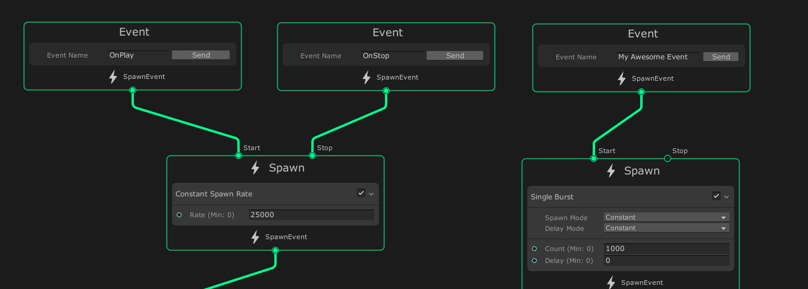

## Events

Events define the inputs for a Visual Effect Graph's [**processing** workflow](GraphLogicAndPhilosophy.md#processing-workflow-(vertical-logic)). The Spawn and Initialize [Contexts](Contexts.md) use Events as their inputs. Through Events, a Visual Effect Graph can:

* Start and stop spawning particles.
* Read [Event Attribute payloads](#event-attribute-payloads) sent from C# scripts.

## Creating Events

In general, an Event is just a string that represents the Event's name. To receive an Event in the Visual Effect Graph, create an Event [Context](Contexts.md) and type the name of the Event you want to receive in the **Event Name** property. Event Contexts have no input flow ports and can only connect their output flow port to Spawn or Initialize Contexts.

To create an Event Context:

1. In the [Visual Effect Graph window](VisualEffectGraphWindow.md), right-click in an empty space.
2. From the menu, click **Create Node**.
3. In the Node Creation menu, click **Contexts > Event (Context)**.
4. In the **Event Name** input field, type the name of your Event.

## Default Events

The Visual Effect Graph provides two default Events:

* **OnPlay**: Enables the spawning of particles when Unity sends the `Play` Event to the Visual Effect. If you do not assign an Event to a Spawn Context's **Start** input flow port, the Visual Effect Graph implicitly binds this Event to that input flow port instead.
* **OnStop**: Disables the spawning of particles when Unity sends the `Stop` Event to the Visual Effect. If you do not assign an Event to a Spawn Context's **Stop** input flow port, the Visual Effect Graph implicitly binds this Event to that input flow port instead.

If you connect an Event Context to a Spawn Context's **Start** or **Stop** input flow port, this removes the implicit binding to the **OnPlay** and **OnStop** Events respectively.

## Custom Events

If you do not want to use the default Events, you can use an Event Context to create your own custom Event.

To do this, first [create an Event Context](#creating-events), then type the name of your custom Event in the **Event Name** property.

## Event Attribute Payloads

Event Attribute payloads are attributes that you can attach to an Event. To set these attributes in a Visual Effect Graph, you can use the **Set [Attribute]** Blocks in Spawn Contexts, but you can also attach them to Events you send from C# scripts. For information on how to do that latter, see [Component API](ComponentAPI.md#event-attributes) .

Event Attribute Payloads are attributes that implicitly travel through the graph from Events, through Spawn Contexts, and eventually to an Initialize Context. To catch a payload in an Initialize Context, use **Get Source Attribute** Operators or **Inherit [Attribute]** Blocks.

## Default Visual Effect Event

The default Visual Effect Event defines the name of the Event that the Visual Effect Graph implicitly sends when a [Visual Effect](VisualEffectComponent.md) instance **Resets**. This happens when the effect first starts, or when the effect restarts.

You can define the default Visual Effect Event for each [Visual Effect Graph Asset](VisualEffectGraphAsset.md) independently. You can also override this value for every instance of the Visual Effect Graph Asset. To override the default Visual Effect Event for an instance, see **Initial Event Name** in the [Visual Effect Inspector](VisualEffectComponent.md).

## GPU Events

GPU Events allow you to spawn particles based on other particles. 

GPU Events are Event Contexts that rely on data sent from other systems, for example, when a particle dies. [Trigger Event Blocks](Block-Trigger-Event.md) send GPU Event Data, and connect to a **GPUEvent** Context. This Context does not handle any Blocks, but instead connects to an Initialize Context of a child system.

To gather data from the parent particle, a child system must refer to [Source Attributes](Attributes.md) in its Initialize Context. To do this, a child system can use a **Get Source Attribute** Operator, or an **Inherit Attribute** Block. For a visual example, see the image below.

*In this example, the child System inherits the source position of the particle that creates it. It also inherit roughly 50% of the parent particle's speed.*
