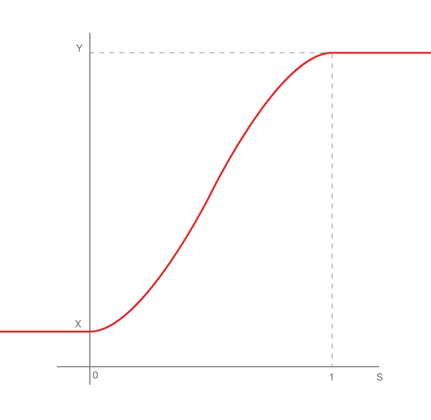

# Smoothstep

Menu Path : **Operator > Math > Arithmetic > Smoothstep**

The **Smoothstep** Operator calculates a smooth Hermite interpolation of a value between two border values with smoothing at the limits.

This Operator returns a value between 0 and 1, depending on the value of **X**, **Y**, and **S**:

- If **S** is less than or equal to **X**, the result is 0.
- If **S** is greater than or equal to **Y**, the result is 1.
- If **S** is between **X** and **Y**, the result is a smooth transition between 0 and 1.

This Operator accepts input values of various types. For the list of types this Operator can use, see [Available Types](#available-types). The **X** and **Y** input are always of the same type. **S** changes to be the same type as **X** and **Y**.

## Operator properties

| **Input** | **Type**                                | **Description**                                              |
| --------- | --------------------------------------- | ------------------------------------------------------------ |
| **X**     | [Configurable](#operator-configuration) | The minimum step value.                               |
| **Y**     | [Configurable](#operator-configuration) | The maximum step value.                                 |
| **S**     | [Configurable](#operator-configuration) | A value for the interpolation. An input of either float type or the same type as **X**. |

| **Output** | **Type**    | **Description**                                              |
| ---------- | ----------- | ------------------------------------------------------------ |
| **Out**    | Output Port | A value between 0 and 1, based on the Hermite interpolation of **S**. |

## Operator configuration

To view the **Smoothstep** Operator’s configuration, click the **cog** icon in the Operator’s header. **X** and **Y** must be the same type among [Available Types](#available-types). If **S** is a vector type, Unity calculates the interpolation value by value.

### Available types

You can use the following types for your **input** ports:

- **float**
- **Vector**
- **Vector2**
- **Vector3**
- **Vector4**
- **Position**
- **Direction**
