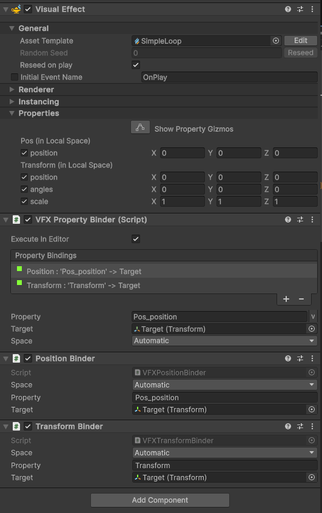

# Property Binders

Property Binders are C# Behaviors you can attach to a GameObject that has a [Visual Effect Component](VisualEffectComponent.md). Use these behaviors to make connections between scene or gameplay values and [Exposed Properties](Blackboard.md#exposed-properties-in-inspector) for this Visual Effect instance.

For example, a Sphere Binder can automatically set the position and the radius of a Sphere Exposed Property using the values of a sphere collider that is linked in the scene.

## Adding Property Binders

You can add Property Binders through a common MonoBehaviour called **VFX Property Binder**. This behavior allows you to use one or more **Property Bindings**. Each property binding is creates a relationship between an [Exposed Property](Blackboard.md#exposed-properties-in-inspector) and a runtime or scene element.

You can also add Property binders through the **Add Component** menu. Unity creates a VFX Property Binder component automatically if one does not already exist.


<br/>A Visual Effect component that uses VFX Property Binder to bind a GameObject's **Transform** and **Position** components to VFX Graph's exposed properties of the same type.


## Built-in Property Binders

The Visual Effect Graph package comes with the following built-in property binders:

* Audio
  * **Audio Spectrum to AttributeMap**: Bakes the Audio Spectrum to an Attribute map and binds it to a Texture2D and uint Count properties.
* GameObject:
  * **Enabled**: Binds the Enabled flag of a Game Object to a bool property.
* Point Cache:
  * **Hierarchy to AttributeMap**: Binds positions and target positions of a hierarchy of transforms to Texture2Ds AttributeMaps and uint Count.
  * **Multiple Position Binder**: Binds positions of a list of transforms to a Texture2D AttributeMap and uint Count.
* Input:
  * **Axis**: Binds the float value of an Input Axis to a float property.
  * **Button**: Binds the bool value of a button press state to a bool property.
  * **Key**: Binds the bool value of a keyboard key press state to a bool property.
  * **Mouse**: Binds the general values of a mouse (Position, Velocity, Clicks) to exposed properties.
  * **Touch**: Binds a input values of a Touch Input (Position, Velocity) to exposed properties.
* Utility:
  * **Light**: Binds Light Properties (Color, Brightness, Radius) to exposed properties.
  * **Plane**: Binds Plane Properties (Position, Normal) to exposed properties.
  * **Terrain**: Binds Terrain Properties (Size, Height Map) to exposed properties.
* Transform:
  * **Position**: Binds game object position to vector exposed property. In the binder, you need to add "*_position*" at the end of your property name for it to work as espected.
  * **Position (previous)**: Binds previous game object position to vector exposed property.
  * **Transform**: Binds game object transform to transform exposed property.
  * **Velocity**: Binds game object velocity to vector exposed property.
* Physics:
  * **Raycast**: Performs a Physics Raycast and binds its result values (hasHit, Position, Normal) to exposed properties..
* Collider:
  * **Sphere**: Binds properties of a Sphere Collider to a Sphere exposed property.
* UI:
  * **Dropdown**: Binds the index of a Dropdown to a uint exposed property.
  * **Slider**: Binds the value of a float slider to a uint exposed property.
  * **Toggle**: Binds the bool value of a toggle to a bool exposed property.

## Writing Property Binders

To write property binders, add new C# classes to your project and extend the `UnityEngine.VFX.Utility.VFXBinderBase` class .

To extend the `VFXBinderBase` class, use one of the following methods:

* `bool IsValid(VisualEffect component)`: A method that validates that the binding can be made. The VFX Property Binder component will only perform the `UpdateBinding()` if this method returns true. You need to implement all checks in this method in order to determine if the binding.
* `void UpdateBinding(VisualEffect component)`: This method applies the bindings if `IsValid` returns true.

#### Example Code

The following example presents a simple Property Binder that sets a float Property value to the distance between the current game object and another (target) Game Object:

```
using UnityEngine;
using UnityEngine.VFX;
using UnityEngine.VFX.Utility;

// The VFXBinder Attribute will populate this class into the property binding's add menu.
[VFXBinder("Transform/Distance")]
// The class need to extend VFXBinderBase
public class DistanceBinder : VFXBinderBase
{
    // VFXPropertyBinding attributes enables the use of a specific
    // property drawer that populates the VisualEffect properties of a
    // certain type.
    [VFXPropertyBinding("System.Single")]
    public ExposedProperty distanceProperty;

    public Transform target;

    // The IsValid method need to perform the checks and return if the binding
    // can be achieved.
    public override bool IsValid(VisualEffect component)
    {
        return target != null && component.HasFloat(distanceProperty);
    }

    // The UpdateBinding method is the place where you perform the binding,
    // by assuming that it is valid. This method will be called only if
    // IsValid returned true.
    public override void UpdateBinding(VisualEffect component)
    {
        component.SetFloat(distanceProperty, Vector3.Distance(transform.position, target.position));
    }
}
```
