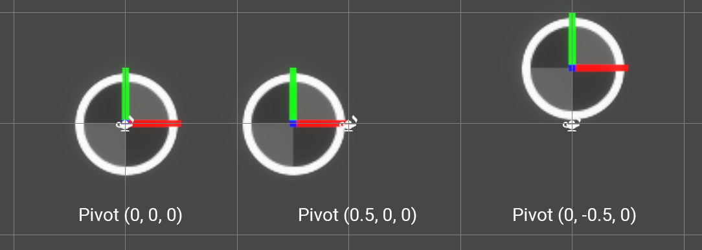

# Standard Attribute Reference

## Standard Attributes

Here is a comprehensive List of all commonly used attributes, with a brief description and usages.

### Basic Simulation Attributes

The Initialize and Update Contexts use Simulation Attributes to apply behavior to **simulated elements** such as Particles or Particle Trails.

| Name       | Type    | Description                                                  | Default Value                                     |
| ---------- | ------- | ------------------------------------------------------------ | ---------- |
| `position` | Vector3 | The position of a simulated element, expressed in the corresponding [System Space](Systems.md), in System Units | (0,0,0) |
| `velocity` | Vector3 | The current self-velocity of the simulated element, expressed as a 3D Vector in the corresponding [System Space](Systems.md), in System Units per Second. | (0,0,0) |
| `age`      | float   | The age of the simulated element, since its spawn, expressed in Seconds. | 0.0 |
| `lifetime` | float | The life expectancy of a simulated element, expressed in Seconds. | 0.0 |
| `alive` | bool | Whether the simulated element is alive or not. | true |
| `size` | float | The size of a simulated element, in system Units. | 0.1 |

### Advanced Simulation Attributes

Some attributes are a bit more advanced and will be used by default in most simulations. However, you can alter these attributes to enhance how other attributes behave.

| Name       | Type    | Description                                                  | Default Value                                     |
| ---------- | ------- | ------------------------------------------------------------ | ---------- |
| `mass` | float | The mass of a particle in Kg/dm^3 | 1.0 (defaults to 1kg per liter of water) |
| `direction` | Vector | You can use this attribute in the following ways: &#8226;As a storage helper to store arbitrary direction. &#8226;Use any block that sets a shape position to write to the direction attribute. For example, Set Position (Shape : Circle). | (0.0, 0.0, 1.0) |
| `angle` | Vector3 | **Variadic:** Euler rotation of a simulated element, expressed as a Vector of Degrees Values. | (0,0,0) |
| `angularVelocity` | Vector3 | **Variadic:** Euler rotation speed of a simulated element, expressed as a Vector of Degrees per second values. | (0,0,0) |
| `oldPosition` | Vector3 | **Deprecated:** This attribute is a storage Helper if you want to back-up current position of a simulated element, before integrating its velocity. | (0,0,0) |
| `targetPosition` | Vector3 | This attribute has various purposes: it can be a storage Helper if you want to store a position to reach, then compute a vector in order to reach this Target Position. In Line Renderers, this attribute can be also used to set the end of each line particle. | (0,0,0) |

### Rendering Attributes

Rendering Attributes are not used in simulation but are useful when you want to render a simulated element.

| Name       | Type    | Description                                                  | Default Value                                     |
| ---------- | ------- | ------------------------------------------------------------ | ---------- |
| `color` | Vector3 | The R,G, and B Components of the Rendered Element. | 1,1,1 |
| `alpha` | float | The alpha Component of the Rendered Element | 1 |
| `size` | float | The uniform size of a rendered element, in system Units, applied to its **unit representation** | 0.1 |
| `scale` | Vector3 | The Non-uniform Scale multiplier of a rendered element, applied to its **unit representation** | (1,1,1) |
| `pivot` | Vector3 | The Origin position of a rendered element, in its **unit representation** | (0,0,0) |
| `texIndex` | float | The animation frame used for sampling Flipbook UVs for a rendered element. | 0.0 |
| `axisX` | Vector3 | The computed Right axis of the rendered Element. | (1,0,0) |
| `axisY` | Vector3 | The computed Up axis of the rendered Element. | (0,1,0) |
| `axisZ` | Vector3 | The computed Forward axis of the rendered Element. | (0,0,1) |

### System Attributes

System Attributes provide information about system values. These attributes are available as **Read Only**, which means you can only read them using the `Get <Attribute>` Operator.

| Name       | Type    | Description                                                  | Default Value                                     |
| ---------- | ------- | ------------------------------------------------------------ | ---------- |
| `particleID` | uint | A unique ID that refers to 1 particle | 0 |
| `seed` | uint | A unique seed used for random number computations. | 0 |
| `spawnCount` | uint | A SpawnEvent attribute available as Source Attribute in Spawn Contexts, that describes how many particles were spawned this frame. | (0,0,0) |
| `spawnTime` | float | A SpawnEvent attribute available as Source Attribute in Spawn Contexts, that contains a Spawn Context internal time (when exported using a **Set Spawn Time** Spawn Block) | 0.0 |
| `particleIndexInStrip` | uint | The index in the Particle Strip Ring Buffer where is located this element. | 0 |
## Attribute Usage and Implicit Behavior

Some attributes combinations are used in various implicit cases during simulation and rendering. Here is a list of the usages and an explanation of their relationships.

#### Velocity and Position : Integration

During an Update simulation : any system that uses the `velocity` attribute will  integrate the velocity to the positions, every frame.

Velocity integration basically used the following formula: `position += velocity * deltaTime`

> Automatic Velocity Integration can be disabled by selecting the Update Context, then setting the Integration enum to **None**.

#### Age, Lifetime and Alive

Setting a Lifetime attribute to a particle in an Initialize Context, will implicitly add the following behaviors to an Update Context:

* Particle will age using the formula `age += deltaTime`
* Particles will be reaped using the formula : `alive = (age < lifeTime)`

> Automatic particle aging can be disabled by selecting the Update Context, then setting the Age Particles value to **False**.

> Automatic particle reaping can be disabled by selecting the Update Context, then setting the Reap Particles value to **False**.

> **Immortal Particles:** Particles with no lifetime will be considered as immortal. You can still kill them explicitly by setting their `alive` attribute to `false`.

#### Angle and Angular Velocity : Angular Integration

During an Update simulation : any system that uses the `angularVelocity` attribute will  integrate the angular Velocity to the angles, every frame.

Angular Velocity integration basically used the following formula: `angle += angularVelocity * deltaTime`

> Automatic Velocity Integration can be disabled by selecting the Update Context, then setting the Angular Integration Enum to **None**.

#### AxisX, AxisY and AxisZ

These three attributes define the **unit representation** 3d coordinate system. While these axis are expected to be normalized, you can use non-normalized lengths and non-orthogonal angles between all three axis.

> Most of the time, these axis are set using the Orient Block (Output Context Only).

#### Size, Scale and Pivot

In order to apply scaling and rotation to simulated elements, Visual Effect Graph uses 3 attributes:

* `size` (float) : uniform size of the particle.
* `scale`(Vector3) : per-axis size of the particle.
* `pivot` (Vector3) : pivot position in the unit representation.

The **Pivot** of a particle is computed in an unit box of size 1 : the **unit representation**. By default, it is (0,0,0), the center of the box. You can change its Value to adjust the center of the box. Every face is located at -0.5 or 0.5 in each axis.

The pivot representation can be also generalized in 3D, with the Z Axis being used for depth.

> Using the Z-Component for Quad Particles using Camera Facing will pull the element towards the camera position or plane, or push it away so it appears more in front, or behind its actual position.

**Scaling** of a particle applies two multipliers the **unit representation** box:

* The uniform `size`
* The non-uniform `scale`

You can use these attributes to perform uniform and non-uniform scaling independently. For example, use the particle scale to compute an initial random scale, and use the size attribute to animate every element, keeping its ratio.
