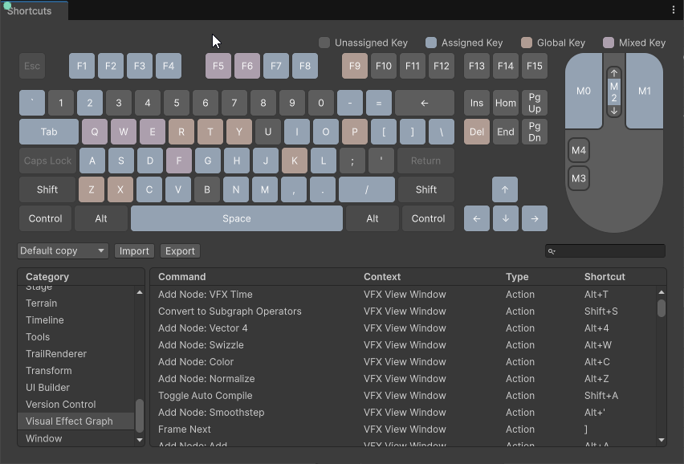

# VFX Graph keyboard shortcuts reference

Use keyboard shortcuts to quickly access common operations in Unity.
You can view and edit the VFX Graph shortcuts in **Edit** > **Shortcuts** > **Visual Effect Graph** (macOS: **Unity** > **Shortcuts** > **Visual Effect Graph**).
For more information, refer to [Shortcuts Manager](xref:um-shortcuts-manager).

## Default shortcuts

| **Command**                                | **Shortcut (Windows/Linux)** | **Shortcut (macOS)**   | **Description**                                                               |
|--------------------------------------------|------------------------------|------------------------|-------------------------------------------------------------------------------|
| **Frame All**                              | `A`                          | `A`                    | Frames all nodes in the graph.                                                |
| **Frame Selection**                        | `F`                          | `F`                    | Frames the selected nodes in the graph.                                       |
| **Frame Origin**                           | `O`                          | `O`                    | Frames to the center of the graph.                                            |
| **Frame Previous**                         | `[`                          | `[`                    | Frames the previous node in the graph.                                        |
| **Frame Next**                             | `]`                          | `]`                    | Frames the next node in the graph.                                            |
| **Deselect All**                           | `Shift`+`D`                  | `Shift`+`D`            | Deselects all nodes in the graph.                                             |
| **Compile**                                | `Shift`+`C`                  | `Shift`+`C`            | Compiles the graph by generating the associated compute and fragment shaders. |
| **Duplicate with Link**                    | `Alt`+`Shift`+`D`            | `Option`+`Shift`+`D`   | Duplicates the selected nodes and links them to the original nodes.           |
| **Restart VFX**                            | `Shift`+`Space`              | `Shift`+`Space`        | Restarts the VFX Graph (stops and starts the VFX Graph simulation).           |
| **Toggle all debug panels**                | `Shift`+`5`                  | `Shift`+`5`            | Toggles all debug panels visibility.                                          |
| **Toggle Blackboard**                      | `Shift`+`1`                  | `Shift`+`1`            | Shows/hides the blackboard.                                                   |
| **Toggle Control Panel**                   | `Shift`+`3`                  | `Shift`+`3`            | Shows/hides the control panel.                                                |
| **Toggle Profiling Panel**                 | `Shift`+`4`                  | `Shift`+`4`            | Shows/hides the profiling panel.                                              |
| **Save**                                   | `Control`+`S`                | `Command`+`S`          | Saves the current VFX Graph.                                                  |
| **Save As**                                | `Shift`+`S`                  | `Shift`+`S`            | Saves the current VFX Graph as a new file.                                    |
| **Open Documentation**                     | `F1`                         | `F1`                   | Opens the VFX Graph documentation in the default web browser.                 |
| **Group Selection**                        | `Shift`+`G`                  | `Shift`+`G`            | Creates a group containing the selected nodes.                                |
| **Toggle Collapse Selection**              | `Shift`+`P`                  | `Shift`+`P`            | Collapses/expands the selected nodes.                                         |
| **Insert Node on Link**                    | `Shift`+`R`                  | `Shift`+`R`            | Inserts a node on the selected link (opens the node search).                  |
| **Toggle Auto Compile**                    | `Shift`+`A`                  | `Shift`+`A`            | Toggles auto compile on/off.                                                  |
| **Add Sticky Note**                        | `Shift`+`N`                  | `Shift`+`N`            | Adds a sticky note to the graph.                                              |
| **Clean All Unlinked Operators**           | `Shift`+`Backspace`          | `Shift`+`Backspace`    | Deletes all unlinked operators in the graph.                                  |
| **Convert to Subgraph Operators**          | `Shift`+`S`                  | `Shift`+`S`            | Converts selected operators to a subgraph operator.                           |
| **Toggle Property--Inline**                | `Shift`+`X`                  | `Shift`+`X`            | Converts selected operators to a property node and vice-versa.                |
| **Save HLSL Code**                         | `Control`+`S`                | `Control`+`S`          | Saves the HLSL code when focus is in the HLSL code editor window.             |
| **Undo HLSL Change**                       | `Control`+`Z`                | `Control`+`Z`          | Undoes the last change in the HLSL code editor.                               |
| **Redo HLSL Change**                       | `Control`+`Y`                | `Control`+`Y`          | Redoes the last change in the HLSL code editor.                               |
| **Increase Font Size in HLSL Code Editor** | `Control`+`Wheel Up`         | `Command`+`Wheel Up`   | Increases the font size in the HLSL code editor.                              |
| **Decrease Font Size in HLSL Code Editor** | `Control`+`Wheel Down`       | `Command`+`Wheel Down` | Decreases the font size in the HLSL code editor.                              |
| **Add Node: Subtract**                     | `Alt`+`S`                    | `Option`+`S`           | Adds a [Subtract](Operator-Subtract.md) node in the graph.                    |
| **Add Node: Multiply**                     | `Alt`+`M`                    | `Option`+`M`           | Adds a [Multiply](Operator-Multiply.md) node in the graph.                    |
| **Add Node: Add**                          | `Alt`+`A`                    | `Option`+`A`           | Adds an [Add](Operator-Add.md) node in the graph.                             |
| **Add Node: Lerp**                         | `Alt`+`L`                    | `Option`+`L`           | Adds a [Lerp](Operator-Lerp.md) node in the graph.                            |
| **Add Node: Divide**                       | `Alt`+`D`                    | `Option`+`D`           | Adds a [Divide](Operator-Divide.md) node in the graph.                        |
| **Add Node: Float**                        | `Alt`+`1`                    | `Option`+`1`           | Adds a [Float](Operator-Inlinefloat.md) node in the graph.                    |
| **Add Node: Vector 2**                     | `Alt`+`2`                    | `Option`+`2`           | Adds a [Vector 2](Operator-InlineVector2.md) node in the graph.               |
| **Add Node: Vector 3**                     | `Alt`+`3`                    | `Option`+`3`           | Adds a [Vector 3](Operator-InlineVector3.md) node in the graph.               |
| **Add Node: Vector 4**                     | `Alt`+`4`                    | `Option`+`4`           | Adds a [Vector 4](Operator-InlineVector4.md) node in the graph.               |
| **Add Node: Age over lifetime**            | `Alt`+`O`                    | `Option`+`O`           | Adds an [Age over lifetime](Operator-AgeOverLifetime.md) node in the graph.   |
| **Add Node: VFX Time**                     | `Alt`+`T`                    | `Option`+`T`           | Adds a [VFX time](Operator-TotalTime.md) node in the graph.                   |
| **Add Node: Random Number**                | `Alt`+`F`                    | `Option`+`F`           | Adds a [Random number](Operator-RandomNumber.md) node in the graph.           |
| **Add Node: One Minus**                    | `Alt`+`I`                    | `Option`+`I`           | Adds a [One minus](Operator-OneMinus.md) node in the graph.                   |
| **Add Node: Saturate**                     | `Alt`+`Q`                    | `Option`+`Q`           | Adds a [Saturate](Operator-Saturate.md) node in the graph.                    |
| **Add Node: Custom HLSL**                  | `Alt`+`H`                    | `Option`+`H`           | Adds a [Custom HLSL](Operator-CustomHLSL.md) node in the graph.               |
| **Add Node: Sample Curve**                 | `Alt`+`U`                    | `Option`+`U`           | Adds a [Sample curve](Operator-SampleCurve.md) node in the graph.             |
| **Add Node: Sample Gradient**              | `Alt`+`G`                    | `Option`+`G`           | Adds a [Sample gradient](Operator-SampleGradient.md) node in the graph.       |
| **Add Node: Power**                        | `Alt`+`P`                    | `Option`+`P`           | Adds a [Power](Operator-Power.md) node in the graph.                          |
| **Add Node: Floor**                        | `Alt`+`[`                    | `Option`+`[`           | Adds a [Floor](Operator-Floor.md) node in the graph.                          |
| **Add Node: Ceiling**                      | `Alt`+`]`                    | `Option`+`]`           | Adds a [Ceiling](Operator-Ceiling.md) node in the graph.                      |
| **Add Node: Clamp**                        | `Alt`+`=`                    | `Option`+`=`           | Adds a [Clamp](Operator-Clamp.md) node in the graph.                          |
| **Add Node: Minimum**                      | `Alt`+`B`                    | `Option`+`B`           | Adds a [Minimum](Operator-Minimum.md) node in the graph.                      |
| **Add Node: Maximum**                      | `Alt`+`N`                    | `Option`+`N`           | Adds a [Maximum](Operator-Maximum.md) node in the graph.                      |
| **Add Node: Smoothstep**                   | `Alt`+`'`                    | `Option`+`'`           | Adds a [Smoothstep](Operator-Smoothstep.md) node in the graph.                |
| **Add Node: Remap**                        | `Alt`+`R`                    | `Option`+`R`           | Adds a [Remap](Operator-Remap.md) node in the graph.                          |
| **Add Node: Step**                         | `Alt`+`J`                    | `Option`+`J`           | Adds a [Step](Operator-Step.md) node in the graph.                            |
| **Add Node: Absolute**                     | `Alt`+`\`                    | `Option`+`\`           | Adds an [Absolute](Operator-Absolute.md) node in the graph.                   |
| **Add Node: Fraction**                     | `Alt`+`/`                    | `Option`+`/`           | Adds a [Fraction](Operator-Fractional.md) node in the graph.                  |
| **Add Node: Modulo**                       | `Alt`+`5`                    | `Option`+`5`           | Adds a [Modulo](Operator-Modulo.md) node in the graph.                        |
| **Add Node: Compare**                      | `Alt`+`K`                    | `Option`+`K`           | Adds a [Compare](Operator-Compare.md) node in the graph.                      |
| **Add Node: Branch**                       | `Alt`+`Y`                    | `Option`+`Y`           | Adds a [Branch](Operator-Branch.md) node in the graph.                        |
| **Add Node: Swizzle**                      | `Alt`+`W`                    | `Option`+`W`           | Adds a [Swizzle](Operator-Swizzle.md) node in the graph.                      |
| **Add Node: Normalize**                    | `Alt`+`Z`                    | `Option`+`Z`           | Adds a [Normalize](Operator-Normalize.md) node in the graph.                  |
| **Add Node: Cross Product**                | `Alt`+`X`                    | `Option`+`X`           | Adds a [Cross product](Operator-CrossProduct.md) node in the graph.           |
| **Add Node: Dot Product**                  | `Alt`+`.`                    | `Option`+`.`           | Adds a [Dot product](Operator-DotProduct.md) node in the graph.               |
| **Add Node: Negate**                       | `Alt`+`-`                    | `Option`+`-`           | Adds a [Negate](Operator-Negate.md) node in the graph.                        |
| **Add Node: Sample Texture 2D**            | `Alt`+`E`                    | `Option`+`E`           | Adds a [Sample texture 2D](Operator-SampleTexture2D.md) node in the graph.    |
| **Add Node: Color**                        | `Alt`+`C`                    | `Option`+`C`           | Adds a [Color](Operator-InlineColor.md) node in the graph.                    |
