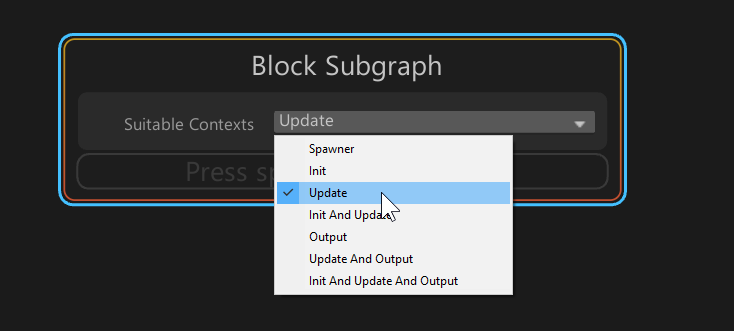

## Subgraph

A Visual Effect Subgraph is an Asset that contains a part of a Visual Effect Graph that can be used in another Visual Effect Graph or Subgraph. Subgraphs appear as a single Node.

Subgraphs can be used in graphs as three main usages:

* **System Subgraph**:  One, or many [Systems](Systems.md) contained into one Graph.
* **Block Subgraph**: A set of [Blocks](Blocks.md) and [Operators](Operators.md) packaged together and used as a Block.
* **Operator Subgraph**: A set of [Operators](Operators.md) packaged together and used as an Operator.

Subgraphs allow you to factorize commonly used sets of Nodes in a graph into reusable Assets and adds them to the Library.

## System Subgraphs

System Subgraphs are Visual Effect Graphs that are **nested** inside other Visual Effect Graphs:

 Example subgraph of an explosion.

Visual Effect Graphs used as Subgraphs appear as a [Context](Contexts.md) that presents:

* **Exposed Properties** defined in the subgraph.
* **Events** used in the subgraph.

### Creating System Subgraphs

System Subgraphs are Visual Effect (VFX) assets, so you can't create them directly in the **Visual Effect Graph** window. To use an existing VFX asset as a System Subgraph, drag it from the **Project** view to the **Visual Effect Graph** window.

### Editing System Subgraphs

To edit a System Subgraph that is open in the Visual Effect Graph window:

1. Double-click the Visual Effect Graph Asset in the Project view.
2. Right-click the System Subgraph Context.
3. Select Enter Subgraph in the context menu.

### Using a System Subgraph in a Visual Effect Graph

To add a System Subgraph Node to your Graph, drag a Visual Effect Graph from your Project View to the Visual Effect Graph window.

### Customizing System Subgraph Nodes

You can customize System Subgraph properties in the same way you customise Visual Effect Graph properties. You can also use Operators to create custom expressions in that extend the behavior of the systems contained in the subgraph.

You can send Events to the Workflow inputs of the System Subgraph Node using Event or Spawn Context.

**Note**: When you use a System Subgraph, Unity creates a deep copy in the parent. This means the System Subgraph isn't a reference at runtime, and Unity generates a new set of shaders and runtime data. Extensive use of System Subgraphs can impact performance, including longer import times in the Editor and increased memory consumption at runtime. Use System Subgraphs sparingly to minimize these impacts.

## Block Subgraphs

Block Subgraphs are specific Subgraphs that only contain Operators and Blocks. You can use Block Subgraphs as Blocks inside another Visual Effect Graph or SubGraph.

 Example Block subgraph of a superpower.

### Creating Block Subgraphs

To create a Block Subgraph:

1. Create a Visual Effect Subgraph Block in the Project Window using **Asset/Create/Visual Effects/Visual Effect Subgraph Block**.
2. Select one or more Blocks and optionally Operators in a Visual Effect Graph
3. Navigate to the the Right-Click context menu and select **Convert to Subgraph Block**
4. Save the Sub Graph Asset in the Save File Dialog.

When you create a subgraph using this method, Unity replaces all converted content with a Block Subgraph Node.

### Editing Block Subgraphs

You can edit a Block Subgraph in one of the following ways:

* Open a Block Subgraph in the Visual Effect Graph window.
* Double click the Subgraph Asset in the Project view.
* Right-click the subgraph Block and select **Open Subgraph** in the context menu.

 Dropdown edit menu of a Block subgraph.

You can add Blocks inside the non-removable Context named Block Subgraph.

* All Blocks indside the Block Subgraph Context execute in order when used as a subgraph
* You can customize the Context using the Suitable Contexts properties, which determines which Context types are compatible with the Block Subgraph
  
You can define the Menu Category the subgraph Block appears in the [Blackboard](Blackboard.md)

### Using Block Subgraphs

To add a Block Subgraph Node to your Graph:

* Drag a Visual Effect Subgraph Block Asset from your Project view to the Visual Effect Graph window, inside a Context's Block Area.

Or:

* Use the Create Block Menu by typing the Block Subgraph Asset name.

### Customizing Block Subgraphs

You can customize Block Subgraph properties in the same way as regular Block properties. You can also use Operators to create custom expressions in order to extend the behavior of the Block used as subgraph.

## Operator Subgraphs

Operator Subgraphs are specific Subgraphs Assets that only contain Operators and that can be used as Operators inside another Visual Effect Graph or Sub Graph.

 Example Operator subgraph of a random vector.

### Creating Operator Subgraphs

To create an Operator Subgraph:

1. Create a Visual Effect Subgraph Operator in the Project window directory `Assets\Create\Visual Effects\Visual Effect Subgraph Operator`.
2. Select one or more Operators in a Visual Effect Graph.
3. Right-click to open the context menu, and select **Convert to Subgraph Operator**.
4. Save the Sub Graph Asset in the Save File Dialog.

When you create a subgraph using this method, Unity replaces all converted content with an Operator Subgraph Node.

### Editing Operator Subgraphs

To edit an Operator Subgraph by opening it in the Visual Effect Graph window:

* Double-click the Subgraph Asset in the Project view.

Or:

* Right-click the subgraph Operator to open the context menu, and select **Open Subgraph**.

You can set up Input and Output Properties for the Operator in the Blackboard:

* To create **Input** Properties, add new Properties and enable their **Exposed** flag.
* To create **Output** Properties, add new Properties, and move them to the **Output Category**.

Use the [Blackboard](Blackboard.md) to define the Menu Category that the subgraph Operator appears in.

### Using Operator Subgraphs

To add an Operator Subgraph Node to your Graph:

* Drag a Visual Effect Subgraph Operator Asset from your Project view to the Visual Effect Graph workspace.

Or:

* Right-click in the workspace, select Create Node from the menu, go to Subgraph category, and pick your preferred subgraph operator.

### Customizing Operator Subgraphs

You can customize Operator Subgraph properties in the same way as regular Block properties. You can also use Operators to create custom expressions in order to extend the behavior of the Block used as subgraph.
