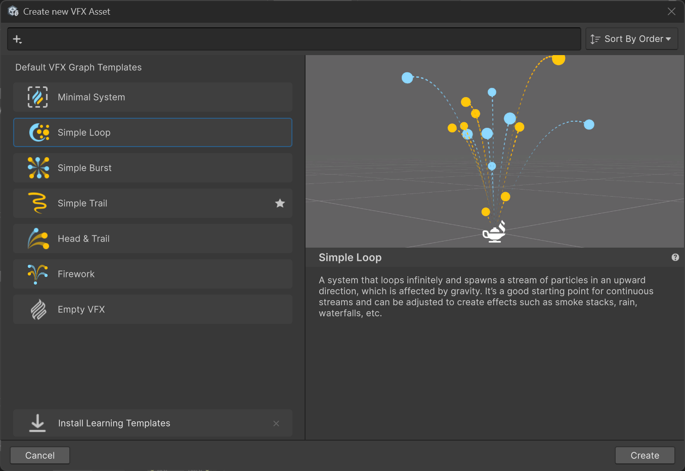
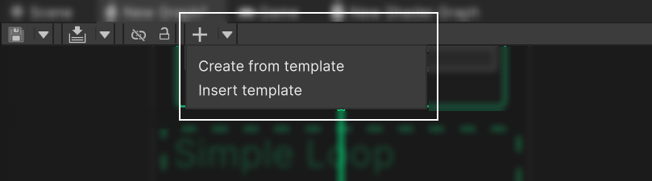

# VFX Graph Templates window
Use the template window to create a VFX Graph asset with a predefined effect. You can use these templates as a starting point for your own effects.
Each template has a description and an image to describe its behavior.    
This window is displayed when you create a new Visual Effect Graph from the `Create` context menu in the project browser.

## Open from VFX Graph editor toolbar

You can open the templates window from the **Add** (+) button in the VFX Graph editor toolbar. This button includes a drop-down to either `insert` a template in the current graph, or `create` a new asset file from a template.

When you insert a template, Unity places it at the center of the screen.    

> [!TIP]
> If you hold the `CTRL` key while you click on the **Add** (+) button, the templates window opens to create a new VFX asset.

## Open from the VFX Graph context menu
When you right click in the VFX Graph editor window, the context menu shows the **Insert template** option, which inserts the template at the mouse position.

## Search and filter templates
The template window includes a search field to filter templates according to various criteria.
The search field works the same way as with the main [Unity search window](https://docs.unity3d.com/Manual/search-window-reference.html), although there are fewer filters available.

## Sort templates
Next to the search field, a dropdown allows to sort templates by:
- Name
- Order
- Modification date
- Last used
- Favorite

> [!NOTE]
> The sorting is applied inside each category, but categories are always sorted by name.

## VFX Graph template Editor

When you select a [Visual Effect Asset](VisualEffectGraphAsset.md) in the Project window, the inspector displays a section dedicated to template description.
To make a Visual Effect asset become a template, activate the **Use as Template** option.
By default the template name is the asset name, but you can override it by editing the `Name` field.
The description, icon and thumbnail fields are optional, but can help to understand the purpose of the template when browsing in the template window.
