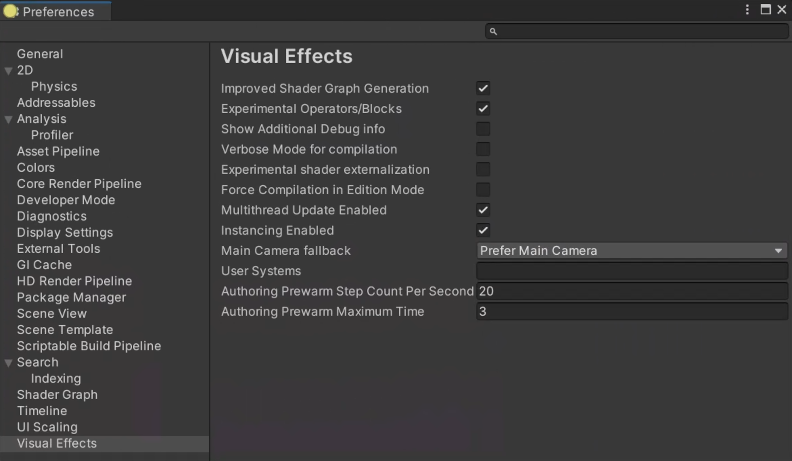

# Visual Effect Graph preferences

Visual Effect Graph preferences is a panel in the Unity Preferences window. To access this panel, go to **Edit > Preferences > Visual Effects**.

## Properties:

| Name                                         | Description                                                  |
| -------------------------------------------- | ------------------------------------------------------------ |
| **Experimental Operators/Blocks**            | Displays experimental Blocks and Operators in the [Node Creation Menu](GettingStarted.md#manipulating-graph-elements). |
| **Show Additional Debug info**               | Displays more detailed debug information in the Inspector when you select [Blocks](Blocks.md), [Operators](Operators.md) or [Contexts](Contexts.md) |
| **Verbose Mode for Compilation**             | Enables verbose logging in the console when Unity compiles VFX Graphs.     |
| **Experimental Shader Externalization**      | Enables externalizing shaders for Debugging purposes in the [Visual Effect Graph Asset Inspector](VisualEffectGraphAsset.md). |
| **Generate Shaders with Debug Symbols**      | Enables shader debug symbols when Unity compiles a VFX graph. |
| **Force Compilation in Edition Mode**        | Disables Graph Optimization when Saving Assets (for Debug Purposes Only) |
| **Main Camera fallback**                     | Specifies the camera source for [MainCamera](Operator-MainCamera.md) Operators and [Blocks](Blocks.md) to use when in the editor. The options are: &#8226; **Prefer Main Camera**: If the Game view is open, Unity uses the main Camera. If the Game view is not open, but the Scene view is, Unity uses the Scene view Camera. &#8226; **Prefer Scene Camera**: If the Scene view is open, Unity uses the Scene view Camera. If the Scene view is not open, but the Game view is, Unity uses the main Camera. &#8226; **No Fallback**: Uses the main Camera even if Unity does not render to it. |
| **Target in Shader Graph**                   | Displays the [Visual Effect Target](sg-target-visual-effect.md) in the ShaderGraph **Target Settings**. From VFX Graph version 23.1, use the [Support VFX Graph](sg-working-with.md) toggle instead. |
| **Authoring Prewarm Step Count Per Second**  | Specifies the number of steps each second that [Auto Reinit](VisualEffectGraphWindow.md#Toolbar) prewarms. A high value might impact performance when you author a VFX Graph. |
| **Authoring Prewarm Maximum Time**           | Specifies the maximum amount of time (in seconds) that [Auto Reinit](VisualEffectGraphWindow.md#Toolbar) can prewarm. |
