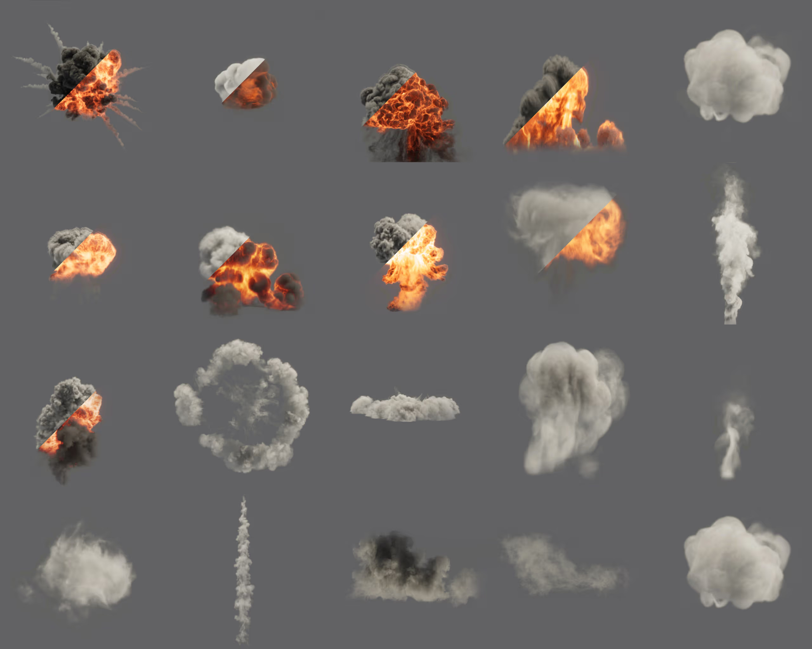

# Customize existing six-way lightmap textures

Customize lightmap textures to create smoke, dust, or explosions with six-way lighting.

Unity provides a library of ready-to-use textures under the [CC0 license](https://creativecommons.org/public-domain/cc0/). These lightmap textures were created in an external DCC and exported using the tools provided in the [VFX Toolbox](https://github.com/Unity-Technologies/VFXToolbox). You can leverage these assets to create compact, game-ready effects with six-way lighting techniques.

To create an effect using built-in lightmaps and six-way lighting, follow these steps:

1. Download the lightmaps from the [library of ready-to-use maps](https://drive.google.com/drive/folders/1_oh0UkAOW6hISqouCXjYwKQ0lkoj0CIF).

1. Unzip the file you downloaded and place it in Unity's **Asset** folder.

1. In the **Project** window, right-click and select **Create** > **Visual Effects** > **Visual Effect Graph**.

	The **Create new VFX Asset** window displays.

1. Create a simple loop VFX asset.

1. Double-click the new VFX asset.

	The VFX Graph editor displays.

1. Open the [Blackboard](Blackboard.md).

1. Right-click the **Output Particle Unlit** node.

1. Select **Convert output**, then convert the node to an **Output Particle Lit Quad** node.

1. With the **Output Particle Lit Quad** node selected, select **Six-Way Smoke Lit** from the Inspector **Material Type** dropdown.

1. Drop the lightmaps you imported in the **Output Particle** context **Positive Axes Lightmap** and **Negative Axes Lightmap** fields.

You can now test the effect in various lighting setups.

## Additional resources

- [VFX Graph](https://unity.com/features/visual-effect-graph)
- [The definitive guide to creating advanced visual effects in Unity](https://create.unity.com/definitive-guide-to-creating-advanced-visual-effects)
- [Realistic smoke lighting with six-way lighting in VFX Graph](https://unity.com/blog/engine-platform/realistic-smoke-with-6-way-lighting-in-vfx-graph)
- [VFX Graph: Six-way lighting workflow | Unity at GDC 2023](https://www.youtube.com/watch?v=uNzLQjpg6UE)
