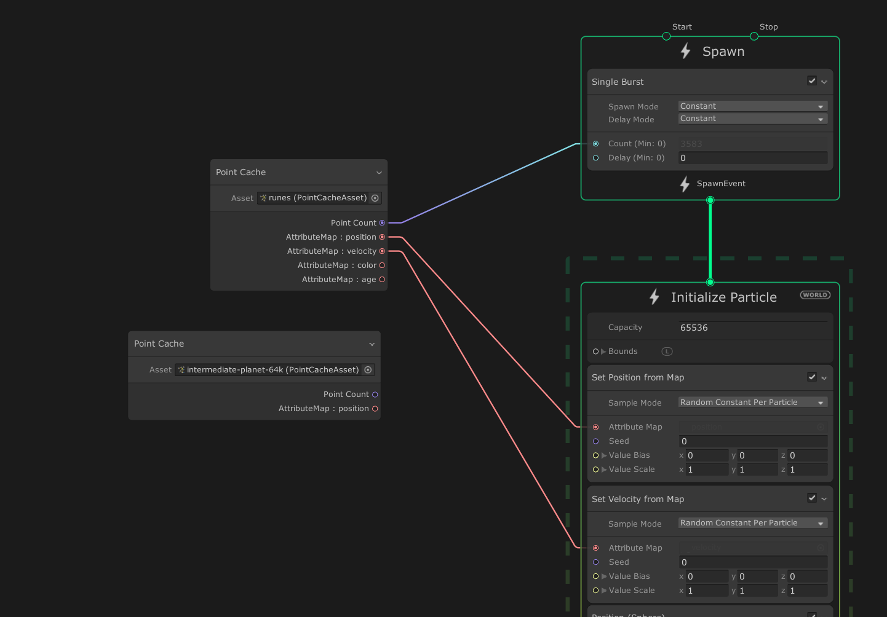

# Point Caches in the Visual Effect Graph

A Point Cache is an asset that stores points and their attributes baked into textures. You can use Point Caches to create particle effects in the shape of complex geometry.

## Attribute map

A Point Cache stores data in attribute maps. An attribute map is a list of values (one for every point in the Point Cache) for a particular point attribute. For example, the position attribute map stores a position for each point in the Point Cache. Each point has an index which you can use to access its attribute values. To get the attribute data for a point, you look up each attribute map at the point's index. You can think of a Point Cache as a table where each column represents an attribute map and each row represents a point. For example:

|             | **Position** | **Normal** | **Color** |
| ----------- | ------------ | ---------- | --------- |
| **Point 1** | ...          | ...        | ...       |
| **Point 2** | ...          | ...        | ...       |
| **Point 3** | ...          | ...        | ...       |
| **Point 4** | ...          | ...        | ...       |
| **...**     | ...          | ...        | ...       |

## Point Cache assets

Unity imports and stores Point Caches as an asset. Point Cache assets follow the open-source [Point Cache](https://github.com/peeweek/pcache/blob/master/README.md) specification and use the `.pCache` file extension. They have no public properties to edit in the Inspector, but they do display read-only information such as the number of particles and the textures that represent the particle properties. For more information about Point Cache assets and a description of the properties they display in the Inspector, see [Point Cache asset](point-cache-asset.md).

## Using Point Caches

The [Point Cache Operator](Operator-PointCache.md) enables you to use Point Caches in visual effects. This Operator extracts the number of particles and their attributes from the Point Cache asset and exposes them as output ports in the Operator. You can then connect the ports to other Nodes, such as the [Set \<attribute> from Map](Block-SetAttributeFromMap.md) Block.

## Generating Point Caches

To generate a Point Cache for use in a visual effect, you can use any of the following methods:

- The built-in [Point Cache Bake Tool](point-cache-bake-tool.md)
- The Houdini pCache Exporter bundled with [*VFXToolbox*](https://github.com/Unity-Technologies/VFXToolbox) (located in the /DCC~ folder) enables you to bake Point Caches.

- You can write your own exporter to write Point Cache files. For information on the Point Cache asset format and specification, see the [pCache README](https://github.com/peeweek/pcache/blob/master/README.md).

## Limitations and Caveats

The Importer supports the `float` and `uchar` property types. Any property of other types returns an error.
