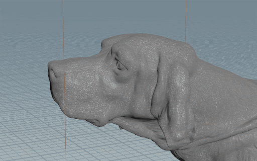
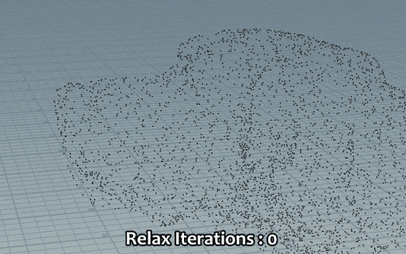

# Representing complex shapes in a visual effect

In the Visual Effect Graph, you can use various Nodes to create custom particle behaviors. However, you might find it difficult to create complex shapes using only mathematical functions. To help with this, the Visual Effect Graph supports Signed Distance Fields (SDFs) and Point Caches within visual effects.

## Signed Distance Fields

A [Signed Distance Field](sdf-in-vfx-graph.md) (SDF) is a 3D texture representation of mesh geometry. To represent the geometry, each texel stores the closest distance value to the surface of the mesh. By convention, this distance is negative inside the mesh and positive outside. This texture representation of the mesh enables you to place a particle at any point on the surface, inside the bounds of the geometry, or at any given distance to it.

Very detailed meshes require a high texture resolution to represent them, which requires more memory. Calculating a random position from an SDF is also more resource-intensive to process, compared to a Point Cache. However, an SDF can serve more purposes than a Point Cache; a visual effect can use SDFs to position particles, conform particles to a particular shape, or collide with particles.

For more information, see [Signed Distance Fields](sdf-in-vfx-graph.md).

 *This gif shows how different 3D texture resolutions affect the accuracy of an SDF. It also shows how the SDF representations compare to the original geometry.*

## Point Caches

A [Point Cache](point-cache-in-vfx-graph.md) is an asset that stores a fixed list of particle attribute data, including points and their position, normal, and color. Because the particle positions and attributes are directly baked into the asset, Point Caches are significantly less resource-intensive to process than SDFs. During the baking process, additional filtering allows points to relax. Point relaxation is a process that separates out points more evenly and reduces the number of overlaps.

You can use Point Caches to represent lists of points generated from 3D meshes or 2D textures, but not their actual geometry. Point attributes are baked into the asset, so if you want a wider variety of points, you need to add more during the baking process. For more information, see [Point Caches](point-cache-in-vfx-graph.md).

 *This gif shows how relaxing points in a Point Cache results in a more even spacing between*
