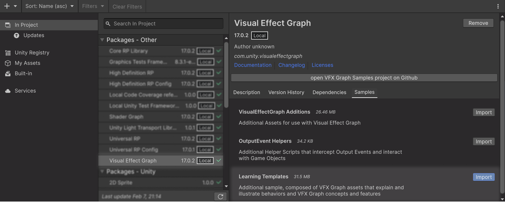
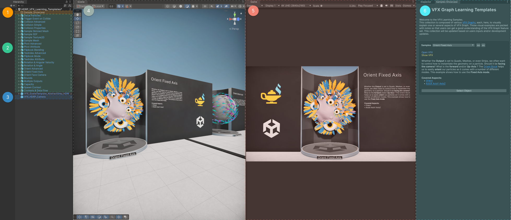
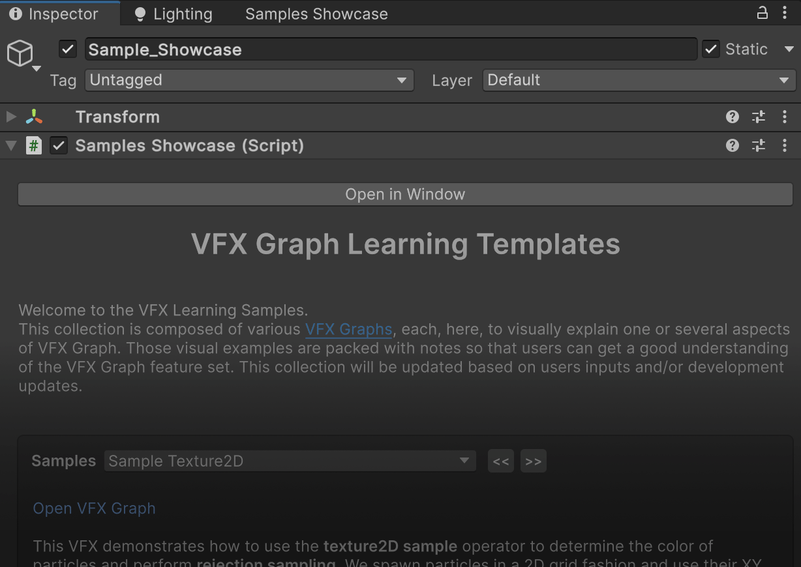
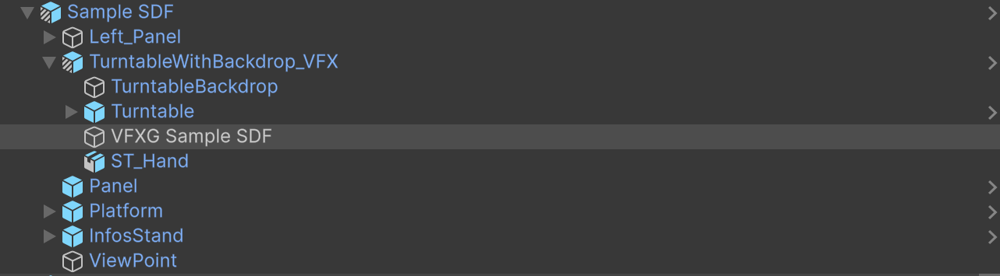
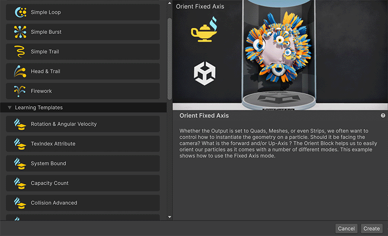
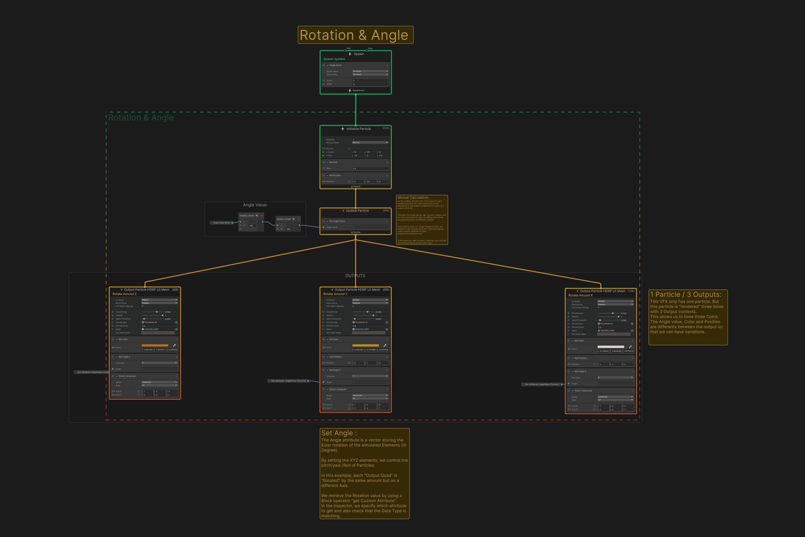

# Learning Templates Sample Content

<video src="Images/LearningSample_Banner_C.mp4" width="700" height="auto" autoplay="true" loop="true" controls></video>

The Learning Templates sample is a collection of VFX assets designed to help you learn about VFX Graph concepts and features. This collection will be updated based on community feedback and new features. This page provides instructions on how to install the sample, a brief overview of the content, and how to make the most of it.

## Requirements

This sample content is compatible with both URP and HDRP projects, for VFX Graph versions 16.0 and later.

## Installing the VFX Learning Templates

To install this sample, first [install the Visual Effect Graph](https://docs.unity3d.com/Packages/com.unity.visualeffectgraph@17.0/manual/GettingStarted.html#installing-visual-effect-graph), then:

 1. Go to **Window > Package Manager.**
 1. From the [Package list view](https://docs.unity3d.com/2023.3/Documentation/Manual/upm-ui.html), select **Visual Effect Graph**.

1. If it is not there: 
   1. From the [Packages drop-down menu](https://docs.unity3d.com/Manual/upm-ui.html), select **Unity Registry** or **In Project**.
   1. Go to **Edit** > **Project Settings** > **Package Manager**
   1. In the **Advanced Settings** drop-down, enable **Show Dependencies**. Visual Effect Graph should now appear in the Packages list view.
1. In the main window that displays the package's details, find the **Samples** section.
1. To import the sample into your project, click **Import**. This creates a folder called `Samples` in your project, and imports the sample you selected into it. Unity imports any future samples into this folder.

## VFX Learning Templates overview

<video src="Images/LearningSample_FlameFlipbook_700.mp4" width="500" height="auto" autoplay="true" loop="true" controls></video>

To start exploring the content of this sample:

1. In your [Project window](https://docs.unity3d.com/Documentation/Manual/ProjectView.html), navigate to the sample **Scenes** folder:
1. Depending on the Render Pipeline used by your project, either select the [HDRP](https://docs.unity3d.com/Documentation/Manual/high-definition-render-pipeline.html) or [URP](https://docs.unity3d.com/Documentation/Manual/universal-render-pipeline.html) version of the VFX Learning template scene.
1. Right-click the scene and select **Open the Scene**.    
 
 

### Scene overview

#### **Hierarchy**
   1. **Sample Showcase**:

      The `Sample_Showcase` GameObject has a script called **Samples Showcase**, which contains a custom Inspector and a dedicated window. Select this GameObject to view information and useful links relative to each VFX in the [Inspector](https://docs.unity3d.com/2023.3/Documentation/Manual/UsingTheInspector.html).

      

   1. **VFX Prefabs**:

      - Each VFX instance is part of a prefab with a display mesh and some text information.

      

   1. **Scene Main Camera**:

      - This camera is used for the game view, and its viewpoint is controlled by the **Showcase** script. In Play mode, you can freely move the camera around.

#### **Views**

   4. **Scene View**:

         - You can use the Scene view to move around freely to find a VFX that interests you. Note that some visual effects require the Editor to be in Play mode.

         <video src="Images/LearningSample_Lion_700.mp4" width="500" height="auto" autoplay="true" loop="true" controls></video>

   4. **Game View**:

      - You can use the Game view to focus on each VFX separately, via the Sample Showcase actions that control the camera. If you prefer to explore freely, you can use the Main Camera.

      <video src="Images/LearningSample_Blossom_700.mp4" width="500" height="auto" autoplay="true" loop="true" controls></video>

#### **Inspector**

   6. **Sample Showcase window**:

      - The  Sample Showcase window displays useful information and documentation related to each VFX. You can also use this window to navigate between the various visual effects, and use the quick-access links to open them.
      
      
 

 

## Inspecting a VFX

Each VFX covers a feature or aspect of VFX Graph, and illustrates what you can do with those features. Each VFX is accompanied by documentation and embedded explanations to help you in your learning journey.

### Sample Showcase window

To open the Sample Showcase window:

1. In the Hierarchy, select the **Sample Showcase** GameObject.
1. In the Inspector, select **Open in window**.    
 

Image key:
1. Drop-down list and button to select which VFX to display in the Sample Showcase window.
1. Links to either highlight the VFX in the Hierarchy, or open it in the VFX editor.
1. Description of the current VFX, and information about the feature or key aspect illustrated by the VFX.
1. The feature or key aspect of the VFX, with links to related documentation.    
 

### Opening a VFX asset

To open a VFX asset, you can do one of the following:

- From the **[Project window](https://docs.unity3d.com/Manual/ProjectView.html)**:

   1. Navigate to the sample project's `VFX` folder:    
`Assets\Samples\Visual Effect Graph\17.xx\Learning Templates\VFX`
   1. Select the desired VFX assets.
   1. Right-click the selected assets, and select **Open**.

- From the **[Hierarchy window](https://docs.unity3d.com/Manual/Hierarchy.html)**:

   1. Open the **VFX Learning Templates** scene.
   1. In the Hierarchy window, select the prefab that you're interested in.
   1. Unfold the Prefab hierarchy:   
`Prefab` > `TurntableWithBackdrop_VFX` > `VFXGameObjectName`
   1. Select the VFX GameObject.
   1. In the [Inspector](https://docs.unity3d.com/Manual/UsingTheInspector.html), find the Visual Effect component.
   1. Select **Edit**.

- From the **Sample Showcase window**:

   1. Open the [Sample Showcase window](#Inspector). 
   1. Use the drop-down menu or arrow button to select the desired VFX.
   1. Select **Open VFX**.   

- From the **Template window**:

   1. Open the [Sample Showcase window](#Inspector). 
   1. Use the drop-down menu or arrow button to select the desired VFX.
   1. Select **Open VFX**.    

### Inside a VFX

The best way to learn and understand how a VFX has been made is to look inside. Take a look at the different parts of the Graph and the embedded notes.

