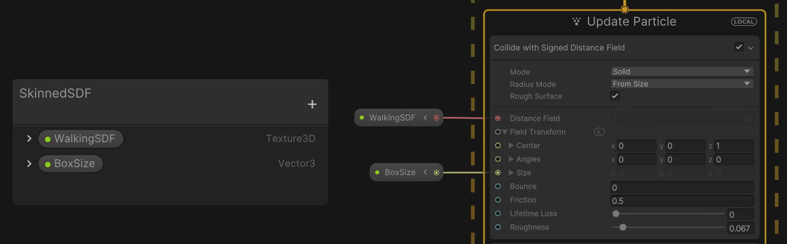

# The SDF Bake Tool API

The SDF Bake Tool API enables you to generate [Signed Distance Field](sdf-in-vfx-graph.md) (SDF) assets using C# both at run-time and in the Unity Editor. You can then use the generated SDF asset to a visual effect.

This page works through an example of how to use the API to create an SDF for a Skinned Mesh Renderer. Each frame it bakes the Mesh from the Skinned Mesh Renderer, bakes an SDF from the Mesh, then passes the SDF to a visual effect.

Note that baking an SDF is a resource-intensive operation. If you need to bake an SDF every frame, it is best practice to use a low resolution.

## Visual Effect Graph setup

Within a Visual Effect Graph, create a new exposed Texture3D property. To do this:

1. In the [Blackboard](VisualEffectGraphWindow.md#Blackboard), click the Add (+) button.
2. Select **Texture3D**.
3. Double-click on the new Texture3D, enter a meaningful name, and press enter to save it. You use this name to identify the property from the C# API.
4. To the left of the new Texture3D, click the drop-down arrow.
5. Enable **Exposed** if it is not already.
6. Drag the property into the graph and connect it to an input that accepts an SDF. For example, the **Distance Field** property of a [Collision Shape](Block-CollisionShape.md) block where **Shape** is set to **Signed Distance Field**.


Assigning an SDF to the Distance Field input port of the Collision Shape Signed Distance Field Block.

## MonoBehaviour

Create a new C# script (**Assets** > **Create** > **C# Script**), call it VFXUpdateSkinnedSDF and replace its contents with the code snippet below. The VFXUpdateSkinnedSDF component handles the interaction between the SkinnedMeshRenderer component and the Visual Effect component. The VFXUpdateSkinnedSDF component is responsible for extracting the current state of the SkinnedMeshRenderer's Mesh, using the SDF Baker Tool API to bake an SDF from the Mesh, and then pass the result to the Visual Effect. At each stage, the VFXUpdateSkinnedSDF component does the following:

1. **On Start**:

2. - Gets a reference to an attached SkinnedMeshRenderer and an attached VisualEffect.
   - Creates an instance of `MeshToSDFBaker`, which is the class that is responsible for baking an SDF from a Mesh.
   - Does an initial bake of the SkinnedMeshRenderer's Mesh and assigns the resulting SDF texture to the property set up in [Visual Effect Graph setup](#visual-effect-graph-setup).

3. **On Update (every frame)**:

4. - It bakes the SkinnedMeshRenderer's Mesh in its current state and assigns the resulting SDF texture to the property set up in [Visual Effect Graph setup](#visual-effect-graph-setup).

5. **On Destroy (when the attached GameObject is destroyed)**:

6. - Runs the relevant cleanup code for the `MeshToSDFBaker` instance.

```c#
using UnityEngine;
using UnityEngine.VFX;
using UnityEngine.VFX.SDF;


public class VFXUpdateSkinnedSDF : MonoBehaviour
{
    MeshToSDFBaker m_Baker;
    SkinnedMeshRenderer m_SkinnedMeshRenderer;
    Mesh m_Mesh;
    VisualEffect m_Vfx;
    public int maxResolution = 64;
    public Vector3 center;
    public Vector3 sizeBox;
    public int signPassCount = 1;
    public float threshold = 0.5f;

    void Start()
    {
        m_Mesh = new Mesh();
        m_Vfx = GetComponent<VisualEffect>();
        m_SkinnedMeshRenderer = GetComponent<SkinnedMeshRenderer>();
        m_SkinnedMeshRenderer.BakeMesh(m_Mesh);
        m_Baker = new MeshToSDFBaker(sizeBox, center, maxResolution, m_Mesh, signPassCount, threshold);
        m_Baker.BakeSDF();
        m_Vfx.SetTexture("WalkingSDF", m_Baker.SdfTexture);
        m_Vfx.SetVector3("BoxSize", m_Baker.GetActualBoxSize());
    }
    void Update()
    {
        m_SkinnedMeshRenderer.BakeMesh(m_Mesh);
        m_Baker.BakeSDF();
        m_Vfx.SetTexture("WalkingSDF", m_Baker.SdfTexture);
    }

    void OnDestroy()
    {
        if (m_Baker != null)
        {
            m_Baker.Dispose();
        }
    }
}
```

Attach the VFXUpdateSkinnedSDF component to a GameObject with an attached SkinnedMeshRenderer component and an attached Visual Effect component. When you enter Play mode, the component updates the SDF in the Visual Effect every frame. If it is difficult to set the center and size of the [baking box](sdf-bake-tool.md#baking-box) in the API, you can open the [SDF Bake Tool window](sdf-bake-tool-window.md) to visualize the Mesh and baking box. Since this is just for visualization, you do not need to save the SDF asset. You can also retrieve the size of the [baking box](sdf-bake-tool.md#baking-box) used to bake the texure from the API.
