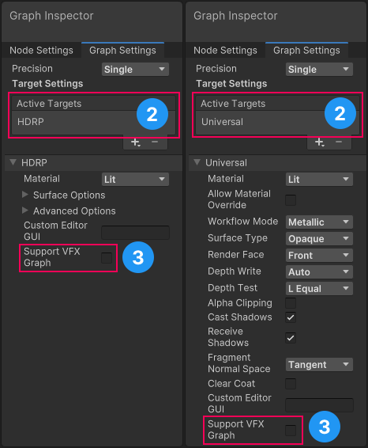
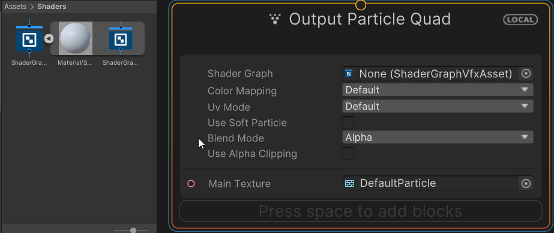

# Working with Shader Graph in the Visual Effect Graph

Visual Effect Graphs (VFX Graphs) can use compatible Shader Graphs to render particles. This enables you to build custom shaders to use in visual effects. This document explains:

- [How to make a Shader Graph compatible with Visual Effect Graphs](#make-shader-graph-compatible)
- [How to set up a Visual Effect Graph to use a Shader Graph to render particles](#use-shader-graph-in-vfx)
- [How to upgrade an existing project](#upgrade-your-project)
- [Known limitations of the Visual Effect Graph](#known-limitations)

## Make a Shader Graph compatible with a Visual Effect Graph

To make a Shader Graph compatible with the Visual Effect Graph:

1. Open a shader in the [Shader Graph window](https://docs.unity3d.com/Packages/com.unity.shadergraph@14.0/manual/index.html).
2. In the [Graph Settings tab](https://docs.unity3d.com/Packages/com.unity.shadergraph@12.1/manual/Graph-Settings-Tab.html), specify the render pipeline [Target](https://docs.unity3d.com/Packages/com.unity.shadergraph@12.1/manual/Graph-Target.html) (**HDRP** or **Universal**).
3. Enable **Support VFX Graph**.

A Shader Graph shader that is compatible with the Visual Effect Graph can also work as a regular shader. Most HDRP and URP Shader Graph shaders support the Visual Effect Graph. For exceptions, see [Known Limitations](#known-limitations).

**Note**: VFX Graph support does not impact runtime performance but Shader Graphs which use **Support VFX Graph** take longer to compile.

## Upgrade your project

Unity versions **2021.2**, and earlier use the deprecated **Visual Effect** Target to integrate Shader Graphs with Visual Effect Graphs.

The **Visual Effect** Target  limits functionality and requires you to use the following:

- Dedicated VFX shaders
- The [Metallic](https://docs.unity3d.com/Manual/StandardShaderMetallicVsSpecular.html) workflow

To upgrade a project to use the new render pipeline Target:

1. Go to **Edit** > **Preferences** > **Visual Effects**.
2. Enable **Improved Shader Graph Generation**.
3. In the [Graph Settings tab](https://docs.unity3d.com/Packages/com.unity.shadergraph@12.1/manual/Graph-Settings-Tab.html) of the shader add a **HDRP** or **Universal** Target.
4. Enable **Support VFX Graph**.
5. Remove the **Visual Effect** Target.

## Use a Shader Graph in a Visual Effect Graph

To make a visual effect with Shader Graph:

1. Go to **Edit** > **Preferences** > **Visual Effects**.
2. Enable **Experimental Operators/Blocks**. This reveals a Shader Graph slot in the output.
3. Open your Visual Effect Graph in the Visual Effect Graph window. If you do not have a Visual Effect Graph, go to **Create** > **Visual Effects** > **Visual Effect Graph** to create a new one.
4. In the interface for output contexts, assign your compatible Shader Graph to the **Shader Graph** property. To do this, either search for the Shader Graph directly in the Asset Picker, or drag the Shader Graph sub-asset to the **Shader Graph** slot:
 
5. Click on the output context to view it in the Inspector.

You can make changes to the Shader Graph's Surface Options in the output context.

**Note**: Any edits you make to a Shader Graph in the VFX Graph are local to the VFX Graph and do not affect the Shader Graph asset.

### Visual Effect Graph output compatibility

The following output contexts support Shader Graphs:

- [Particle Mesh](https://docs.unity3d.com/Packages/com.unity.visualeffectgraph@12.1/manual/Context-OutputParticleMesh.html) (including Particle Lit Mesh)
- [Particle Primitive](https://docs.unity3d.com/Packages/com.unity.visualeffectgraph@12.1/manual/Context-OutputPrimitive.html) (including Particle Quad, Particle Triangle, Particle Octagon, Particle Lit Quad, Particle Lit Triangle, and Particle Lit Octagon)
- Particle Strip Quad (including Particle Lit Strip Quad)

## Known limitations

Visual Effect Graph does not support the following [Blackboard](https://docs.unity3d.com/Packages/com.unity.shadergraph@14.0/manual/Blackboard.html) features:

- [Diffusion Profile](https://docs.unity3d.com/Packages/com.unity.shadergraph@12.1/manual/Diffusion-Profile-Node.html)
- [Virtual Texture](https://docs.unity3d.com/Manual/svt-use-in-shader-graph.html)
- [Gradient](https://docs.unity3d.com/Packages/com.unity.shadergraph@12.1/manual/Gradient-Node.html)
- [Keyword](https://docs.unity3d.com/Packages/com.unity.shadergraph@12.1/manual/Keywords.html)

Shader Graph does not support some features in specific Targets.

- The HDRP Target does not support the following:
  - [Decal Shader Graph](https://docs.unity3d.com/Packages/com.unity.render-pipelines.high-definition@12.1/manual/master-stack-decal.html).
  - [Motion vectors](https://docs.unity3d.com/Packages/com.unity.render-pipelines.high-definition@12.1/manual/Motion-Vectors.html) for vertex animation.
- The URP target does not support the following:
  - [Sprite Shader Graphs](https://docs.unity3d.com/Packages/com.unity.render-pipelines.universal@12.1/manual/ShaderGraph.html) and [Decal Shader Graphs](https://docs.unity3d.com/Packages/com.unity.render-pipelines.universal@12.1/manual/decal-shader.html).
- The Visual Effect Target (deprecated) does not support:
  - HDRP or Universal material types.
  - Access to the shader's Vertex stage.
