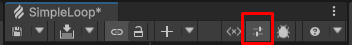
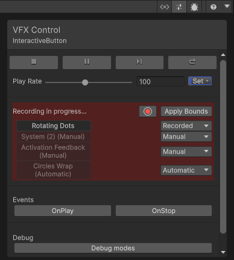

# Visual Effect Bounds

Unity uses the bounds of a visual effect to determine whether to render it or not. If a camera can't see the bounds of an effect, then it culls and doesn't render the effect. The cumulative bounds of each System within a visual effect define the bounds of the visual effect. It's important that the bounds of each System correctly encapsulate the System:
- If the bounds are too large, cameras process the visual effect even if individual particles aren't on screen. This results in wasted resources.
- If the bounds are too small, Unity may cull the visual effect even if some of the effect's particles are still on screen.

**Culling Flags** can be set in the [Visual Effect Asset Inspector](VisualEffectGraphAsset.md#visual-effect-asset-inspector). The [Culling state](performance-debug-panel.md#particle-system-info) of a system can be known using the [Profiling and Debug Panel](performance-debug-panel.md)

Each System in a visual effect defines its bounds in the [Initialize Context](Context-Initialize.md). By default, Recorded mode is enabled and default values are used to set bounds, waiting to be overwritten with a recording, but you can change this behavior and use other methods to define the bounds. The Initialize Context's **Bounds Setting Mode** property controls the method the visual effect uses. The bounds calculation methods are:

- **Manual**: You set the bounds directly in the Initialize Context. You can calculate the bounds dynamically using Operators and send the output to the Initialize Context's **Bounds** input ports. Bounds are compatible with [AABox type](Type-AABox.md) Operators or Properties.
- **Recorded**: Allows you to record the System from the VFX Control panel. For information on how to do this, see [Bounds Recording](#bounds-recording). In this mode, you can also calculate the bounds using Operators and pass them to the Initialize Context, like in **Manual**. This overrides any recorded bounds.
- **Automatic**: Unity calculates the bounds automatically. Note: This will force the culling flags of the VFX asset to "Always recompute bounds and simulate". Automatic bounds calculations can have a negative impact on performances and are not recommended when possible to avoid.

The Initialize Context also contains a **Bounds Padding** input port. This is a Vector3 that enlarges the per-axis bounds of the System. If a System uses **Automatic** bounds or a recording is in progress in **Recorded** mode, Unity calculates the bounds of the System during the Update Context. This means that any changes to the size, position, scale, or pivot of particles that occur in the Output Context don't affect the bounds during that frame. Adding padding to the bounds helps to mitigate this effect.

## Bounds recording

The [VFX Control panel](VisualEffectGraphWindow.md#vfx-control) in the Visual Effect Graph window includes the **Bounds Recording** section which helps you set the bounds of your Systems. If you set a System's **Bounds Setting Mode** to **Recorded**, the tool calculates the bounds of the System as the visual effect plays.

You can click on the icon at the top right corner of the [Toolbar](VisualEffectGraphWindow.md#toolbar) to open the VFX Control panel.

Then, you will need to have an [attached VFX from the scene](GettingStarted.md#attaching-a-visual-effect-from-the-scene-to-the-current-graph) to properly use VFX Control panel's functionnalities. Once done, you can click on the red recording button to start recording your bounds to match your particles behavior.

> The Target Visual Effect GameObject panel interface while recording.

You can visualize the bounds that the recorder is saving. When the recorder is active, look at the visual effect in the Scene view. The bounds appear as a red box around the visual effect. If you want to visualize the bounds of specific Systems, select them in the tool window or select their Initialize Context.

While recording, you can **Pause**, **Play**, **Restart**, or event change the **Play Rate**. This enables you to speed up the recording or simulate various spawn positions. When you are happy with the calculated bounds, click **Apply Bounds** to apply the recorded bounds to the System. Applying recorded bounds can be done during or after the recording. To end the recording, click a second time on the recording button.
