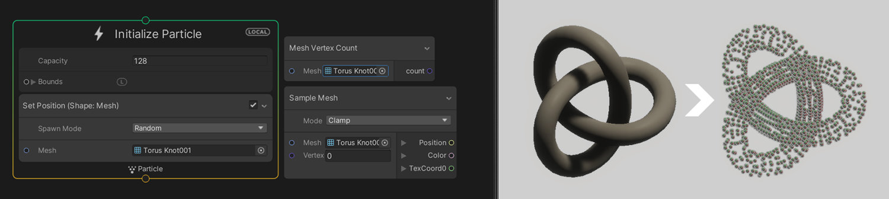

# What's new in version 10

This page contains an overview of new features, improvements, and issues resolved in version 10 of the Visual Effect Graph.

## Features

The following is a list of features Unity added to version 10 of the Visual Effect Graph. Each entry includes a summary of the feature and a link to any relevant documentation.

### CPU Output Event

The Output Event sends an event from the graph to C# when triggered. You can use this to synchronize lights, sound, physical reactions, or gameplay to a visual effect.

For more information about this feature, see [Output Event](Context-Event.md).

For examples of how to use this feature, see [Output Event Handler](#outputevent-helpers).

### Per-particle Mesh LOD (Experimental)

Optimize your mesh particles using [LODs](https://docs.unity3d.com/Manual/LevelOfDetail.html) based on the screen size.

For more information about this feature, see [Particle Mesh Output](Context-OutputParticleMesh.md).

### Multi-Mesh (Experimental)

Use up to four meshes in the same [Particle Mesh Output](Context-OutputParticleMesh.md) to add per-particle variety to your effects. This enables you to add visual variety to individual mesh particles without having to use multiple Outputs.

For more information about this feature, see [Output Particle Mesh](Context-OutputParticleMesh.md). In particular, the **Mesh Count** property.

### Static mesh sampling (Experimental)

Spawn particles directly from meshes. This enables you to quickly spawn particles in more complex shapes directly from meshes without the need to first bake their positions into a [point cache](point-cache-in-vfx-graph.md).

You can sample vertices of a mesh with the Position (Mesh) Block and the Sample Mesh Operator.

For more information about this feature, see [Mesh sampling](MeshSampling.md).

### Operators & Blocks

This version of the Visual Effect Graph introduces new Operators and Blocks:

* [Exp](Operator-Exp.md)
* [Log](Operator-Log.md)
* [LoadTexture](Operator-LoadTexture2D.md)
* [GetTextureDimensions](Operator-GetTextureDimensions.md)
* [WorldToViewportPoint](Operator-WorldToViewportPoint.md)
* [ViewportToWorldPoint](Operator-ViewportToWorldPoint.md)
* [Construct Matrix](Operator-ConstructMatrix.md)
* [TransformVector4](Operator-Transform(Vector4).md)

## Improvements

The following is a list of improvements Unity made to the Visual Effect Graph in version 10. Each entry includes a summary of the improvement and, if relevant, a link to any documentation.

### Documentation

The documentation now includes [reference information](node-library.md) about all the Nodes in the Visual Effect Graph. Also, Attributes, Blocks, Contexts, Operators, and various menus and options now include tooltips.

### UX & Workflows

<video src="Images/banner-ux-improvements.mp4" title="A mouse arrow selects the Flip Book Size node's input, draws a connection line to the left and creates a new New Vector 2 node in an empty space." width="320" height="auto" autoplay="true" loop="true" controls></video>

This version of the Visual Effect Graph introduces many workflow improvements. The list is as follows:

* There is now a **Save** button in the graph view which saves the currently open Visual Effect Graph.
* Unity now compiles a VFX asset when it imports the asset. Before this version, Unity compiled the asset whenever you saved it. This improvement solves some incompatibility issues of shaders between versions and prevents creating unnecessary changes with source control.
* There were multiple improvements to edges:
  * Now if you right-click an edge, there is an option to create an intermediate node.
  * If you make a connection from a node's input, you can hold alt when you release the click to create a new exposed property in an empty space. The exposed property is of the same type as the input you created it from.
  * Now when you duplicate connected nodes, the duplicates have the same edge connections.
* There were multiple improvements to the [Blackboard](Blackboard.md):
  * If you right-click in the Blackboard, there is now an option to delete unused properties.
  * int and uint properties now support [Range](https://docs.unity3d.com/ScriptReference/RangeAttribute.html) and [Min](https://docs.unity3d.com/ScriptReference/MinAttribute.html) attributes.
  * You can use and view a uint property as an enum.
* Blocks & Nodes:
  * Position (shape, sequential, depth) and Velocity from Direction & Speed Blocks now include composition for both the position and direction. Originally, they only included composition for the position.
  * The built-in Operator now provides new times access.
  * There is now a custom Inspector for the Update Context. This displays **Update Position** and **UpdateRotation** instead of **Euler Integration**.

  * There is now a custom Inspector for the Spawn Context to include loop and delay settings which adds another layer of depth when creating customizable spawn behaviors.

### Performance optimizations

This version of the Visual Effect Graph introduces multiple performance optimizations:

* Unity now culls particles using compute shaders to very efficiently discard the rendering of inactive, off-screen, and not-alive particles. For more information about this feature, see the **Compute Culling** property in [Shared Output settings and properties](Context-OutputSharedSettings.md#particle-options-settings).
* Unity now processes noise evaluation on the CPU when possible. Originally, Unity performed this on a per-particle basis whereas some use cases only required it to be done once for all particles.

### Signed distance field

This version of the Visual Effect Graph introduces improvements to working with signed distance fields (SDFs). It added a new Operator to sample SDFs as well as a new Block to set a particle's position based on an SDF.

These allow you to create custom behaviors like detecting whether particles have collided with SDFs.

For more information about the sample SDF Operator, see [Sample Signed Distance Field](Operator-SampleSDF.md).

For more information about the new position Block, see [Position (Signed Distance Field)](Block-SetPosition(SignedDistanceField).md).

### Distortion Output

This version of the Visual Effect Graph introduces octagon and triangle support for the distortion Outputs. It also introduces a new Output Distortion Quad Context for particle strips.

For more information about the distortion Output, see [Output Distortion](Context-OutputDistortion.md).

### Particle strips

This version of the Visual Effect Graph introduces multiple improvements to particle strips:

* There are now options for quad strip texture mapping. You can use UV or custom mapping.
* A custom z-axis option for strip Outputs. This enables you to set a custom forward direction to the strips and make them face in a particular direction. This is useful for example if you wanted to create a banner on a wall that faces away from the wall.
* A new attribute for particle strips, particleCountInStrip, stores the number of particles in the strip.
* A new attribute for particle strips in the Initialize Context, spawnIndexInStrip, acts as the particle strip equivalent for [spawnIndex](Operator-GetAttributeSpawnIndex).stores...

### Operators & Blocks

This version of the Visual Effect Graph introduces multiple improvements to Operators and Blocks:

* The [Compare](Operator-Compare.md) Operator now accepts ints and uints as inputs.
* Attributes in the Spawn Context are now available to read.

## Samples

The following is a list of Visual Effect Graph package samples Unity created or improved upon in version 10. Each entry includes a summary of the change and, if relevant, a link to any documentation.

### Visual Effect Graph Additions

This version of Visual Effect Graph introduces new utility Operators to the **Visual Effect Graph Additions** Sample.

* **Get Strip Progress**: A subgraph that calculates the progress of a particle in the strip in the range 0 to 1. This is useful to sample curves and gradients in order to modify the strip based on its progress.
* **Encompass (Point)**: A subgraph that grows the bounds of an [AABox](Type-AABox.md) to encompass a point.
* **Degrees to Radians** and **Radians to Degrees**: Subgraphs that help you convert between radians and degrees within your graph.

### OutputEvent Helpers

This version of Visual Effect Graph introduces new helper scripts to the **OutputEvent Helpers** sample to help you set up various use cases of OutputEvents:

* **Cinemachine Camera Shake**: An Output Event Handler script that triggers a Camera shake through a [Cinemachine Impulse Source](https://docs.unity3d.com/Packages/com.unity.cinemachine@latest?subfolder=/manual/CinemachineImpulseSourceOverview.html), when a given output event occurs.

* **Play audio**: An Output Event Handler script that plays a single AudioSource when a given output event occurs.

* **Spawn a Prefab**: An Output Event Handler script that spawns Prefabs (managed from a pool) upon a given output event. It uses position, angle, scale, and lifetime to position the Prefab and disable it after a delay. To synchronize other values, you can use other scripts inside the Prefab.

  * **Change Prefab Light**: An example that shows how to synchronize a light with your effect.
  * **Change Prefab RigidBody Velocity**: An example that shows how to synchronize changing the velocity of a RigidBody with your effect.

* **RigidBody**: An Output Event Handler script that applies a force or a velocity change to a RigidBody when a given output event occurs.

* **Unity Event**: An Output Event Handler that raises a UnityEvent when a given output event occurs.

## Issues resolved

For information on issues resolved in version 10 of the Visual Effect Graph, see the [changelog](../changelog/CHANGELOG.html).
