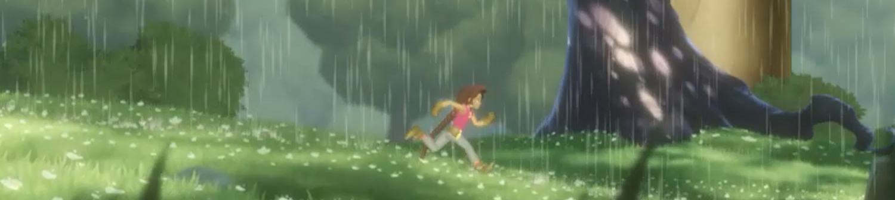
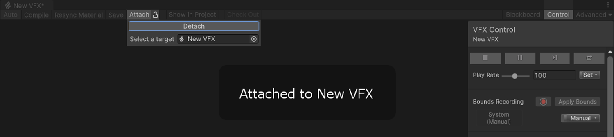

# What's new in version 12

This page contains an overview of new features, improvements, and issues resolved in version 12 of the Visual Effect Graph, embedded in Unity 2021.2.

## Added

The following is a list of features Unity added to version 12 of the Visual Effect Graph, embedded in Unity 2021.12 Each entry includes a summary of the feature and a link to any relevant documentation.

### Fixed Lit Output for the Universal Render Pipeline (URP)

This version of the Visual Effect Graph adds support for lit outputs in the Universal Render Pipeline (URP). You can use this to create effects that can respond to the lighting in the scene.

### 2D Renderer support (compute-capable devices)

In this version, the Visual Effect Graph has added support for the Universal Render Pipeline’s (URP) 2D Renderer. This means that you can now render effects in a 2D project and sort them along with sprites in your scene.

For more information, see [Rendering in the Universal Render Pipeline](https://docs.unity3d.com/Packages/com.unity.render-pipelines.universal@12.0/manual/rendering-in-universalrp.html).

### Bounds helpers

This version of the Visual Effect Graph adds helpers for setting and working with bounds. You can now record bounds in the Target GameObject window to ensure a more accurate fit. You can also set bounds automatically to make sure they are always visible.

This feature helps you create accurate bounds that match their systems so that effects don’t unexpectedly disappear when the camera moves.

For more information, see [Visual effect bounds](visual-effect-bounds.md).

### Graphics buffer support

VFX version 12.0 also adds support for Graphics buffers. This makes it easier to handle and transfer large amounts of data to a Visual Effect Graph. This is particularly useful for tracking multiple GameObject positions in your graph.

This feature requires C# knowledge to set and handle Graphics Buffers.

### Signed Distance Field Bake Tool

This version includes the new Signed Distance Field (SDF) Bake Tool. To access it, navigate to **Window > Visual Effects > Utilities > SDF Bake Tool**. You can use this tool to quickly turn meshes and prefabs into SDF assets which you can use to create various effects, such as custom collisions, or to make particles conform to a particular shape.

For more information, see [Signed Distance Fields in the Visual Effect Graph](sdf-in-vfx-graph.md).

### HDRP Decal Output

This version of VFX graph adds a Lit Decal output that allows you to use lit particle decals in the High Definition Render Pipeline (HDRP). You can use this to create many effects; for example, to add dirt or damage on multiple surfaces in your scene.

## Updated

The following is a list of improvements Unity made to the Visual Effect Graph in version 12.0, embedded in Unity 2021.2. Each entry includes a summary of the improvement and, if relevant, a link to any documentation.

### Transform Shape

This VFX graph version adds a transform to various shape blocks and operators to make them easier to use and to give you more precise control. For example, you can use this transform to rotate a Position Circle block to make the circle shape face a new direction, or to scale the shape of a sphere collision block on one axis to collide with an ellipsoid.

### Upgraded Shader Graph integration

This VFX graph version improves how Shader Graph and the Visual Effect Graph integrate with each other in both the Universal Render Pipeline (URP) and the High Definition Render Pipeline (HDRP).

This gives you access to many powerful tools, including the following:

- The full range of URP and HDRP Material types in the VFX Graph is now available.
- You can now modify particles at the vertex stage. This is useful for detailed effects. For example, you could animate bird wings in a flock.
- You can now use existing Shader Graphs for both regular Materials and visual effects. To make this possible, the dedicated Visual Effect target is now deprecated.

### Attachment workflow

VFX graph 12.0 includes a new workflow to attach visual effects to their instances in a scene: When a Visual Effect Asset is open in the Visual Effect window, it automatically attaches itself to an instance when you select it.

When an effect is attached, you can use various helper tools and use it to visualize some gizmos.

### URP high-end mobile support (compute-capable devices)

This version of the Visual Effect Graph applies a number of fixes and stability improvements to allow you to use visual effects on a range of mobile compute-capable devices and XR platforms.

**Disclaimer:**

Compute support on mobile devices varies widely across brands, mobile GPU architecture, and operating systems. This means that only a subset of high-end mobile devices can be officially supported by the VFX Graph and other devices might encounter issues running it. For most mobile applications, use Unity’s built-in [Particle System](https://docs.unity3d.com/Manual/Built-inParticleSystem.html).

## Fixed
For information on issues resolved in version 12 of the Visual Effect Graph, embedded in Unity 2021.2, see the [changelog](../changelog/CHANGELOG.html).
