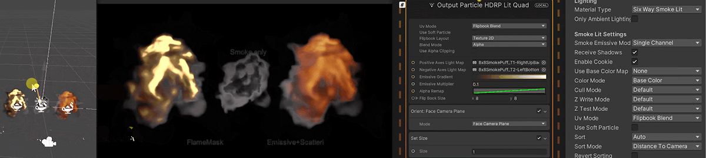
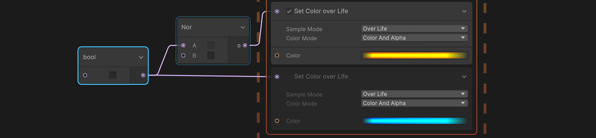
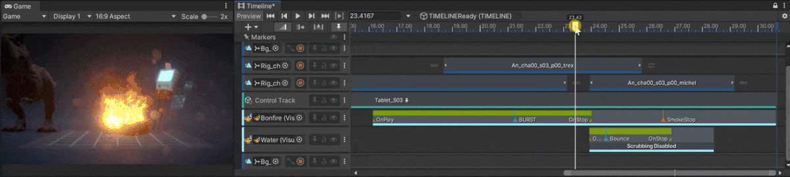
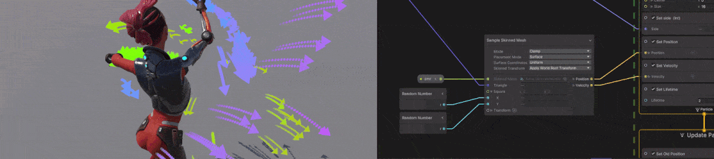

# What's new in version 14 / Unity 2022.2

This page contains an overview of new features, improvements, and issues resolved in version 14 of the Visual Effect Graph, embedded in Unity 2022.2.

## Added

The following is a list of features Unity added to version 14 of the Visual Effect Graph  embedded in Unity 2022.2. Each entry includes a summary of the feature and a link to any relevant documentation.

### Six way smoke

VFX Graph version 14 includes a new way to light smoke effects. You can now use custom lightmaps exported from third-party software to light your smoke texture. VFX Graph bakes six light directions from these lightmaps and uses them to light the smoke from every direction.

### Boolean ports

Version 14 includes Boolean ports that you can use to activate or deactivate Blocks depending on logic operations. This feature also includes some implicit casts between numeral types and Booleans.

### 2D Shader Graph support

In this version, Visual Effect Graph supports Shader Graph’s 2D sub-targets that you can use to render your particles as sprites. To find the new sub-targets, go to **Create** > **Shader Graph** > **URP**. This feature is only available in the Universal Render Pipeline.

## Updated

The following is a list of improvements Unity made to the Visual Effect Graph in version 14, embedded in Unity 2022.2. Each entry includes a summary of the improvement and, if relevant, a link to any documentation.

### Timeline integration

VFX Graph 14 improves the workflow of visual effects in Timeline. You can use the new VFX Animation clip to scrub through and control VFX Graph [Events](Events.md). You can also control how the effect reinitializes and pre-warm the effect. For more information, see [Timeline](Timeline.md).

### Skinned mesh sampling

In VFX Graph 14 improves aspects of the Skinned Mesh Renderer Sampling based on your feedback in the following ways:

- You can now retrieve the position velocity directly in the **Sample Skinned Mesh** Operator.
- You can orient particles in the transform, defined by the sampled tangent and normal.
- Root bone transform options are now integrated into the block or operator, which means you don’t need to use a property binder.

## Fixed

For information on issues resolved in version 14 of the Visual Effect Graph, embedded in Unity 2022.1, see the [changelog](../changelog/CHANGELOG.html).
