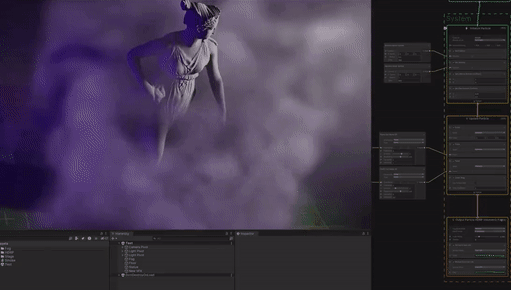

# What's new in version 15 / Unity 2023.1

This page contains an overview of new features, improvements, and issues resolved in version 15 of the Visual Effect Graph, embedded in Unity 2023.1.

## Added

The following is a list of features Unity added to version 15 of the Visual Effect Graph  embedded in Unity 2023.1. Each entry includes a summary of the feature and a link to any relevant documentation.

### Ray tracing support

From version 15.0, you can use VFX Graph particles with the following ray tracing features in the High Definition Render Pipeline (HDRP): 
- Ray-traced Reflections 
- Refraction, Shadows
- Ambient Occlusion
- Global illumination

You can enable Ray tracing with VFX Graphs that use quads, triangles, and octagons. VFX Graph does not support ray tracing with meshes or strips.

To use ray tracing in an HDRP scene, refer to [Getting started with ray tracing](https://docs.unity3d.com/Packages/com.unity.render-pipelines.high-definition@15.0/manual/Ray-Tracing-Getting-Started.html).

### Volumetric Fog Output

VFX Graph verision 15.0 adds the [Output Particle HDRP Volumetric Fog](Context-OutputParticleHDRPVolumetricFog.md
) output node which samples [Local Volumetric Fog](https://docs.unity3d.com/Packages/com.unity.render-pipelines.high-definition@latest?subfolder=/manual/Local-Volumetric-Fog.html) in the High Definition Render Pipeline (HDRP).
