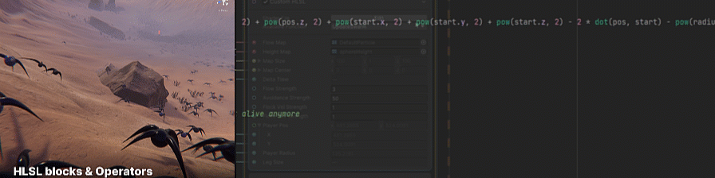
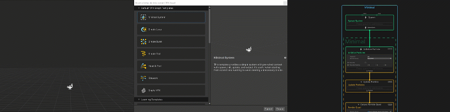
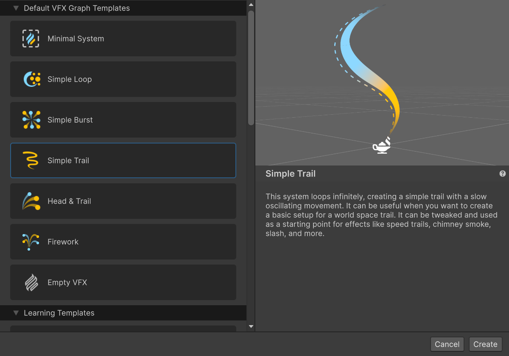
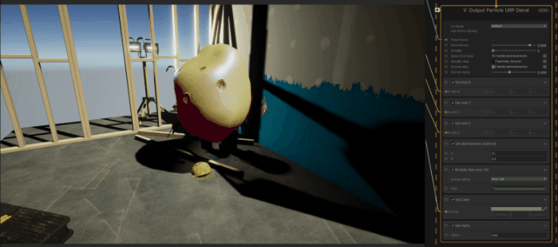

# What's new in version 16 / Unity 2023.2

This page contains an overview of new features, improvements, and issues resolved in version 16 of the Visual Effect Graph, embedded in Unity 2023.2.

## Added

The following is a list of features Unity added to version 16 of the Visual Effect Graph embedded in Unity 2023.2. Each entry includes a summary of the feature and a link to any relevant documentation.

### Custom HLSL
    
Version 16 includes a new [block](https://docs.unity3d.com/Packages/com.unity.visualeffectgraph@16.0/manual/Block-CustomHLSL.html) and [operator](https://docs.unity3d.com/Packages/com.unity.visualeffectgraph@16.0/manual/Operator-CustomHLSL.html) that you can use to write [custom HLSL](
https://docs.unity3d.com/Packages/com.unity.visualeffectgraph@latest/index.html?subfolder=/manual/CustomHLSL-Common.html) code directly in a VFX Graph. You can use this to script complex behavior in a single node. You can embedd custom HLSL code in the node or load it from an external file to reuse the code.    

### Templates window 
    
VFX Graph 16 adds a [template window](https://docs.unity3d.com/Packages/com.unity.visualeffectgraph@16.0/manual/Templates-window.html) to add a VFX templates into an existing VFX Graph. This window has multiple templates to quickly create a VFX Graph. You can also create a [custom template](https://docs.unity3d.com/Packages/com.unity.visualeffectgraph@16.0/manual/Templates-window.html#create-a-custom-vfx-graph-template).

    

<em></em>

    

### URP Decal output
    
VFX Graph version 16 adds the Lit Decal output for your Universal Render Pipeline (URP) project. Use this output to use lit particle decals in a URP project.

### Six Way Smoke for URP and Shader Graph 
   
Version 16 makes the smoke lighting model compatible with URP [Lit Outputs](https://docs.unity3d.com/Packages/com.unity.visualeffectgraph@16.0/manual/Context-OutputLitSettings.html) and [Shader Graph](https://docs.unity3d.com/Packages/com.unity.visualeffectgraph@16.0/manual/sg-working-with.html). This means that you can use lightmaps exported from third-party software to create advanced custom shaders to light a smoke texture in URP and HDRP. 
