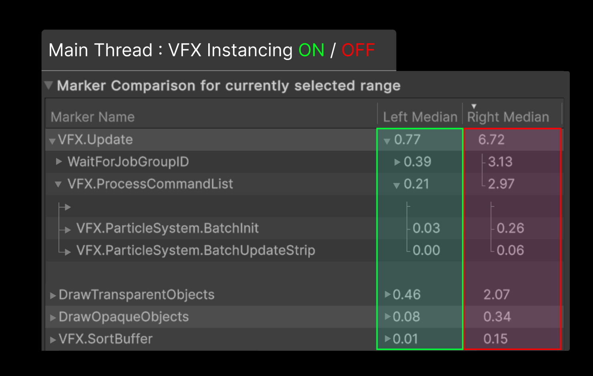

# What's new in version 17.1 / Unity 6.1

Visual Effect Graph 17.1 introduces new features and performance improvements, such as instancing support for GPU events and read/write texture support in custom HLSL.

For a full list of changes and updates in this version, refer to the [Visual Effect Graph changelog](../changelog/CHANGELOG.html).

## Instancing support for GPU events

[GPU events](Events#gpu-events) now support instancing, so VFX using GPU events no longer disables instancing by force. This simulates and renders many instances of VFX with GPU events more efficiently as batches. For more information, refer to [instancing](Instancing).

<video src="Images/WhatsNew_17_1_Instanced_Explosions.mp4" width="400" height="auto" autoplay="true" loop="true" aria-label="VFX instanced explosions" controls></video>

## Runtime and compilation optimizations

VFX Graph now has the following performance optimizations on both the Unity Editor and runtime:

* Optimized particle data layout for reduced bandwidth usage and smaller memory footprint.  
* Improved parallelization in the VFX runtime for faster CPU execution and less computation on the main thread.  
* Reduced garbage creation during shader source generation, resulting in faster import and authoring times.

## Read/write texture support in custom HLSL

The custom HLSL block and operator now support read/write graphics buffers or textures as input parameters. This allows VFX to write into custom buffers without relying on global bindings. For more information, refer to [Custom HLSL Nodes (block and operator)](CustomHLSL-Common).

## New examples in Learning Templates

The Learning Templates sample now includes new examples of the different ways to create particle trails. For more information, refer to [Learning Templates Sample Content](sample-learningTemplates).

<video src="Images/WhatsNew_17_1_VFXLearning_Strips.mp4" width="400" height="auto" autoplay="true" loop="true" aria-label="New template examples for particle trails" controls></video>