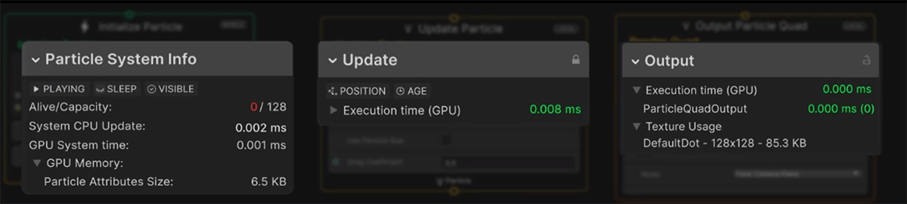
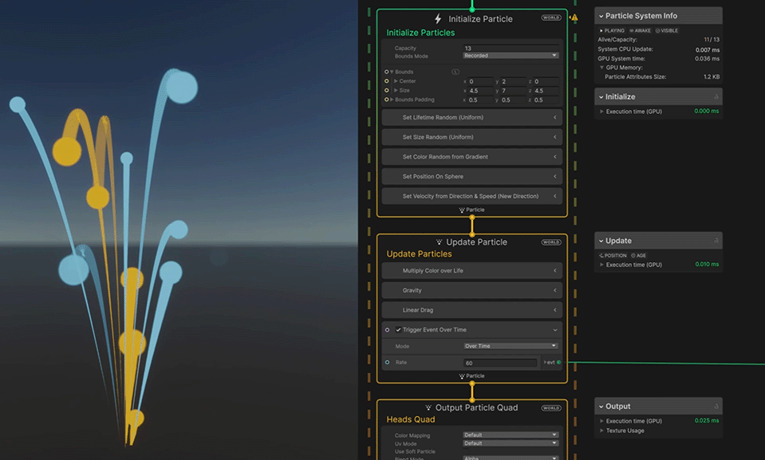
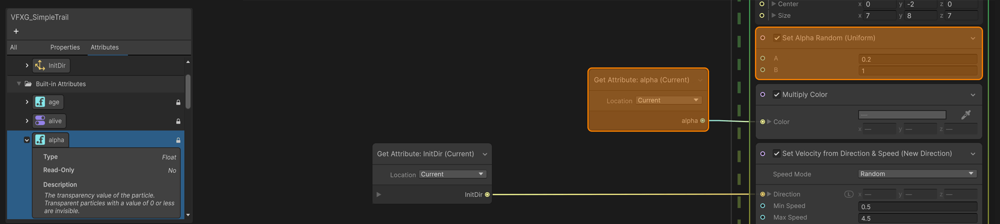
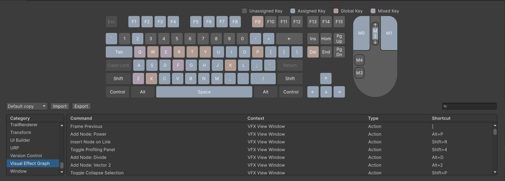
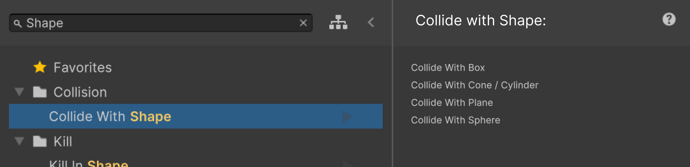
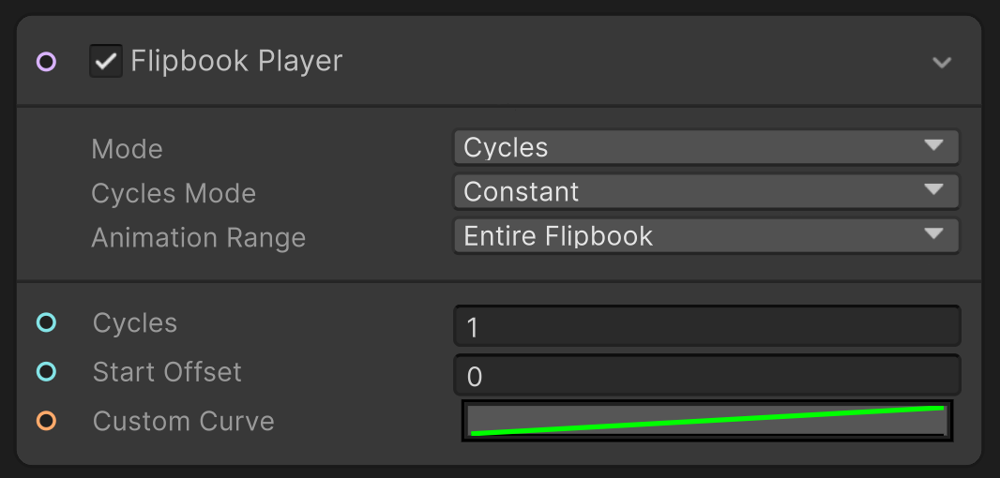
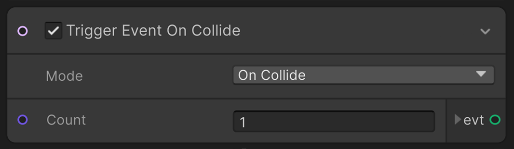
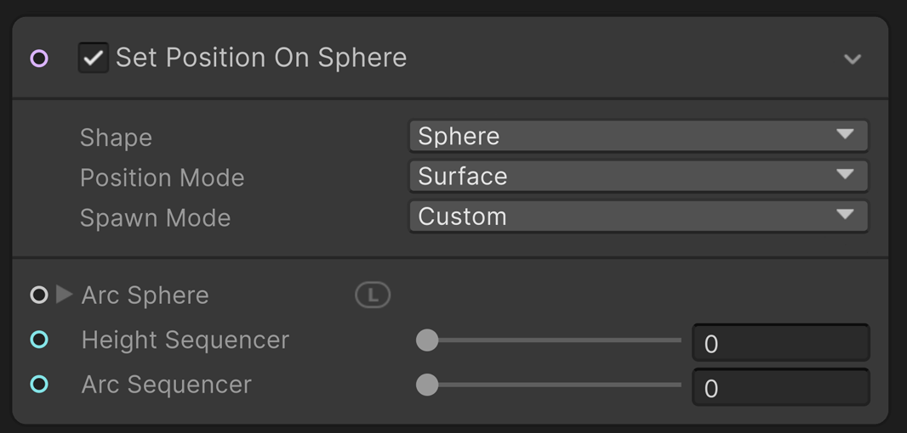

# What's new in version 17 / Unity 2023.3

This page contains an overview of new features, improvements, and issues resolved in version 17 of the Visual Effect Graph, embedded in Unity 2023.3.

## Added

The following is a list of features Unity added to version 17 of the Visual Effect Graph embedded in Unity 2023.3. Each entry includes a summary of the feature and a link to any relevant documentation.

### URP Camera Buffer

<video src="Images/What_New17_URPBuffer_Banner_700.mp4" width="700" height="auto" autoplay="true" loop="true" controls></video>

You can now sample URP camera buffers to obtain the scene's depth and color. This powerful feature allows you to perform fast [collision on the GPU](https://docs.unity3d.com/Packages/com.unity.visualeffectgraph@17.0/manual/Block-CollideWithDepthBuffer.html) or to [spawn particles against the depth buffer](https://docs.unity3d.com/Packages/com.unity.visualeffectgraph@17.0/manual/Block-SetPosition(Depth).html) and inherit the scene color.

### Profiling Tools

You can use the new [Debug panel](https://docs.unity3d.com/Packages/com.unity.visualeffectgraph@17.0/manual/Templates-window.html) to check and optimize performance directly inside your graph. The Debug panel can display GPU and CPU timing, data related to GPU memory storage and texture usage, and the current system state.  

    

### Attribute Blackboard

The [Blackboard panel](https://docs.unity3d.com/Packages/com.unity.visualeffectgraph@17.0/manual/Blackboard.html) now has a new [section](https://docs.unity3d.com/Packages/com.unity.visualeffectgraph@17.0/manual/Blackboard.html#using-the-blackboard) dedicated to particle attributes, making them easier to manipulate with drag and drop.

- Drag and drop from the blackboard to “Set” or “Get” an attribute.
- Highlight attribute usage by hovering over graph elements.
- Easily create custom attributes from the blackboard.
- Change the type of previously created custom attributes.
- Access to the description and type of the built-in attribute.

<video src="Images/WhatNew_17_Blackboad_Usage.mp4" width="500" height="auto" autoplay="false" loop="true" controls></video>

### VFX Learning Sample

<video src="Images/LearningSample_Banner_C.mp4" width="700" height="auto" autoplay="true" loop="true" controls></video>

The [VFX Learning Sample](sample-learningTemplates.md) is a new content sample aiming to help you learn VFX Graph concepts and features. This evolving collection of assets is packed with VFX examples along with information, embedded explanations, and documentation links related to the features and VFX Graph's aspects highlighted by the VFX assets. 

### Shader Graph Keyword Support

<video src="Images/WhatNew_17_Keyword.mp4" width="700" height="auto" autoplay="true" loop="true" controls></video>

Version 17 adds keyword support for [Shader Graph outputs](https://docs.unity3d.com/Packages/com.unity.visualeffectgraph@17.0/manual/Context-OutputForwardDecal.html) in VFX Graph. This will help you create parametric [shader graphs](https://docs.unity3d.com/Packages/com.unity.shadergraph@17.0/manual/index.html) that you can use and customize directly from the VFX Graph output contexts.

### Keyboard Shortcuts

   
The [Shortcut Manager](https://docs.unity3d.com/2023.3/Documentation/Manual/ShortcutsManager.html) now has a VFX Graph category that lets you modify the shortcut command available in the Visual Effect Graph window. Additionally, new shortcut commands have been added to be able to speed up the VFX artist's workflow.

## Updated

<video src="Images/whatnew_17_BlockBanner.mp4" width="700" height="auto" autoplay="true" loop="true" controls></video>

The following is a list of improvements Unity made to the Visual Effect Graph in version 17, embedded in Unity 2023.3. Each entry includes a summary of the improvement and, if relevant, a link to any documentation.

### Collider Shape Blocks:
[Collider blocks](https://docs.unity3d.com/Packages/com.unity.visualeffectgraph@17.0/manual/Block-CollideWithSphere.html) have been combined so that you can easily switch between shapes. Several options have been added, and stability and accuracy have been greatly improved.

- Merged Collider blocks.
- New [Collision's attributes](https://docs.unity3d.com/Packages/com.unity.visualeffectgraph@17.0/manual/Block-CollideWithAABox.html) (*Collision count, position, normal and event).
- Enhanced collision stability.
- Improved collision accuracy.

<video src="Images/WhatsNew_17_CollisionAttributes_700.mp4" width="500" height="auto" autoplay="false" loop="true" controls></video>

### Node Search:

The visual and structure of the [node search](https://docs.unity3d.com/Packages/com.unity.visualeffectgraph@17.0/manual/VisualEffectGraphWindow.html) have been revised to provide a hierarchical tree view, facilitating a more efficient browsing of the block library. Also, a side panel, search filtering, custom colors and a favorite folder have been added to this tool to enhance the search and browsing experience.

- Hierarchical tree view.
- Advanced variants search filtering.
- Side Panel.
- Ability to set an entry as a favorite.
- Ability to define the folders color.

### Flipbook Player:
New options have been added to make the [Flipbook Player](https://docs.unity3d.com/Packages/com.unity.visualeffectgraph@17.0/manual/Block-FlipbookPlayer.html) more versatile and closer to Shuriken's set of features.

- New “cycle mode”.
- Offset the start frame.
- Define the animation range.
- Automatically pick up the Flipbook size from the output context.
- Animation Curve.

### Trigger Event Blocks:
[Trigger blocks](https://docs.unity3d.com/Packages/com.unity.visualeffectgraph@17.0/manual/Block-TriggerEventRate.html) have been merged into one block, giving you the ability to easily change the spawn event behavior without creating a new block.

- Combined trigger event blocks.
- New [trigger event on collide](https://docs.unity3d.com/Packages/com.unity.visualeffectgraph@17.0/manual/Block-TriggerEventRate.html) block.
- Trigger event blocks are now compatible with the spawn context.

### Position Shape Blocks:
[Position on Shape](https://docs.unity3d.com/Packages/com.unity.visualeffectgraph@17.0/manual/Block-SetPosition(Sphere).html) blocks have been merged into one block so that you can easily switch between shapes without the need to recreate another block.

- Merged “position on shape” blocks.
- New [oriented box](https://docs.unity3d.com/Packages/com.unity.visualeffectgraph@17.0/manual/Block-SetPosition(AABox).html) shape.
- New [arc sequencer](https://docs.unity3d.com/Packages/com.unity.visualeffectgraph@17.0/manual/Block-SetPosition(Sphere).html#block-properties) setting on the sphere shape. 

