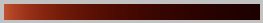
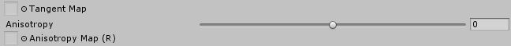
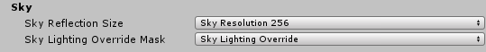
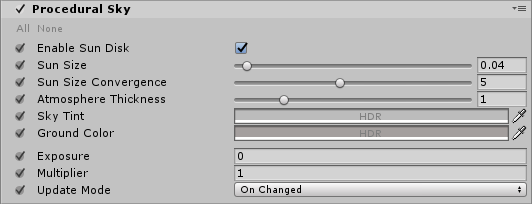
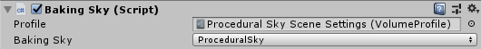
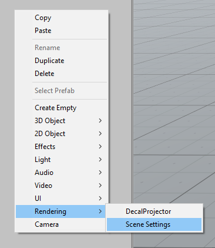

# High Definition Render Pipeline


The High Definition Render Pipeline (HDRP) is a high-fidelity Scriptable Render Pipeline built by Unity to target modern (Compute Shader compatible) platforms. 

The HDRP utilizes Physically-Based Lighting techniques, linear lighting, HDR lighting and a configurable hybrid Tile/Cluster deferred/Forward lighting architecture and gives you the tools you need to create games, technical demos, animations and more to a high graphical standard. 

NOTE: Projects made using HDRP are not compatible with the Lightweight Render Pipeline. You must decide which render pipeline your project will use before starting development as HDRP features are not cross-compatible between HDRP and Lightweight. 

This section contains the information you need to begin creating applications using HDRP; including information on Lighting, Materials and Shaders, Cameras, debugging and information for advanced users.

HRDP is only supported on the following platforms: 

__Note: HDRP will only work on the following platforms if the device used supports Compute Shaders. I.e: HDRP will only work on iOS if the iPhone model used supports Compute Shaders.__

* Windows and Windows Store, with DirectX 11 or DirectX 12 and Shader Model 5.0
* macOS and iOS using Metal graphics
* Android, Linux and Windows platforms with Vulkan
* Modern consoles (Sony PS4 and Microsoft Xbox One)

__HDRP does not support OpenGL or OpenGL ES devices.__

# Getting Started with High Definition Render Pipeline

This page details the initial setup of a project using the High Definition Render Pipeline (HDRP) and notes on upgrading existing projects to HDRP. 
## Setting up a new Project

### Using Unity Hub
To set up a new HDRP project using Unity Hub, click the New button, then select High Definition - Preview from the Template drop-down box. After clicking Create Project, Unity will automatically create a Project with the High Definition Render Pipeline package installed. 


## Upgrading an Existing Project
To upgrade an existing Project, you must first download the High Definition Render Pipeline using the Package Manager UI. 

Navigate to **Window > Package Manager** to open the Package Manager UI. Then click the All button to open the packages list. 

Left click on Render-pipelines.high-definition  to select it, then click the Install button to add HDRP to your project. 


After you have installed HDRP from the Package Manager UI you must add the HDRP  Asset to the Scriptable Render Pipeline Graphics settings field. 

Navigate to Edit > Settings > Graphics Settings, then Assign the HDRP Asset to the Scriptable Render Pipeline field by dragging in the HDRP Asset, or using the radio button to select the Asset from the popup window. 

## Building from source code

The latest version of the Scriptable Render Pipeline (SRP) repo can be found at the following link: https://github.com/Unity-Technologies/ScriptableRenderPipeline

### Github Desktop or Git command line tools

#### Cloning the repo using the GitHub Desktop App: 
Open the GitHub Desktop App and click Clone a Repository. 

Click the URL tab in the Clone a Repository window
Enter the following URL: https://github.com/Unity-Technologies/ScriptableRenderPipeline
Click the Choose… button to navigate to your project’s Asset folder. 
Click the Clone button. 

After the repo has been cloned you must run the following console commands from the ScriptableRenderPipeline folder:

`git checkout Unity-2018.1.0b2 (or the latest tag)`

`git submodule update --init --recursive --remote`

#### Cloning the repo using Git console commands:
Enter the following commands in your console application of choice:  
`cd <Path to your Unity project>/Assets`

`git clone https://github.com/Unity-Technologies/ScriptableRenderPipeline`

`cd ScriptableRenderPipeline`

`git checkout Unity-2018.1.0b2 (or the latest tag)`

`git submodule update --init --recursive --remote`

Once you have cloned the repo, re-open your project and follow the below instructions: 

Navigate to **Edit > Project Settings > Graphics** and add the HDRenderPipelineAsset Asset to the Render Pipeline Settings field. 

Create a copy of the HDRenderPipelineAsset and store it outside of the Scriptable Render Pipeline folder. This ensures that your HDRP settings are not lost when merging new changes from the SRP repo. 
HDRP will be ready to use in your project after following the above instructions.

## Upgrading Shaders

The built-in Unity shaders are incompatible with Scriptable Render Pipelines, as such, any preexisting Shaders in your project must be updated to work with the HDRP.

Navigate to **Edit > Render Pipelines > Upgrade Project Materials to High Definition Materials** to run the automatic upgrade script. This script with automatically update all preexisting shaders in your project to the new HDRP shaders. 

# The HD Render Pipeline Lit Shader

The lit shader is the default shader when using HDRenderPipeline (HDRP). This shader can be set with subsurface scattering, iridescence, vertex or pixel displacement and many other new parameters. This shader allows to users to produce more realistic assets with the use of HDRP. A version call LitTessellation is used to activate the tessellation.

## Creating a Lit Shader

In HDRP, when a new material is created it is by default a lit shader.


## How to set a Lit Shader?

### Surface options

__Surface type:__


Surface can be set as Opaque or Transparent. Transparent is an alpha blend and it is more costly.

__Alpha Cutoff:__


This check box enable the alpha cutoff to use an alpha test. The handle set the value of the test. All the values under the handle value is totally transparent and the values equal or above the handle value is opaque.

__Double sided:__


This option allows the double side. The faces are rendered on the two sides. The normal mode manages the normal behaviour on the backfaces. By default the mode is mirror.

__Material type:__

Material type introduces new behaviour for shaders to create realistic assets.

* Standard: Common use with basic parameters. The standard type uses a metallic workflow.

* Subsurface scattering (SSS): Mainly use to do a skin shader. This material type simulates the light transport inside a material and create softer micro shadows. 
Also a new parameter appears: Enable transmission. This parameter simulate the translucency of an object and it is managed by a thickness map.
SSS and transmission are setting by a diffusion profile explain later in this document.

* Anisotropy: The anisotropy determines the shape of the highlight. The surface vector is managed by a tangent map, an anisotropy map modulate the anisotropy intensity and a handle modulate and orient to horizontally or vertical the anisotropic effect. These parameters are more explain later in the documentation.

* Iridescence: Use to create an iridescent effect. The effect is modulate by an iridescence mask, iridescence thickness map and an handle iridescence thickness.

* Specular Color: Instead of standard type, the specular color type uses a specular workflow. In this way the specular can be colorize even for a not metallic matter.

* Translucent: This type is used to simulate only the transmission. It can be handy for vegetation and more light than a SSS type.This type use a profile like the SSS type to manage the transmission.

__Enable Decal:__

Allow the material to receive decals.

__Enable MotionVector For Vertex Animation:__

Use it to remove ghosting coming from vertex animation.

__Displacement mode:__

* None: no change.

* Vertex displacement: Use a height map to displace the vertices.

* Pixel displacement: Use a height map to displace the pixels. Use it only on plane surface. The surface can be only digged.

## Vertex animation / Enable wind


Prototype feature, don’t use it.

## Inputs

__Base color + opacity__: RGB channels are used as base color and alpha channel is used for opacity.

__Smoothness__ handle: This handle modulate (0 to 1) the smoothness value coming from the Mask map alpha channel.

__Mask map:__

* Red channel: Metallic mask. 0 = not metallic, 1 = metallic.

* Green channel: Ambient occlusion.

* Blue channel: Detail map mask.

* Alpha channel: Smoothness.

__Normal map space:__

By default the normal map space is in tangent space. The normal map space can be set to object space.

__Normal map:__

Use to assign the normal map. The handle modulate the normal intensity between 0 and 2.

__Bent normal map:__

The bent normal is used to have a better ambient occlusion. It works only with diffuse lighting like lightmap or light probe.

__Coat Mask:__

By default the value is 0. The mask is used to modulate the clear coat effect base on the handle value (0 to 1).

__Base UV mapping:__

UV can be set to UV0, UV1 (used by the lightmap), UV2, UV3, planar or triplanar.

Planar and triplanar use a world scale. This ratio depends about the size of the textures and the texel ratio wanted. By default it is 1, that means the material is applied on 1 meter. A value of 0.5 applies the material on 2 meters. 

__Tiling:__

Set the X/Y values to tile the material.

__Offset:__

Set on X/Y offset for the UV.

## Detail inputs

The detail map is a composited map used to add micro details into the material. The detail map visibility is managed by the blue channel of the Mask map.


__Detail map:__

* Red channel: Grey scale used as albedo.

* Green channel: Green channel of the detail normal map.

* Blue channel: Detail smoothness.

* Alpha channel: Red channel  of the detail normal map.

Channels are organised like this due the different compressions quality of each channels.

__Detail UV mapping:__

UV0, UV1, UV2 or UV3 can be set. If the material UV are set to planar or triplanar, the detail UV are also set to planar or triplanar.

__Lock to base Tiling/Offset:__

By default a detail texture is linked to the material aspect because it is done to add a micro detail in it. If for any reason the link have to be removed, just uncheck this checkbox.

__Tiling:__

Set the tiling of the detail texture inside a tile of the material. 
For example if the material is tiled by 2 on a plane and the detail texture is also tile by 2, the detail will appears tile by 4 on the plane.
In this condition the tile of the material can be changed without set another time the detail UV to keep the good appearance.

__Offset:__

Set on X/Y offset for the detail UV.

__Detail AlbedoScale:__

This handle modulate (0 to 2) the detail albedo (red channel) like an overlay effect. The default value is 1 and has no scale.

__Detail NormalScale:__

This handle modulate (0 to 2)  the intensity of the detail normal map. The default value is 1 and has no scale.

__Detail SmoothnessScale:__

This handle modulate (0 to 2)  the detail smoothness (blue channel) like an overlay effect. The default value is 1 and has no scale.

## Emissive inputs

__Emissive color:__

The emissive color can be managed by a map or a single color. If both are used they are multiplied.

__Emissive intensity:__

Set the power of the emissive effect. By default the value is 0 and doesn’t produce any emissive effect.

__Albedo Affect Emissive:__

By default it is on and allows the albedo to produce color for the emissive. In this case the albedo is multiplied by emissive color and color picker to produce the emissive final color.

For example the emissive color map can be used as an emissive mask, the albedo used to do the color and  the color picker to modulate it.

## Advanced options:

__Enable GPU instancing:__

If objects are not static batched and identical, all objects with this material become instanced.


For example, objects with an animation base on the object pivot can’t be static batched (unique pivot for all) but they can be instanced by GPU.

__Enable Specular Occlusion from Bent normal:__

This option used the bent normal assign in the bent normal slot to do a specular occlusion for the reflection probe.

## Specific setting from material type

### Subsurface scattering


__Enable transmission: __

On/off the transmission effect. The transmission is managed by a profile and a thickness map. More the object is set thin more lighting cross it.

__Specific subsurface settings:__


Diffusion profile:

Rollout menu to choose the profile. Profiles are set in the SSSSettings.asset file. Goto button select the the SSSSettings file.

Subsurface mask map:

This map uses the red channel to manage the visibility (0 = not visible, 1= totally visible) of the SSS effect. This map is modulated by the handle value (0 to 1, 1 is the default).

Thickness map:

This map uses the red channel to set the thickness inside the range set in the profile. 0 is the min range value and 1 is the max range value.

__The profile:__


* Name: Name of the profile

* Scattering value: It is a HDR value to manage the color and the scatter of the SSS.

* Max radius: It is an information value and linked to the scattering value. It is the effective radius in millimeters. The blur is energy-preserving, so a wide result in a large area provides a small contribution of individual samples. A short distance increases the sharpness of the result.

* Index of Refraction: To set the real index of refraction. It is 1.4 for skin and between 1.3 and 1.5 for most other material.

* World scale: Set the size of the world unit in meters. Default it is 1 and shouldn’t be modified except if the world unit used is customized.

__Subsurface scattering only:__

Texturing mode: Specifies when the diffuse texture should be applied.

__Transmission only:__

Transmission mode: Regular or Thin object. Really thin object need a specific use.

Transmission tint: Set a HDR value to color the transmission.

Min/Max thickness (mm): Set the range of the thickness. This range is modulate by the thickness map (0 = min, 1 = max).

Thickness remap: This setting allows to remap the thickness without to change the min/max values. The range can be moved without losing the thickness values.

Profile preview: Shows the fraction of lights scattered from the source located in the center.The distance to the boundary of the image corresponds to the max radius. Display is not HDR, so the intensity of pixels around the center may be clipped.


Transmission preview: Shows the fraction of light passing through the object for thickness values from the remap. Can be viewed as a cross section of a slab of material illuminated by white light from the left.



### Anisotropy

Anisotropic materials don’t have an uniform specular shape.

Real anisotropy example:


 Anisotropy is used to deform the specular shape on an axe.



__Tangent map: __

It is a vector map. Red and Green channel orient the specular shape.

__Anisotropy:__

This handle modulate the intensity of the anisotropic effect and modify the shape orientation, horizontally or vertically, coming from the tangent map.


__Anisotropy map:__

This map uses the red channel to modulate the anisotropic effect intensity.

### Iridescence

The iridescence (Thin-film interference) is a natural phenomenon in which lightwaves reflected by the upper and lower boundaries of a thin film interfere with one another, either enhancing or reducing the reflected[ ](https://en.wikipedia.org/wiki/Reflected_light)light. 


__Iridescence Mask:__

This map uses the red channel to manage the visibility of the iridescence effect. The handle can modulate the mask or the visibility if no mask is assigned.

__Iridescence Layer thickness map:__

If no map is assigned, by default the value is 1. The iridescence gradient color is linked to the thickness. When the thickness change the gradient color change too. The handle modulate the thickness also and it is multiplied when a map is assigned.


FYI: If the base color is white no iridescence can be visible. For a white base color no lighting enter the matter. All the lighting is reflected to produce a pure white color, so no iridescence can be produce.

### Specular color

When the specular color shader type is chosen, the specular color is defined by a dedicated map not anymore by the albedo value.


__Specular color:__

RGB map to set the specular color. When no map is assigned the default value is 1.

__Picker color:__

Uniform color used for the specular. It is multiply by the Specular color map.

## Translucent

The translucency is the transmission of a part of light across the matter.


The translucency is manage by a profile and a thickness map like for the subsurface scattering.

## How to set a Lit Shader Tessellation?

From a lit shader, use the shader rollout menu to choose the LayeredLitTessellation shader.


In case of lit shader tessellation only standard, subsurface scattering and translucent types are available.

__Displacement mode:__


None: No displacement is applied. The tessellation is used only to smooth the surface.

Tessellation displacement: A height map (red channel) is used in the inputs to displace the mesh vertices.


* Lock with object scale: the height map appearance doesn’t change when the object is scaled.

* Lock with height map tiling rate: the height map appearance doesn’t change when the material is tiled.

__Tessellations options:__


Tessellation mode:

* None: no smooth is aplied.

* Phong: the tessellation applied a smooth effect.

Tessellation factor:

Between 0 and 64 this factor modulate the tessellation quantity. Higher value mean a surface more tessellated. Above 15 is costly. For XBox one and Playstation4 the maximum is set to 15.

Start fade distance:

It is the distance (in Unity unit) to the camera where the tessellation start to fade out.

End fade distance:

It is the maximum distance (in Unity unit) to the camera where triangle are tessellated.

Triangle size:

Desired screen space size of triangle (in pixel). A smaller value mean smaller triangle.

__Height map parameterization:__

Two parametrizations are available.

Min/Max:


In this mode the base of the height map is linked to the base of the mesh. It is used if the height map has uniform values on the map.

Min: Set the height value for the 0 value on the map.

Max: Set the height value for the 1 (255) value on the map.

Offset: Can up and down the height map without modify the min/max values.

Amplitude:


Amplitude mode is more used in case of height map with a dedicated center. In this case the height map uses often none uniform values. In case of non uniform values a range of the map is not used to store values, it is clamped in positive or negative.

Amplitude: The amplitude is the double value of the maximum value in negative or in positive.

Base: It is the reference of the base mesh into the height map. By default the base is at 0.5.

Offset: Can up and down the height map without modify the other values.

# Sky and Fog

In HDRP, sky and fog are setup via the interpolation volume framework. The goal is for the user to be able to dynamically change the look of the sky and fog depending on the camera position.

We also provide the necessary tools to offer consistent baking of lightmaps and probes.

The Sky Framework used by HDRP is also designed in a way that it is easy for users to write their own custom sky and use it in their project with minimal effort.

As part of the Volume framework, all local settings components described below are actually VolumeComponents which need to be added to a VolumeComponent on a regular GameObject. As such, all their parameters can be interpolated between different volumes.

## Setting up the Sky

Setting up a sky has two goals: The first one is to define what will be displayed in the background of the scene for a given camera. The second one is to define environment lighting, namely sky reflection and sky ambient probe which is then later used to render lightmaps (real-time or baked).

Settings are split between global settings which are per project/platform and local settings that use the volume framework and can change depending on the scene or camera position.

### Global Sky Settings

Global settings for the sky are in the HDRenderPipeline configuration asset:



__Sky Reflection Size__

This parameter drives the size of the cubemap generated from the sky and used for fallback reflection when no local reflection probes are present. It has no effect on the quality of the sky rendered in the background.

__Sky Lighting Override Mask__

In some cases, users may want to dissociate lighting environment from what is rendered in the background (a typical example is to have a very dark sky at night but have a brighter lighting so that the player can still see).

In order to achieve this, users can define the sky lighting override mask which is a Layer mask. If any volumes are present in this layer then environment lighting will use these volumes instead of those from the main camera. If this mask is set to **Nothing**or if there are no volume in this mask then lighting will come from volumes setup in the main camera volume layer mask.

In practice this means that user can define two sets of masks, one for the visual sky and the other for the lighting. Both sets of volume will then be interpolated independently from each other.

Note that lighting override does not affect baked lighting.

### Local Sky Settings

Once global parameters are set, users need to setup volumes with the correct components to setup local parameters for the sky. Currently HDRP provides two different kind of skies.

__Procedural Sky__

This sky is similar to the procedural sky provided with the built-in Unity Render Pipelines. 



| Property| Function |
|:---|:---|
| __Enable Sun Disk__| Display sun disk |
| __Sun Size__| Size of the sun disk |
| __Sun Size Convergence__|  |
| __Atmospheric Thickness__|  |
| __Sky Tint__| Color of the sky hemisphere |
| __Ground Color__| Color of the ground hemisphere |
| __Exposure__| Exposure applied to the sky |
| __Multiplier__| Multiplier applied to the sky |
| __Update Mode__| Rate at which the sky environment (reflection en ambient probe) should be updated |
| On Changed| Sky environment is updated when one of its parameter changes |
| On Demand| Sky Environment is explicitly updated by the script |
| Realtime| Sky environment is updated regularly |
| Update Period| Period (in seconds) at which the realtime sky is updated (0 means every frame) |


__HDRI Sky__

Simple sky represented by a cubemap texture.


| Property| Function |
|:---|:---|
| __Hdri sky__| Cubemap representing the sky |
| __Exposure__| Exposure applied to the sky |
| __Multiplier__| Multiplier applied to the sky |
| __Rotation__| Rotation applied to the cubemap in degrees |
| __Update Mode__| Rate at which the sky environment (reflection en ambient probe) should be updated |
| On Changed| Sky environment is updated when one of its parameter changes |
| On Demand| Sky Environment is explicitly updated by the script |
| Realtime| Sky environment is updated regularly |
| Update Period| Period (in seconds) at which the realtime sky is updated (0 means every frame) |


### Baking Global Illumination with the sky

In HDRP the sky is completely controlled by the volume system. It means that in the editor, the current state of the sky will depend on the camera position. The consequence is that for users to get a consistent lighting baking, we can’t rely on what is in the scene.

Instead the sky used for baking is set explicitly by the user through the Baking Sky component.



User should select a volume profile which contains the sky intended to be used for baking and then choose the right type (in case the profile contains different kinds of skies). If the component is added to a game object that already has a Volume, the profile property will be automatically populated with the corresponding profile asset.

This sky setting will live outside of the volume framework and thus will never be interpolated based on the camera position. Any time the baking is required, this is the sky that will be used.

Only one such component can be present in the editor at any given time. Any additional component of the same type will generate a warning and be ignored.

## Setting up the Fog

Fog is the effect of overlaying a color onto objects dependant on the distance from the camera. This is used to simulate fog or mist in outdoor environments and is also typically used to hide clipping of objects when a camera’s far clip plane has been moved forward for performance.

In HDRP, users can choose between two different kind of fogs, linear and exponential fog. All types of materials (lit or unlit) will react correctly to the fog. Depending on the type of fog, density will evolve differently with respect to distance from camera and world space height.

Instead of using a constant color, both types of fog can choose to use the background sky as a source for color. In this case, the color will be sampled from different mip maps of the cubemap generated from the current sky settings. Chosen mip will vary linearly between the blurriest one to the highest resolution one depending on the distance from camera and the "Mip Fog" parameters. Users can also choose to limit the resolution of the higher mip used.

For both types of fog, density is computed from camera distance and world space height independently and then multiplied together to obtain the final result.

__Linear Fog__

Density will increase linearly with view distance and world space height depending on the provided parameters.


| Property| Function |
|:---|:---|
| __Density__| Global multiplier for the fog density |
| __Color Mode__| Source of the fog color |
| Constant Color| Fog is a constant color |
| Color| Color of the fog |
| Sky Color| Fog color is sampled from the sky |
| Mip Fog Near| Distance at which the blurriest sky mip is used |
| Mip Fog Far| Distance at which the higher sky mip (see "Mip Fog Max Mip" ) is used |
| Mip Fog Max Mip| Maximum mip map used to sample the color (1.0 being highest resolution and 0.0 lowest resolution). |
| __Fog Start__| Distance from camera at which fog density starts to increase from zero. |
| __Fog End__| Distance from camera at which fog density is maximum. |
| __Fog Height Start__| Height at which fog density starts to decrease |
| __Fog Height End__| Height at which fog density is zero |


__Exponential Fog__

Density will increase exponentially with view distance and world space height depending on the provided parameters.


| Property| Function |
|:---|:---|
| __Density__| Global multiplier for the fog density |
| __Color Mode__| Source of the fog color |
| Constant Color| Fog is a constant color |
| Color| Color of the fog |
| Sky Color| Fog color is sampled from the sky |
| Mip Fog Near| Distance at which the blurriest sky mip is used |
| Mip Fog Far| Distance at which the higher sky mip (see "Mip Fog Max Mip" ) is used |
| Mip Fog Max Mip| Maximum mip map used to sample the color (1.0 being highest resolution and 0.0 lowest resolution). |
| __Fog Distance__| Distance from camera at will reach maximum |
| __Fog Base Height__| World space height at which fog density starts to decrease from 1.0 |
| __Fog Height Attenuation__| Fall off of height fog attenuation (bigger values will make attenuation sharper) |

## Visual Environment

Once the proper components have been setup, users need to specify what kind of sky and fog should be used for rendering. This is done through the Visual Environment component.


| Property| Function |
|:---|:---|
| __Sky Type__| Type of sky used for rendering. This list will be automatically updated with any custom sky written by users |
| __Fog Type__| Type of fog used for rendering |


To help setting things up more easily, users can use the contextual menu to directly create a game object named "Scene Settings" and go from there. This game object is already setup with a default procedural sky and exponential fog inside a global Volume (it also contains default shadow settings).



## Writing Custom Sky Renderers

The sky system is setup in a way that allows users to develop their own kind of sky with their own parameters and shaders.

Three things are needed in order to write your own sky.

__SkySettings__

Create a new class that inherits from *SkySettings*. This class will contain all parameters specific to the particular sky renderer user is writing. Please refer to the Volume system documentation to learn how to declare volume parameters.

Three things are mandatory to write:

* SkyUniqueID attribute: This must be an integer unique to this particular sky. Must not clash with any other sky settings. The SkyType enum is available for users to see what values are already used by HDRP.

* GetHashCode: This is used by the sky system to determine when to re-render the sky reflection cubemap.

* CreateRenderer: This is used by the sky system to instantiate the proper renderer.

Exemple: HDRI Sky
```
 [SkyUniqueID(87248]<br/>    public class HDRISky : SkySettings
    {
        [Tooltip("Cubemap used to render the sky.")]
        public CubemapParameter hdriSky = new CubemapParameter(null);

        public override SkyRenderer CreateRenderer()
        {
            return new HDRISkyRenderer(this);
        }

        public override int GetHashCode()
        {
            int hash = base.GetHashCode();

            unchecked
            {
                hash = hdriSky.value != null ? hash * 23 + hdriSky.GetHashCode() : hash;
            }

            return hash;
        }
    }
```


​    

__SkyRenderer__

This is the class that will actually render the sky, either into a cubemap for lighting or on the background. This is where users must implement all their specific rendering.

It must implement this interface:

```
    public abstract class SkyRenderer
    {
        // Method used to initialize any resource for the sky rendering (shaders, …)
        public abstract void Build();
        // Method used to clean up any resource previously allocated
        public abstract void Cleanup();
        // SkyRenderer is responsible for setting up render targets provided in builtinParams
        public abstract void SetRenderTargets(BuiltinSkyParameters builtinParams);
        // renderForCubemap: When rendering into a cube map, no depth buffer is available so user has to make sure not to use depth testing or the depth texture.
        public abstract void RenderSky(BuiltinSkyParameters builtinParams, bool renderForCubemap);
        // Returns true if provided sky setting parameters are valid.
        public abstract bool IsValid();
    }

```

Exemple: HDRISkyRenderer:

```
public class HDRISkyRenderer : SkyRenderer<br/>{
    Material m_SkyHDRIMaterial; // Renders a cubemap into a render texture (can be cube or 2D)
    MaterialPropertyBlock m_PropertyBlock;
    HDRISky m_HdriSkyParams;

    public HDRISkyRenderer(HDRISky hdriSkyParams)
    {
        m_HdriSkyParams = hdriSkyParams;
        m_PropertyBlock = new MaterialPropertyBlock();
    }

    public override void Build()
    {
        var hdrp = GraphicsSettings.renderPipelineAsset as HDRenderPipelineAsset;
        m_SkyHDRIMaterial = CoreUtils.CreateEngineMaterial(hdrp.renderPipelineResources.hdriSky);
    }

    public override void Cleanup()
    {
        CoreUtils.Destroy(m_SkyHDRIMaterial);
    }

    public override void SetRenderTargets(BuiltinSkyParameters builtinParams)
    {
        if (builtinParams.depthBuffer == BuiltinSkyParameters.nullRT)
        {
            HDUtils.SetRenderTarget(builtinParams.commandBuffer, builtinParams.hdCamera, builtinParams.colorBuffer);
        }
        else
        {
            HDUtils.SetRenderTarget(builtinParams.commandBuffer, builtinParams.hdCamera, builtinParams.colorBuffer, builtinParams.depthBuffer);
        }
    }

    public override void RenderSky(BuiltinSkyParameters builtinParams, bool renderForCubemap)
    {
        m_PropertyBlock.SetTexture(HDShaderIDs._Cubemap, m_HdriSkyParams.hdriSky);
        m_PropertyBlock.SetVector(HDShaderIDs._SkyParam, new Vector4(m_HdriSkyParams.exposure, m_HdriSkyParams.multiplier, -m_HdriSkyParams.rotation, 0.0f)); // -rotation to match Legacy...

        // This matrix needs to be updated at the draw call frequency.
        m_PropertyBlock.SetMatrix(HDShaderIDs._PixelCoordToViewDirWS, builtinParams.pixelCoordToViewDirMatrix);

        CoreUtils.DrawFullScreen(builtinParams.commandBuffer, m_SkyHDRIMaterial, m_PropertyBlock, renderForCubemap ? 0 : 1);
    }

    public override bool IsValid()
    {
        return m_HdriSkyParams != null && m_SkyHDRIMaterial != null;
    }
}
```


__Rendering Shader__

This is highly dependent on what the particular sky is supposed to look like. Here we’ll just show the example of HDRISky.

Note that we implemented two passes, one that uses Depth Test for rendering the sky in the background (so that it’s occluded by geometry) and the other that does not for when the sky is rendered into the reflection cubemap.

```
Shader "Hidden/HDRenderPipeline/Sky/HDRISky"<br/>{
    HLSLINCLUDE

    #pragma vertex Vert
    #pragma fragment Frag

    #pragma target 4.5
    #pragma only_renderers d3d11 ps4 xboxone vulkan metal

    #include "CoreRP/ShaderLibrary/Common.hlsl"
    #include "CoreRP/ShaderLibrary/Color.hlsl"
    #include "CoreRP/ShaderLibrary/CommonLighting.hlsl"

    TEXTURECUBE(_Cubemap);
    SAMPLER(sampler_Cubemap);

    float4   _SkyParam; // x exposure, y multiplier, z rotation
    float4x4 _PixelCoordToViewDirWS; // Actually just 3x3, but Unity can only set 4x4

    struct Attributes
    {
        uint vertexID : SV_VertexID;
    };

    struct Varyings
    {
        float4 positionCS : SV_POSITION;
    };

    Varyings Vert(Attributes input)
    {
        Varyings output;
        output.positionCS = GetFullScreenTriangleVertexPosition(input.vertexID, UNITY_RAW_FAR_CLIP_VALUE);
        return output;
    }

    float4 Frag(Varyings input) : SV_Target
    {
        // Points towards the camera
        float3 viewDirWS = normalize(mul(float3(input.positionCS.xy, 1.0), (float3x3)_PixelCoordToViewDirWS));
        // Reverse it to point into the scene
        float3 dir = -viewDirWS;

        // Rotate direction
        float phi = DegToRad(_SkyParam.z);
        float cosPhi, sinPhi;
        sincos(phi, sinPhi, cosPhi);
        float3 rotDirX = float3(cosPhi, 0, -sinPhi);
        float3 rotDirY = float3(sinPhi, 0, cosPhi);
        dir = float3(dot(rotDirX, dir), dir.y, dot(rotDirY, dir));

        float3 skyColor = ClampToFloat16Max(SAMPLE_TEXTURECUBE_LOD(_Cubemap, sampler_Cubemap, dir, 0).rgb * exp2(_SkyParam.x) * _SkyParam.y);
        return float4(skyColor, 1.0);
    }

    ENDHLSL

    SubShader
    {
        Pass
        {
            ZWrite Off
            ZTest Always
            Blend Off
            Cull Off

            HLSLPROGRAM
            ENDHLSL

        }

        Pass
        {
            ZWrite Off
            ZTest LEqual
            Blend Off
            Cull Off

            HLSLPROGRAM
            ENDHLSL
        }

    }
    Fallback Off
}
```

After doing all this, the new Sky should automatically appear in the combo box in the *Visual Environment* component.


